#A CSS Crash Course {#chapter-css}
In Web development, we use *Cascading Style Sheets (CSS)* to describe the presentation of a HTML document (i.e. its look and feel).

Each element within a HTML document can be *styled*. The CSS for a given HTML element describes how it is to be rendered on screen. This is done by ascribing *values* to the different *properties* associated with an element. For example, the `font-size` property could be set to `24pt` to make any text contained within the specified HTML element to appear at 24pt. We could also set the `text-align` property to a value of `right` to make text appear within the HTML element on the right-hand side.

I> ### CSS Properties
I> There are many, many different CSS properties that you can use in your stylesheets. Each provides a different functionality. Check out the [W3C website](http://www.w3.org/TR/CSS2/propidx.html) and [HTML Dog](http://www.htmldog.com/references/css/properties/) for lists of available properties. [pageresource.com](http://www.pageresource.com/dhtml/cssprops.htm) also has a neat list of properties, with descriptions of what each one does. Check out Section css-course-reading-label for a more comprehensive set of links.

CSS works by following a *select and apply pattern* - for a specified element, a set of styling properties are applied. Take a look at the following example in the [figure below](#image-css-render), where we have some HTML containing `<h1>` tags. In the CSS code example, we specify that all `h1` be styled. We'll come back to [selectors](http://www.w3schools.com/cssref/css_selectors.asp) later on in [this chapter](#section-css-selectors). For now though, you can assume the CSS style defined will be applied to our `<h1>` tags. The style contains four properties:

-   `font-size`, setting the size of the font to 16pt;
-   `font-style`, which when set to `italic` italicises the contents of all `<h1>` tags within the document;
-   `text-align` centres the text of the `<h1>` tags (when set to `center`); and
-   `color`, which sets the colour of the text to red via [hexadecimal code](http://html-color-codes.com/) `#FF0000`.

With all of these properties applied, the resultant page render can be seen in the browser as shown in the figure below.

{#image-css-render}

W> ### What you see is what you *(may or may not)* get
W>
W> Due to the nature of web development, *what you see isn't necessarily what you'll get*. This is because different browsers have their own way of interpreting [web standards](http://en.wikipedia.org/wiki/Web_standards) and so the pages may be rendered differently. This quirk can unfortunately lead to plenty of frustration, but today's modern browsers (or developers) are much more in agreement as to how different components of a page should be rendered.

## Including Stylesheets
Including stylesheets in your webpages is a relatively straightforward process, and involves including a `<link>` tag within your HTML's `<head>`. Check out the minimal HTML markup sample below for the attributes required within a `<link>` tag.

{lang="html",linenos=off}
	<!DOCTYPE html>
	<html>
	    <head>
	        <link rel="stylesheet" type="text/css" href="URL/TO/stylesheet.css" />
	        <title>Sample Title</title>
	    </head>
	
	    <body>
	        <h1>Hello world!</h1>
	    </body>
	</html>

As can be seen from above, there are at minimum three attributes that you must supply to the `<link>` tag:

-   `rel`, which allows you to specify the relationship between the HTML document and the resource you're linking to (i.e., a stylesheet);
-   `type`, in which you should specify the [MIME type](http://en.wikipedia.org/wiki/Internet_media_type) for CSS; and
-   `href`, the attribute which you should point to the URL of the stylesheet you wish to include.

With this tag added, your stylesheet should be included with your HTML page, and the styles within the stylesheet applied. It should be noted that CSS stylesheets are considered as a form of [static media](#section-templates-static-static), meaning you should place them within your project's `static` directory.

I> ### Inline CSS
I> You can also add CSS to your HTML documents *inline*, meaning that the CSS is included as part of your HTML page. However, this isn't generally advised because it removes the abstraction between presentational semantics (CSS) and content (HTML).

## Basic CSS Selectors {#section-css-selectors}
CSS selectors are used to map particular styles to particular HTML elements. In essence, a CSS selector is a *pattern*. Here, we cover three basic forms of CSS selector: *element selectors*, *id selectors* and *class selectors*. [Later on in this chapter](#section-css-links), we also touch on what are known as *pseudo-selectors*.

## Element Selectors
Taking the CSS example from the [rendering example shown above](#image-css-render), we can see that the selector `h1` matches to any `<h1>` tag. Any selector referencing a tag like this can be called an *element selector*. We can apply element selectors to any HTML element such as `<body>`, `<h1>`, `<h2>`, `<h3>`, `
` and `
`. These can be all styled in a similar manner. However, using element selectors is pretty crude - styles are applied to *all* instances of a particular tag. We usually want a more fine-grained approach to selecting what elements we style, and this is where *id selectors* and *class selectors* come into play.

### ID Selectors
The *id selector* is used to map to a unique element on your webpage. Each element on your webpage can be assigned a unique id via the `id` attribute, and it is this identifier that CSS uses to latch styles onto your element. This type of selector begins with a hash symbol (`#`), followed directly by the identifier of the element you wish to match to. Check out the figure below for an example 

### Class Selectors
The alternative option is to use *class selectors*. This approach is similar to that of *id selectors*, with the difference that you can legitimately target multiple elements with the same class. If you have a group of HTML elements that you wish to apply the same style to, use a class-based approach. The selector for using this method is to precede the name of your class with a period (`.`) before opening up the style with curly braces (`{ }`). Check out the [figure below](#image-css-class) for an example.

{#image-css-class}

W> ### Ensure `id`s are Unique
W> Try to use id selectors sparingly. [Ask yourself:](http://net.tutsplus.com/tutorials/html-css-techniques/the-30-css-selectors-you-must-memorize/) *do I absolutely need to apply an identifier to this element in order to target it?* If you need to apply a given set of styles to more than one element, the answer will always be **no**. In cases like this, you should use a class or element selector.

## Fonts
Due to the huge number available, using fonts has historically been a pitfall when it comes to web development. Picture this scenario: a web developer has installed and uses a particular font on his or her webpage. The font is pretty arcane - so the probability of the font being present on other computers is relatively small. A user who visits the developer's webpage subsequently sees the page rendered incorrectly as the font is not present on their system. CSS tackles this particular issue with the `font-family` property.

The value you specify for `font-family` can be a *list* of possible fonts - and the first one your computer or other device has installed is the font that is used to render the webpage. Text within the specified HTML element subsequently has the selected font applied. The example CSS shown below applies *Arial* if the font exists. If it doesn't, it looks for *Helvetica*. If that font doesn't exist, any available [sans-serif font](http://en.wikipedia.org/wiki/Sans-serif) is applied.

{lang="css",linenos=off}
	h1 {
	    font-family: 'Arial', 'Helvetica', sans-serif;
	}

In 1996, Microsoft started the [core fonts for the Web](http://en.wikipedia.org/wiki/Core_fonts_for_the_Web) initiative with the aim of guaranteeing a particular set of fonts to be present on all computers. Today however, you can use pretty much any font you like - check out [Google Fonts](http://www.google.com/fonts) for examples of the fonts that you can use and [this Web Designer Depot article](http://www.webdesignerdepot.com/2013/01/how-to-use-any-font-you-like-with-css3/) on how to use such fonts.

## Colours and Backgrounds
Colours are important in defining the look and feel of your website. You can change the colour of any element within your webpage, ranging from background colours to borders and text. In this book, we make use of words and *hexadecimal colour codes* to choose the colours we want. As you can see from the list of basic colours shown in the [figure below](#image-css-colours), you can supply either a *hexadecimal* or *RGB (red-green-blue)* value for the colour you want to use. You can also [specify words to describe your colours](http://www.w3schools.com/colors/colors_names.asp), such as `green`, `yellow` or `blue`.

W> ### Pick Colours Sensibly
W>
W> Take great care when picking colours to use on your webpages. If you select colours that don't contrast well, people simply won't be to read your text! There are many websites available that can help you pick out a good colour scheme - try [colorcombos.com](http://www.colorcombos.com/) for starters.

Applying colours to your elements is a straightforward process. The property that you use depends on the aspect of the element you wish to change! The following subsections explain the relevant properties and how to apply them.

{#image-css-colours}
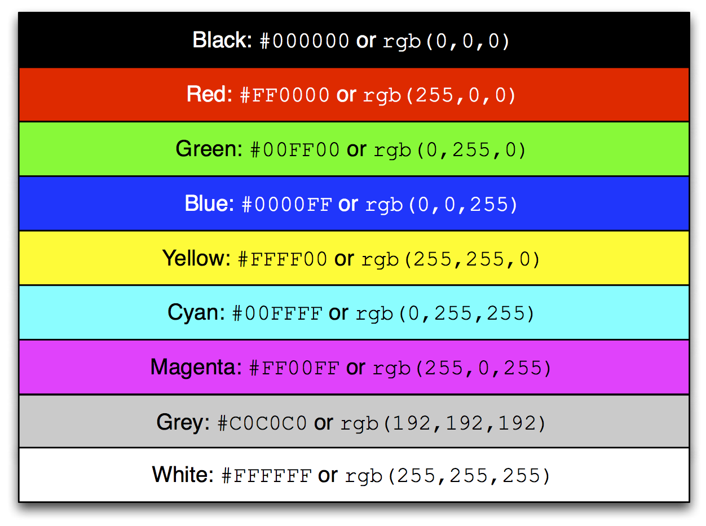

There are many different websites that you can use to aid you in picking the right hexadecimal codes to enter into your stylesheets. You aren't simply limited to the nine examples above! Try out [html-color-codes.com](http://html-color-codes.com/) for a simple grid of colours and their associated six character hexadecimal code. You can also try sites such as [color-hex.com](http://www.color-hex.com/color-wheel/) which gives you fine grained control over the colours you can choose.

I> ### Hexadecimal Colour Codes
I> For more information on how colours are coded with hexadecimal, check out [this thorough tutorial](http://www.quackit.com/css/css_color_codes.cfm).

W> ### Watch your English!
W> As you may have noticed, CSS uses American/International English to spell words. As such, there are a few words that are spelt slightly differently compared to their British counterparts, like `color` and `center`. If you have grown up in the United Kingdom, double check your spelling and be prepared to spell it the *wrong way!*

### Text Colours {#section-css-colours-text}
To change the colour of text within an element, you must apply the `color` property to the element containing the text you wish to change. The following CSS for example changes all the text within an element using class `red` to...red!

{lang="css",linenos=off}
	.red {
	    color: #FF0000;
	}

You can alter the presentation of a small portion of text within your webpage by wrapping the text within `` tags. Assign a class or unique identifier to the element, and from there you can simply reference the `` tag in your stylesheet while applying the `color` property.

### Borders
You can change the colour of an element's *borders*, too. We'll discuss what borders are discussed as part of the [CSS box model](#section-css-box). For now, we'll show you how to apply colours to them to make everything look pretty.

Border colours can be specified with the `border-color` property. You can supply one colour for all four sides of your border, or specify a different colour for each side. To achieve this, you'll need to supply different colours, each separated by a space.

{lang="css",linenos=off}
	.some-element {
	    border-color: #000000 #FF0000 #00FF00
	}

In the example above, we use multiple colours to specify a different colour for three sides. Starting at the top, we rotate clockwise. Thus, the order of colours for each side would be `top right bottom left`.

Our example applies any element with class `some-element` with a black top border, a red right border and a green bottom border. No left border value is supplied, meaning that the left-hand border is left transparent. To specify a colour for only one side of an element's border, consider using the `border-top-color`, `border-right-color`, `border-bottom-color` and `border-left-color` properties where appropriate.

### Background Colours
You can also change the colour of an element's background through use of the CSS `background-color` property. Like the `color` property described above, the `background-color` property can be easily applied by specifying a single colour as its value. Check out the example below which applies a bright green background to the entire webpage. Not very pretty!

{lang="css",linenos=off}
	body {
	    background-color: #00FF00;
	}

### Background Images
Of course, a colour isn't the only way to change your backgrounds. You can also apply background images to your elements, too. We can achieve this through the `background-image` property.

{lang="css",linenos=off}
	#some-unique-element {
	    background-image: url('../images/filename.png');
	    background-color: #000000;
	}

The example above makes use of `filename.png` as the background image for the element with identifier `some-unique-element`. The path to your image is specified *relative to the path of your CSS stylesheet*. Our example above uses the [double dot notation to specify the relative path](http://programmers.stackexchange.com/a/186719) to the image. *Don't provide an absolute path here; it won't work as you expect!* We also apply a black background colour to fill the gaps left by our background image - it may not fill the entire size of the element.

I> ### Background Image Positioning
I>
I> By default, background images default to the top-left corner of the relevant element and are repeated on both the horizontal and vertical axes. You can customise this functionality by altering [how the image is repeated](http://www.w3schools.com/cssref/pr_background-repeat.asp) with the `background-image` property. You can also specify [where the image is placed](http://www.w3schools.com/cssref/pr_background-position.asp) by default with the `background-position` property.

## Containers, Block-Level and Inline Elements
Throughout the crash course thus far, we've introduced you to the `` element but have neglected to tell you what it is. All will become clear in this section as we explain *inline* and *block-level* elements.

A `` is considered to be a so-called *container element*. Along with a `
` tag, these elements are themselves meaningless and are provided only for you to *contain* and *separate* your page's content in a logical manner. For example, you may use a `
` to contain markup related to a navigation bar, with another `
` to contain markup related to the footer of your webpage. As containers themselves are meaningless, styles are usually applied to help control the presentational semantics of your webpage.

Containers come in two flavours: *block-level elements* and *inline elements*. Check out the [figure below](#image-css-nesting-blocks) for an illustration of the two kinds in action, and read on for a short description of each.

{#image-css-nesting-blocks}

### Block-Level Elements
In simple terms, *block-level elements* are by default rectangular in shape and spread across the entire width of the containing element. Block-level elements therefore by default appear underneath each other. The rectangular structure of each block-level element is commonly referred to as the *box model*, which we discuss [later on in this chapter](#section-css-box). A typical block-level element you will use is the `
` tag, short for *division.*

Block-level elements can be nested within other block-level elements to create a hierarchy of elements. You can also nest *inline elements* within block-level elements, but not vice-versa! Read on to find out why.

### Inline Elements
An *inline element* does exactly what it says on the tin. These elements appear *inline* to block-level elements on your webpage, and are commonly found to be wrapped around text. You'll find that `` tags are commonly used for this purpose.

This text-wrapping application was explained in the [text colours section](#section-css-colours-text), where a portion of text could be wrapped in `` tags to change its colour. The corresponding HTML markup would look similar to the example below.

{lang="html",linenos=off}
	

	    This is some text wrapped within a block-level element. This text is wrapped within an inline element! But this text isn't.
	

Refer back to the [nested blocks figure above](#image-css-nesting-blocks) to refresh your mind about what you can and cannot nest before you move on.

## Basic Positioning
An important concept that we have not yet covered in this CSS crash course regards the positioning of elements within your webpage. Most of the time, you'll be satisfied with inline elements appearing alongside each other, and block-level elements appearing underneath each other. These elements are said to be *positioned statically*.

However, there will be scenarios where you require a little bit more control on where everything goes. In this section, we'll briefly cover three important techniques for positioning elements within your webpage: *floats*, *relative positioning* and *absolute positioning*.

### Floats
CSS *floats* are one of the most straightforward techniques for positioning elements within your webpage. Using floats allows us to position elements to the left or right of a particular container - or page.

Let's work through an example. Consider the following HTML markup and CSS code.

{lang="html",linenos=off}
	

	    Span 1
	    Span 2
	

{lang="css",linenos=off}
	.container {
	    border: 1px solid black;
	}
	
	.yellow {
	    background-color: yellow;
	    border: 1px solid black;
	}
	
	.red {
	    background-color: red;
	    border: 1px solid black;
	}

This produces the output shown below.

{id="fig-css-ex1"}
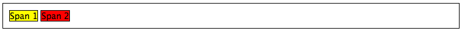

We can see that each element follows its natural flow: the container element with class `container` spans the entire width of its parent container, while each of the `` elements are enclosed inline within the parent. Now suppose that we wish to then move the red element with text `Span 2` to the right of its container. We can achieve this by modifying our CSS `.red` class to look like the following example.

{lang="css",linenos=off}
	.red {
	    background-color: red;
	    border: 1px solid black;
	    float: right;
	}

By applying the `float: right;` property and value pairing, we should then see something similar to the example shown below.

{id="fig-css-ex2"}
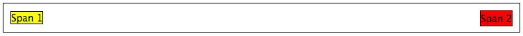

Note how the `.red` element now appears at the right of its parent container, `.container`. We have in effect disturbed the natural flow of our webpage by artificially moving an element! What if we then also applied `float: left;` to the `.yellow` ``?

{id="fig-css-ex3"}
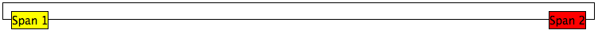

This would float the `.yellow` element, removing it from the natural flow of the webpage. In effect, it is not sitting on top of the `.container` container. This explains why the parent container does not now fill down with the `` elements like you would expect. You can apply the `overflow: hidden;` property to the parent container as shown below to fix this problem. For more information on how this trick works, have a look at [this QuirksMode.org online article](http://www.quirksmode.org/css/clearing.html).

{lang="css",linenos=off}
	.container {
	    border: 1px solid black;
	    overflow: hidden;
	}

{id="fig-css-ex4"}
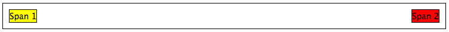

Applying `overflow: hidden` ensures that our `.container` pushes down to the appropriate height.

### Relative Positioning
*Relative positioning* can be used if you require a greater degree of control over where elements are positioned on your webpage. As the name may suggest to you, relative positioning allows you to position an element *relative to where it would otherwise be located.* We make use of relative positioning with the `position: relative;` property and value pairing. However, that's only part of the story.

Let's explain how this works. Consider our previous example where two `` elements are sitting within their container.

{lang="html",linenos=off}
	

	    Span 1
	    Span 2
	

{lang="css",linenos=off}
	.container {
	    border: 1px solid black;
	    height: 200px;
	}
	
	.yellow {
	    background-color: yellow;
	    border: 1px solid black;
	}
	
	.red {
	    background-color: red;
	    border: 1px solid black;
	}

This produces the following result - just as we would expect. Note that we have artificially increased the `height` of our `container` element to 150 pixels. This will allow us more room with which to play with.

{id="fig-css-ex5"}

Now let's attempt to position our `.red` `` element relatively. First, we apply the `position: relative` property and value pairing to our `.red` class, like so.

{lang="css",linenos=off}
	.red {
	    background-color: red;
	    border: 1px solid black;
	    position: relative;
	}

This has no effect on the positioning of our `.red` element. What it does do however is change the positioning of `.red` from `static` to `relative`. This paves the way for us to specify where - from the original position of our element - we now wish the element to be located.

{lang="css",linenos=off}
	.red {
	    background-color: red;
	    border: 1px solid black;
	    position: relative;
	    left: 150px;
	    top: 80px;
	}

By applying the `left` and `top` properties as shown in the example above, we are wanting the `.red` element to be *pushed* 150 pixels *from the left*. In other words, we move the element 150 pixels to the right. Think about that carefully! The `top` property indicates that the element should be pushed 80 pixels from the *top* of the element. The result of our experimentation can be seen below.

{id="fig-css-ex6"}
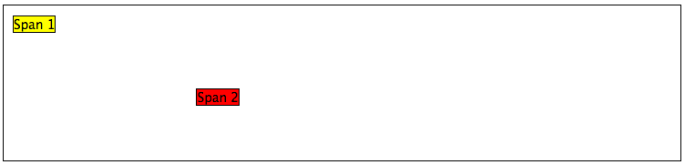

From this behaviour, we can see that the properties `right` and `bottom` *push* elements from the right and bottom respectively. We can test this out by applying the properties to our `.yellow` class as shown below.

{lang="css",linenos=off}
	.yellow {
	    background-color: yellow;
	    border: 1px solid black;
	    float: right;
	    position: relative;
	    right: 10px;
	    bottom: 10px;
	}

This produces the following output. The `.yellow` container is pushed into the top left-hand corner of our container by pushing up and to the right.

{id="fig-css-ex7"}
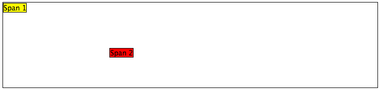

T> ### Order Matters
T>
T> What happens if you apply both a `top` and `bottom` property, or a `left` and `right` property? Interestingly, the *first* property for the relevant axis is applied. For example, if `bottom` is specified before `top`, the `bottom` property is used.

We can even apply relative positioning to elements that are floated. Consider our earlier example where the two `` elements were positioned on either side of the container by floating `.red` to the right.

{id="fig-css-ex8"}
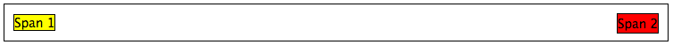

We can then alter the `.red` class to the following.

{lang="css",linenos=off}
	.red {
	    background-color: red;
	    border: 1px solid black;
	    float: right;
	    position: relative;
	    right: 100px;
	}

{id="fig-css-ex9"}

This means that relative positioning works from the position at which the element would have otherwise been at - regardless of any other position changing properties being applied.

### Absolute Positioning
Our final positioning technique is *absolute positioning.* While we still modify the `position` parameter of a style, we use `absolute` as the value instead of `relative`. In contrast to relative positioning, absolute positioning places an element *relative to its first parent element that has a position value other than static.* This may sound a little bit confusing, but let's go through it step by step to figure out what exactly happens.

First, we can again take our earlier example of the two coloured `` elements within a `
` container. The two `` elements are placed side-by-side as they would naturally.

{lang="html",linenos=off}
	

	    Span 1
	    Span 2
	

{lang="css",linenos=off}
	.container {
	    border: 1px solid black;
	    height: 70px;
	}
	
	.yellow {
	    background-color: yellow;
	    border: 1px solid black;
	}
	
	.red {
	    background-color: red;
	    border: 1px solid black;
	}

This produces the output shown below. Note that we again set our `.container` height to an artificial value of 70 pixels to give us more room.

{id="fig-css-ex10"}
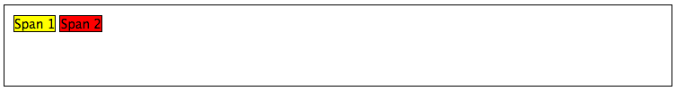

We now apply absolute positioning to our `.red` element.

{lang="css",linenos=off}
	.red {
	    background-color: red;
	    border: 1px solid black;
	    position: absolute;
	}

Like with relative positioning, this has no overall effect on the positioning of our red element in the webpage. We must apply one or more of `top`, `bottom`, `left` or `right` in order for a new position to take effect. As a demonstration, we can apply `top` and `left` properties to our red element like in the example below.

{lang="css",linenos=off}
	.red {
	    background-color: red;
	    border: 1px solid black;
	    position: absolute;
	    top: 0;
	    left: 0;
	}

{id="fig-css-ex11"}
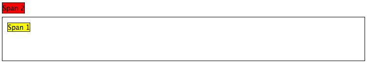

Wow, what happened here? Our red element is now positioned outside of our container! You'll note that if you run this code within your own web browser window, the red element appears in the top left-hand corner of the viewport. This therefore means that our `top`, `bottom`, `left` and `right` properties take on a slightly different meaning when absolute positioning is concerned.

As our container element's position is by default set to `position: static`, the red and yellow elements are moving to the top left and bottom right of our screen respectively. Let's now modify our `.yellow` class to move the yellow `` to 5 pixels from the bottom right-hand corner of our page. The `.yellow` class now looks like the example below.

{lang="css",linenos=off}
	.yellow {
	    background-color: yellow;
	    border: 1px solid black;
	    position: absolute;
	    bottom: 5px;
	    right: 5px;
	}

This produces the following result.

{id="fig-css-ex12"}
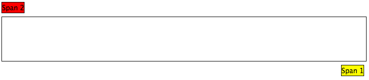

But what if we don't want our elements to be positioned absolutely in relation to the entire page? More often than not, we'll be looking to adjusting the positioning of our elements in relation to a container. If we recall our definition for absolute positioning, we will note that absolute positions are calculated *relative to the first parent element that has a position value other than static.* As our container is the only parent for our two `` elements, the container to which the absolutely positioned elements is therefore the `<body>` of our HTML page. We can fix this by adding `position: relative;` to our `.container` class, just like in the example below.

{lang="css",linenos=off}
	.container {
	    border: 1px solid black;
	    height: 70px;
	    position: relative;
	}

This produces the following result. `.container` becomes the first parent element with a position value of anything other than `relative`, meaning our `` elements latch on!

{id="fig-css-ex13"}
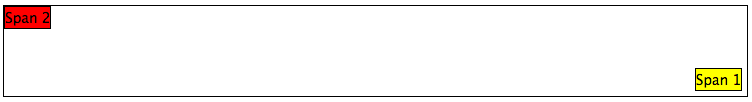

Our elements are now absolutely positioned in relation to `.container`. Great! Now, let's adjust the positioning values of our two `` elements to move them around.

{lang="css",linenos=off}
	.yellow {
	    background-color: yellow;
	    border: 1px solid black;
	    position: absolute;
	    top: 20px;
	    right: 100px;
	}
	
	.red {
	    background-color: red;
	    border: 1px solid black;
	    position: absolute;
	    float: right;
	    bottom: 50px;
	    left: 40px;
	}

{id="fig-css-ex14"}
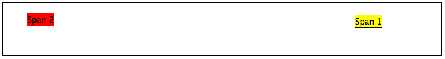

Note that we also apply `float: right;` to our `.red` element. This is to demonstrate that unlike relative positioning, absolute positioning *ignores any other positioning properties applied to an element*. `top: 10px` for example will always ensure that an element appears 10 pixels down from its parent (set with `position: relative;`), regardless of whether the element has been floated or not.

## The Box Model {#section-css-box}
When using CSS, you're never too far away from using *padding*, *borders* and *margins*. These properties are some of the most fundamental styling techniques which you can apply to the elements within your webpages. They are incredibly important and are all related to what we call the *CSS box model.*

Each element that you create on a webpage can be considered as a box. The [CSS box model](http://www.w3.org/TR/CSS2/box.html) is defined by the [W3C](http://www.w3.org/) as a formal means of describing the elements or boxes that you create, and how they are rendered in your web browser's viewport. Each element or box consists of *four separate areas*, all of which are illustrated in the [figure below](#image-css-box-model). The areas - listed from inside to outside - are the *content area*, the *padding area*, the *border area* and the *margin area*.

{#image-css-box-model}
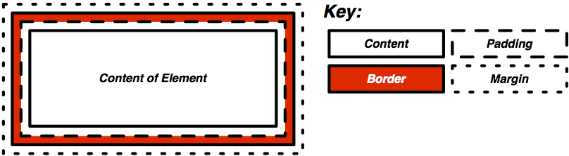

For each element within a webpage, you can create a margin, apply some padding or a border with the respective properties `margin`, `padding` and `border`. Margins clear a transparent area around the border of your element; meaning margins are incredibly useful for creating a gap between elements. In contrast, padding creates a gap between the content of an element and its border. This therefore gives the impression that the element appears wider. If you supply a background colour for an element, the background colour is extended with the element's padding. Finally, borders are what you might expect them to be - they provide a border around your element's content and padding.

For more information on the CSS box model, check out [addedbytes excellent explanation of the model](http://www.addedbytes.com/articles/for-beginners/the-box-model-for-beginners/). [Why not even order a t-shirt with the box model on it](http://cssboxmodel.com/)?

W> ### Watch out for the `width`!
W>
W> As you may gather from the [box model illustration](#image-css-box-model), the width of an element isn't defined simply by the value you enter as the element's `width`. Rather, you should always consider the width of the border and padding on both sides of your element. This can be represented mathematically as:
W>
W> `total_width = content_width + left padding + right padding + left border + left margin + right margin`
W>
W> Don't forget this. You'll save yourself a lot of trouble if you don't!

## Styling Lists
Lists are everywhere. Whether you're reading a list of learning outcomes for a course or a reading a list of times for the train, you know what a list looks like and appreciate its simplicity. If you have a list of items on a webpage, why not use a HTML list? Using lists within your webpages - [according to Brainstorm and Raves](http://brainstormsandraves.com/articles/semantics/structure/) - promotes good HTML document structure, allowing text-based browsers, screen readers and other browsers that do not support CSS to render your page in a sensible manner.

Lists however don't look particularly appealing to end-users. Take the following HTML list that we'll be styling as we go along trying out different things.

{lang="html",linenos=off}
	<ul class="sample-list">
	    <li>Django</li>
	    <li>How to Tango with Django</li>
	    <li>Two Scoops of Django</li>
	</ul>

Rendered without styling, the list looks pretty boring.

{id="fig-css-ex15"}
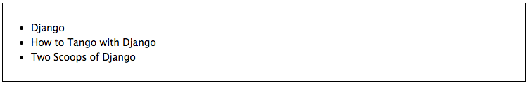

Let's make some modifications. First, let's get rid of the ugly bullet points. With our `<ul>` element already (and conveniently) set with class `sample-list`, we can create the following style.

{lang="css",linenos=off}
	.sample-list {
	    list-style-type: none;
	}

This produces the following result. Note the lack of bullet points!

{id="fig-css-ex16"}

Let's now change the orientation of our list. We can do this by altering the `display` property of each of our list's elements (`<li>`). The following style maps to this for us.

{lang="css",linenos=off}
	.sample-list li {
	    display: inline;
	}

When applied, our list elements now appear on a single line, just like in the example below.

{id="fig-css-ex17"}
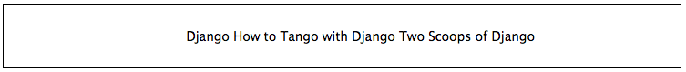

While we may have the correct orientation, our list now looks awful. Where does one element start and the other end? It's a complete mess! Let's adjust our list element style and add some contrast and padding to make things look nicer.

{lang="css",linenos=off}
	.example-list li {
	    display: inline;
	    background-color: #333333;
	    color: #FFFFFF;
	    padding: 10px;
	}

When applied, our list looks so much better - and quite professional, too!

{id="fig-css-ex18"}
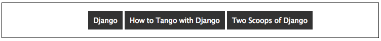

From the example, it is hopefully clear that lists can be easily customised to suit the requirements of your webpages. For more information and inspiration on how to style lists, you can check out some of the selected links below.

-   Have a look at [this excellent tutorial on styling lists on A List Apart](http://alistapart.com/article/taminglists/).
-   Check out [this advanced tutorial from Web Designer Wall](http://webdesignerwall.com/tutorials/advanced-css-menu) that uses graphics to make awesome looking lists. In the tutorial, the author uses Photoshop - you could try using a simpler graphics package if you don't feel confident with Photoshop.
-   [This site](http://learn.shayhowe.com/html-css/creating-lists/) provides some great inspiration and tips on how you can style lists.

The possibilities of styling lists are endless! You could say it's a never-ending list...

## Styling Links {#section-css-links}
CSS provides you with the ability to easily style hyperlinks in any way you wish. You can change their colour, their font or any other aspect that you wish - and you can even change how they look when you hover over them!

Hyperlinks are represented within a HTML page through the `<a>` tag, which is short for *anchor*. We can apply styling to all hyperlinks within your webpage as shown in following example.

{lang="css",linenos=off}
	a {
	    color: red;
	    text-decoration: none;
	}

Every hyperlink's text colour is changed to red, with the default underline of the text removed. If we then want to change the `color` and `text-decoration` properties again when a user hovers over a link, we can create another style using the so-called [pseudo-selector](http://css-tricks.com/pseudo-class-selectors/) `:hover`. Our two styles now look like the example below.

{lang="css",linenos=off}
	a {
	    color: red;
	    text-decoration: none;
	}
	
	a:hover {
	    color: blue;
	    text-decoration: underline;
	}

This produces links as shown below. Notice the change in colour of the second link - it is being hovered over.

{id="fig-css-ex19"}

You may not however wish for the same link styles across the entire webpage. For example, your navigation bar may have a dark background while the rest of your page has a light background. This would necessitate having different link stylings for the two areas of your webpage. The example below demonstrates how you can apply different link styles by using a slightly more complex CSS style selector.

{lang="css",linenos=off}
	#dark {
	    background-color: black;
	}
	
	#dark a {
	    color: white;
	    text-decoration: underline;
	}
	
	#dark a:hover {
	    color: aqua;
	}
	
	.light {
	    background-color: white;
	}
	
	.light a {
	    color: black;
	    text-decoration: none;
	}
	
	.light a:hover {
	    color: olive;
	    text-decoration: underline;
	}

We can then construct some simple markup to demonstrate these classes.

{lang="html",linenos=off}
	

	    <a href="http://www.google.co.uk/">Google Search</a>
	

	
	

	    <a href="http://www.bing.co.uk/">Bing Search</a>
	

The resultant output looks similar to the example shown below. Code up the example above, and hover over the links in your browser to see the text colours change!

{id="fig-css-ex20"}
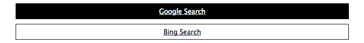

With a small amount of CSS, you can make some big changes in the way your webpages appear to users.

## The Cascade
It's worth pointing out where the *Cascading* in *Cascading Style Sheets* comes into play. [Looking back at the CSS rendering example way back at the start of this chapter](#image-css-render), you will notice that the red text shown is **bold**, yet no such property is defined in our `h1` style. This is a perfect example of what we mean by *cascading styles*. Most HTML elements have associated with them a *default style* which web browsers apply. For `<h1>` elements, the [W3C website provides a typical style that is applied](http://w3c.github.io/html-reference/h1.html). If you check the typical style, you'll notice that it contains a `font-weight: bold;` property and value pairing, explaining where the **bold** text comes from. As we define a further style for `<h1>` elements, typical property/value pairings *cascade* down into our style. If we define a new value for an existing property/value pairing (such as we do for `font-size`), we *override* the existing value. This process can be repeated many times - and the property/value pairings at the end of the process are applied to the relevant element. Check out the [figure below](#image-css-cascading) for a graphical representation of the cascading process.

{#image-css-cascading}

## Additional Reading
What we've discussed in this section is by no means a definitive guide to CSS. There are [300-page books](http://www.amazon.co.uk/Professional-CSS-Cascading-Sheets-Design/dp/047017708X) devoted to CSS alone! What we have provided you with here is a very brief introduction showing you the very basics of what CSS is and how you can use it.

As you develop your web applications, you'll undoubtedly run into issues and frustrating problems with styling web content. This is part of the learning experience, and you still have a bit to learn. We strongly recommend that you invest some time trying out several online tutorials about CSS - there isn't really any need to buy a book (unless you want to).

-   The *W3C* [provides a neat tutorial on CSS](http://www.w3.org/Style/Examples/011/firstcss.en.html), taking you by the hand and guiding you through the different stages required. They also introduce you to several new HTML elements along the way, and show you how to style them accordingly.
-   [W3Schools also provides some cool CSS tutorials](http://www.w3schools.com/css/css_examples.asp). Instead of guiding you through the process of creating a webpage with CSS, *W3Schools* has a series of mini-tutorials and code examples to show you to achieve a particular feature, such as setting a background image. We highly recommend that you have a look here.
-   [html.net has a series of lessons on CSS](http://html.net/tutorials/css/) which you can work through. Like W3Schools, the tutorials on *html.net* are split into different parts, allowing you to jump into a particular part you may be stuck with.

This list is by no means exhaustive, and a quick web search will indeed yield much more about CSS for you to chew on. Just remember: CSS can be tricky to learn, and there may be times where you feel you want to throw your computer through the window. We say this is pretty normal - but take a break if you get to that stage. We'll be tackling some more advanced CSS stuff as we progress through the tutorial in the next few sections.

I> ### CSS And Browser Compatibility
I>
I> With an increasing array of devices equipped with more and more powerful processors, we can make our web-based content do more. To keep up, [CSS has constantly evolved](http://blogs.adobe.com/dreamweaver/2015/12/the-evolution-of-css.html) to provide new and intuitive ways to express the presentational semantics of our SGML-based markup. To this end, support [for relatively new CSS properties](http://www.quackit.com/css/css3/properties/) may be limited on several browsers, which can be a source of frustration. The only way to reliably ensure that your website works across a wide range of different browsers and platforms is to [test, test and test some more!](http://browsershots.org/)
