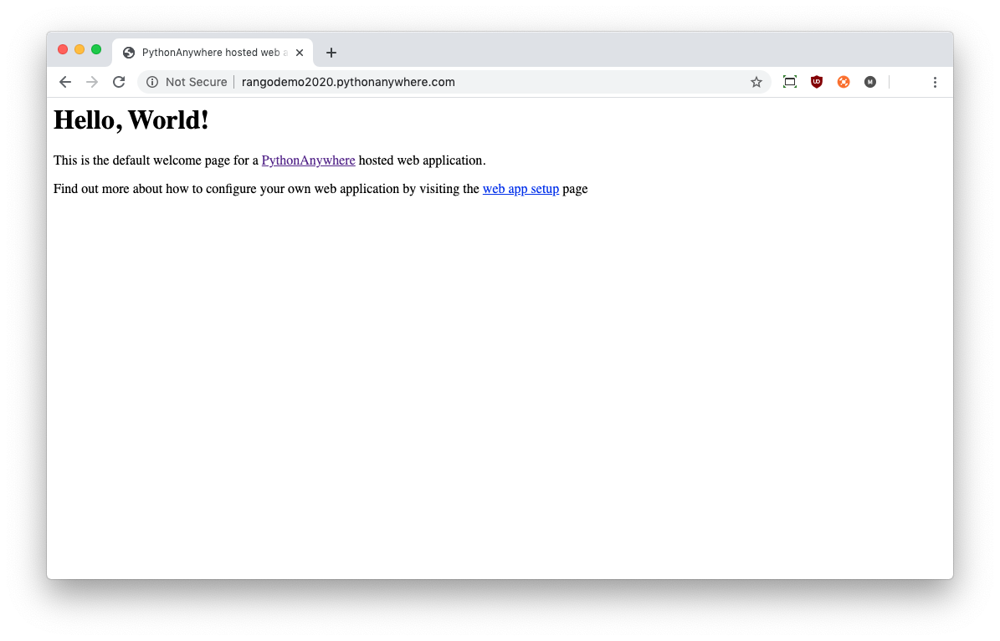
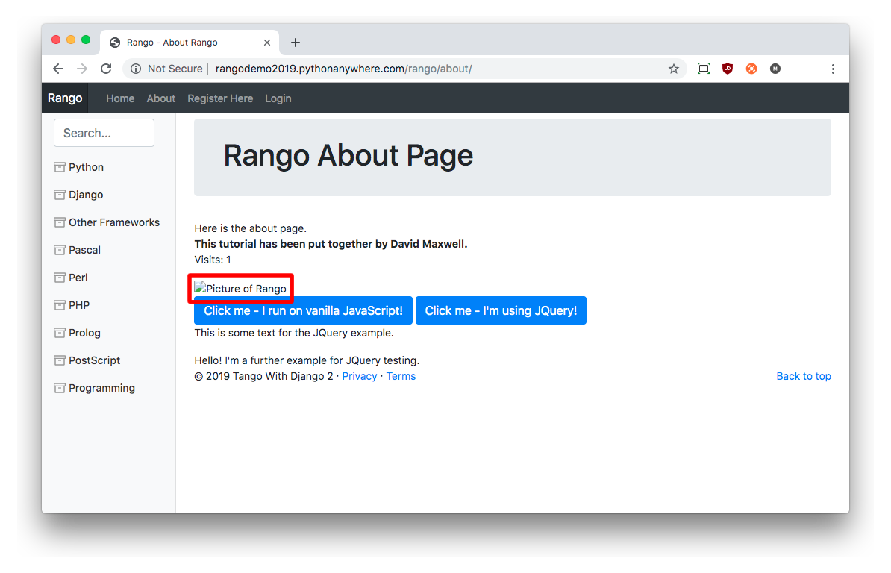
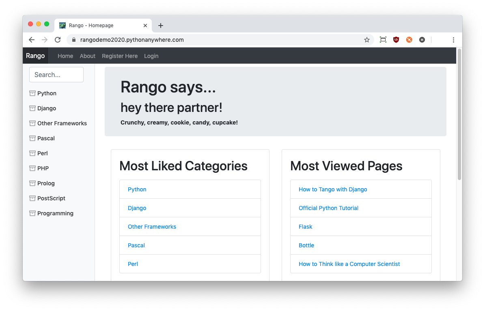

# Deploying Your Project {#chapter-deploy}
This chapter provides a step-by-step guide on how to deploy your Django application on  [PythonAnywhere](https://www.pythonanywhere.com/?affiliate_id=000116e3). PythonAnywhere is an online IDE and web hosting service, geared towards hosting Python applications. The service provides in-browser access to the server-based Python and Bash command line interfaces, meaning you can interact with PythonAnywhere's servers just like you would with a regular terminal instance on your computer. Currently, PythonAnywhere is offering a free beginner account, which is perfect to get started. It provides you with an adequate amount of storage space and CPU time to get a single Django project up and running.

I> ### Are you using Git?
I> You can do this chapter independently as we have already implemented Rango and it is [available from GitHub](https://github.com/maxwelld90/tango_with_django_2_code). If you haven't used Git/GitHub before, you can check out our [chapter on using Git](#chapter-git).

## Creating a PythonAnywhere Account
First, [sign up for a Beginner PythonAnywhere account](https://www.pythonanywhere.com/?affiliate_id=000116e3). We recommend that you take the seven-step tour to get familiar with the PythonAnywhere interface. If your application takes off and becomes popular, you'll always have the ability to upgrade your account at a later date to gain more storage space and CPU time along with several other benefits, such as hosting specific domains and the ability to [SSH](https://en.wikipedia.org/wiki/Secure_Shell) in, for example.

Once your account has been created and you have confirmed your email, you will have your little slice of the World Wide Web at `http://<username>.pythonanywhere.com`, where `<username>` is your PythonAnywhere username. It is from this URL that your hosted application will be available.

I> ### Your Username
I> Your username will vary from the one we have used to demonstrate the functionality of PythonAnywhere. We chose `rangodemo2019`, and you'll see this throughout the screenshots and code snippets in this chapter. Simply substitute `rangodemo2019` with your username when required.

## The PythonAnywhere Web Interface
The PythonAnywhere web interface contains a *dashboard* which in turn provides a series of different components allowing you to manage your application. The components as [illustrated in the figure below](#pa-interface) include:

- *Consoles*, allowing you to create and interact with Python and Bash console instances;
- *Files*, which allows you to upload to and organise files within your disk quota; and
- *Web apps*, allowing you to configure settings for your hosted web application;

Other components exist, such as *Notebooks*, but we won't be using them here -- we'll be working primarily with the *consoles* and *web app* components. The [PythonAnywhere Wiki](https://www.pythonanywhere.com/wiki/) provides a series of detailed explanations on how to use the other components if you are interested in finding out more.

{#pa-interface}

## Creating a Virtual Environment
As part of its standard default Bash environment, PythonAnywhere comes with Python 2.7+ and several pre-installed Python Packages (including *Django*). Since we are using a different setup, we need to set up the Python 3 version manually through the creation of a virtual environment.

First, open a Bash console. By clicking `$ Bash` from under the `New console` header. If you run `python --version` then you will see that the Python is 2.7+. To set up our Python 3.7+ environment, we'll need to issue the following command.

{lang="bash",linenos=off}
	$ mkvirtualenv -p python3.7 rangoenv
	Running virtualenv with interpreter /usr/bin/python3.7
	Using base prefix '/usr'
	New python executable in /home/rangodemo2019/.virtualenvs/rangoenv/bin/python3.7
	Also creating executable in /home/rangodemo2019/.virtualenvs/rangoenv/bin/python
	Installing setuptools, pip, wheel...done.
	virtualenvwrapper.user_scripts creating
	    /home/rangodemo2019/.virtualenvs/rangoenv/bin/predeactivate
	virtualenvwrapper.user_scripts creating
	    /home/rangodemo2019/.virtualenvs/rangoenv/bin/postdeactivate
	virtualenvwrapper.user_scripts creating
	    /home/rangodemo2019/.virtualenvs/rangoenv/bin/preactivate
	virtualenvwrapper.user_scripts creating
	    /home/rangodemo2019/.virtualenvs/rangoenv/bin/postactivate
	virtualenvwrapper.user_scripts creating
	    /home/rangodemo2019/.virtualenvs/rangoenv/bin/get_env_details

Above we have used Python 3.7, but you can check which version of Python you are using, and use that instead. Remember that `rangodemo2019` will be replaced with your username. The process of creating the virtual environment will take a little while to complete (as you are using a host shared with many others). After the environment has been created, you will be presented with a slightly different prompt. Exciting stuff!

{lang="text",linenos=off}
	(rangoenv) ~ $

Note the inclusion of `(rangoenv)` compared to the previous prompt. This signifies that the `rangoenv` virtual environment has been activated, so any package installations will be done within that virtual environment, leaving the wider system setup alone. If you issue the command `ls -la`, you will see that a directory called `.virtualenvs` has been created. This is the directory in which all of your virtual environments and associated packages will be stored. To confirm the setup, issue the command `which pip`. This will print the location in which the active `pip` binary is located - hopefully within `.virtualenvs` and `rangoenv`, as shown in the example below.

{lang="text",linenos=off}
	/home/rangodemo2019/.virtualenvs/rangoenv/bin/pip

To see what packages are already installed, enter `pip list`. Now we can customise the virtual environment by installing the required packages for our Rango application. Install all the required packages by issuing the following commands.

{lang="text",linenos=off}
	$ pip install django==2.1.5
	$ pip install pillow==5.4.1
	$ pip install django-registration-redux==2.2
	$ pip install requests
	$ pip install coverage

If you decided to use the [optional Bcrypt password hasher](#sec-user-passwordhash), you'll also need to install the Bcrypt library.

{lang="text",linenos=off}
	$ pip install bcrypt

**Ensure that you replace the version of Django specified above with the one you are using for development.** Here we have used version 2.1.5. Remember that this book supports a range of versions, from 2.0 to 2.2. Not using the same version as your development machine could lead to some weird errors, which will be frustrating, to say the least. To ensure you have the same setup, we recommend using `pip freeze > requirements.txt` on your local development machine. This will note down all the packages in your current development environment. Then on PythonAnywhere, you can run `pip install -r requirements.txt` to install all the packages in one go.

T> ### Using `requirements.txt`?
T> If you went down the path of using `pip freeze` on your computer to create a `requirements.txt` file of all packages, this should have been added to your Git repository.
T>
T> In this instance, [skip to cloning your repository first](#sec-deploy-cloning), then come back here. When you clone your repository, you gain access to your requirements files, which means you can then install all the packages to your `rangoenv` virtual environment on PythonAnywhere with the command `pip install -r requirements.txt`.

I> ### Waiting to Download...
I> Since you're on a shared host, downloading and installing these packages will take considerably longer than doing so on your own computer. Don't worry if you think it's crashed -- give it time!

Once installed, check if Django has been installed correctly. You can do this with the command `which django-admin.py`. You should receive output similar to the following.

{lang="text",linenos=off}    
	/home/rangodemo2019/.virtualenvs/rangoenv/bin/django-admin.py

I> ### Virtual Environments on PythonAnywhere
I> PythonAnywhere also provides instructions on how to set up virtual environments. [Check out their Wiki documentation for more information](https://help.pythonanywhere.com/pages/VirtualEnvForNewerDjango).

### Virtual Environment Switching
Moving between virtual environments can be done pretty easily. PythonAnywhere should have this covered for you. Below, we provide you with a quick tutorial on how to switch between virtual environments.

You can launch into an existing virtual environment with the `workon` command. For example, load up the `rangoenv` environment with the following command.

{lang="text",linenos=off}
	~ $ workon rangoenv

Here, `rangoenv` can be replaced with the name of the virtual environment you wish to use. Your prompt should then change to indicate you are working within a virtual environment. This is shown by the addition of `(rangoenv)` to your prompt.

{lang="text",linenos=off}
	(rangoenv) ~ $

You can then leave the virtual environment using the `deactivate` command. Your prompt should then be missing the `(rangoenv)` prefix, with an example shown below. This confirms that the environment has been successfully deactivated.

{lang="text",linenos=off}
	(rangoenv) ~ $ deactivate
	~ $

### Cloning your Git Repository {#sec-deploy-cloning}
Now that your virtual environment for Rango is all set up, you can now clone your Git repository to obtain a copy of your project's files. Clone your repository by issuing the following command from your home directory.

{lang="text",linenos=off}
	$ git clone https://github.com/<OWNER>/<REPO_NAME>

You will of course be looking to replace `<OWNER>` with the username of the person who owns the repository and `<REPO_NAME>` with the name of your project's repository. For example, a repository `tango_with_django_project` hosted by `djangolearner` would have the following command.

{lang="text",linenos=off}
	$ git clone https://github.com/djangolearner/tango_with_django_project

You'll see the following output showing that the cloning of the repository was successful.

{lang="text",linenos=off}
	$ git clone https://github.com/djangolearner/tango_with_django_project/
	Cloning into 'tango_with_django_project'...
	remote: Enumerating objects: 335, done.
	remote: Counting objects: 100% (335/335), done.
	remote: Compressing objects: 100% (239/239), done.
	remote: Total 335 (delta 203), reused 213 (delta 81), pack-reused 0
	Receiving objects: 100% (335/335), 1.11 MiB | 484.00 KiB/s, done.
	Resolving deltas: 100% (203/203), done.
	Checking connectivity... done.
	Checking out files: 100% (54/54), done.

### Setting Up the Database
With your repository cloned, you must then prepare your database. If you have the database committed to the repository, delete this copy. We'll start from scratch. We'll also be making use of the `populate_rango.py` module that we created earlier in the book to populate the database with sample data. As we'll be running the module, you must ensure that you are using the `rangoenv` virtual environment (i.e. you see `(rangoenv)` as part of your prompt -- if not, invoke `workon rangoenv`).

From your home directory (denoted by the `~` in your prompt), you want to navigate to the directory containing your `manage.py` and `populate_rango.py` scripts. Following the instructions we provided earlier, this would be at `~/tango_with_django_project/` -- the directory that you just cloned. If you chose to follow a different structure, navigate to the location where these files are stored.

T> ### How do I navigate?
T> In a Bash terminal, you can change the directory with the `cd` command, followed by the path you wish to change to. In this instance, you would issue the command `cd ~/tango_with_django_project/`.
T>
T> Note that when you change directory, your prompt will change to reflect your *present working directory.* `~ $` would change to `~/tango_with_django_project $`, for instance.

Once you have changed directory, issue the following commands. These should be second nature to you by now!

{lang="text",linenos=off}
	$ python manage.py makemigrations rango
	$ python manage.py migrate
	$ python populate_rango.py
	$ python manage.py createsuperuser

You should know exactly what all of these commands do. Of course, the final command will require some interaction on your part to create an administrator's account for your Django project.

## Setting up your Web Application
Now that the database is set up, we need to configure the PythonAnywhere [*NGINX*](https://www.nginx.com/resources/wiki/) webserver to serve up your application. To do this, navigate back to your PythonAnywhere dashboard, find the *Web apps* section, and click the *Open Web tab* button. On the left of the page that appears, click *Add a new web app.*

A popup box will then appear. Follow the instructions on-screen, and when the time comes, select the *manual configuration* option and complete the wizard. Make sure you select the same Python version as the one you selected earlier. Click *Next*, and PythonAnywhere will then set up your web app, redirecting you to an updated *Web app* page, complete with a green button to reload the app.

In a new tab or window in your web browser, go visit your PythonAnywhere subdomain at the address `http://<username>.pythonanywhere.com`. You should be presented with the [default `Hello, World!` webpage, as shown below](#hello-world). This is because the WSGI script is currently serving up this simple page, and not your Django application. This is the next thing we need to work on -- updating the WSGI to serve your Django app instead!

{#hello-world}

### Configure the Virtual Environment
However, before we do this, we need to configure our new web app to use the virtual environment we set up previously. Navigate to the *Web* tab in PythonAnywhere's interface if you aren't already there. From there, scroll down the page until you see the heading *Virtualenv*. 

Enter the path to your virtual environment. Click the red text, which is replaced with an input box. Assuming you created a virtual environment called `rangoenv`, the path would be:

{lang="text",linenos=off} 
	/home/rangodemo2019/.virtualenvs/rangoenv

When you have entered the path, click the tick so submit it. Once again, we ask you to replace `rangodemo2019` with your PythonAnywhere username.

Now scroll to the *Code* section. From here, you can set the path to your Django project's source code. Click the red text next to *Source code*, which will again turn into an input field.

{lang="text",linenos=off} 
	/home/rangodemo2019/tango_with_django_project/

Once again, replace `rangodemo2019` with your username, and make sure that the path after the username points to the directory that stores your `manage.py` script. This is imperative: you can open a new Bash *Console* to double-check if you aren't sure what the path is. If you do have to do this, you can navigate to the correct directory, type `ls` to confirm that `manage.py` is indeed present in that directory, and then issue the command `pwd` to retrieve the full path to that directory. This is the path you will need to supply.

### Configuring the WSGI Script
The *[Web Server Gateway Interface](http://en.wikipedia.org/wiki/Web_Server_Gateway_Interface) (WSGI)* provides a simple and universal interface between web servers and web applications. PythonAnywhere uses WSGI to bridge the server-application link and map incoming requests to your subdomain to your web application.

To configure the WSGI script, navigate to the *Web* tab in PythonAnywhere's interface. Under the *Code* header, you can see a link to the WSGI configuration file in the Code section: e.g. `/var/www/rangodemo2019_pythonanywhere_com_wsgi.py`. Of course, the `rangodemo2019` part will have your username instead.

The people at PythonAnywhere have set up a sample WSGI file for us with several possible configurations. For your web application, you'll need to configure the Django section of the file by clicking on the link to open a simple editor. The example below demonstrates a possible configuration for your application.

{lang="python",linenos=off}
	import os
	import sys
	
	# Add your project's directory the PYTHONPATH
	path = '/home/rangodemo2019/tango_with_django_project/'
	if path not in sys.path:
	    sys.path.append(path)
	
	# Move to the project directory
	os.chdir(path)
	
	# Tell Django where the settings.py module is located
	os.environ.setdefault('DJANGO_SETTINGS_MODULE',
	                      'tango_with_django_project.settings')
	
	# Set up Django -- let it instantiate everything!
	import django
	django.setup()
	
	# Import the Django WSGI to handle requests
	import django.core.handlers.wsgi
	application = django.core.handlers.wsgi.WSGIHandler()

Once again, ensure that you replace `rangodemo2019` with your PythonAnywhere username, and update any other path settings to suit your application. The `path` variable should contain the absolute path to the directory containing your `manage.py` script. You should also remove all other code from the WSGI configuration script to ensure no conflicts take place, leaving only the code we provide above.

The script adds your project's directory to the `PYTHONPATH` for the Python instance that runs your web application. This allows Python to access your project's modules. If you have additional paths to add, you can easily insert them here. You can then specify the location of your project's `settings.py` module. The final step is to include the Django WSGI handler and invoke it for your application by setting the `application` variable.

When you have completed the WSGI configuration, click the green *Save* button at the top of the webpage. Before we can (re)load the application, we need to set a few security parameters (see the [Django Documentation for a Security Deployment Checklist](https://docs.djangoproject.com/en/2.1/howto/deployment/checklist/)).

### Allowing your Hostname
Django provides a useful feature which will only accept requests from *allowed* hosts. By only allowing specified domains to be served by your web server, this reduces the chance that your app could be part of a [HTTP Host Header attack](https://www.acunetix.com/blog/articles/automated-detection-of-host-header-attacks/). If you were to load and view your application now, you would encounter a `DisallowedHost` exception stopping your app from loading.

This is a simple problem to fix and involves a change in your project's `settings.py` module. First, work out your app's URL on PythonAnywhere. For a basic account, this will be `rangodemo2019.pythonanywhere.com`, where `rangodemo2019` is replaced with your PythonAnywhere username. It's a good idea to edit this file locally (on your computer), then `git add`, `git commit` and `git push` your changes to your Git repository, before downloading the changes to your PythonAnywhere account. Alternatively, you can edit the file directly on PythonAnywhere by editing the file in the web interface's files component -- or using a text editor in the terminal, like `nano` or `vi`.

With this information, open your project's `settings.py` module and locate the `ALLOWED_HOSTS` list, which by default will be empty (and found near the top of the file). Add a string with your PythonAnywhere URL into that list -- such that it now looks like the following example.

{lang="python",linenos=off}
	ALLOWED_HOSTS = ['rangodemo2019.pythonanywhere.com']

If you have edited the file on your computer, you can now go through the (hopefully) familiar process of running the `git add settings.py`, `git commit` and `git push` commands to make changes to your Git repository. Once done, you should then run the `git pull` command to retrieve the changes on your PythonAnywhere account through a console. If you have edited the file directly on PythonAnywhere, simply save the file.

T> ### No Place like `127.0.0.1`
T> When debugging, you might also want to add the host `127.0.0.1` to your `ALLOWED_HOSTS` list so that you'll be able to continue working on your app locally. Of course, this should be removed in production.

All that then remains is for you to reload your PythonAnywhere app. This can be done by clicking the *Reload* button in the PythonAnywhere *Web* page. Once you've done this, access your app's URL, and you should [see your app working, but without static media](#fig-deploy-nostatic). We'll address this issue shortly.

{#fig-deploy-nostatic}

	
I> ### Bad Gateway Errors
I> During deployment sometimes you might receive `HTTP 502 - Bad Gateway` errors instead of your application. Try reloading your application again, and then waiting a little longer. If the problem persists, try reloading again. If the problem persists, [check out your log files](#section-deploy-logfiles) to see if any errors are occurring before contacting the PythonAnywhere support.

### Setting the Secret Key
It is wise not to commit your secret key to your git repository -- and instead load the key in from a separate, uncommitted file. To do this, open your project's `settings.py` file and either change the secret key that you are using in production (a hacky solution), or load it from a file, as we demonstrate with the example below.

{lang="python",linenos=off}
	key = None
	with open('/home/rangodemo2019/secret.key') as f:
	    key = f.read().strip()
	
	SECRET_KEY = key

This sets `SECRET_KEY` to the contents of the `secret.key` file, located in your home directory. Create this file, and take the string representation of `SECRET_KEY` from `settings.py`, and paste it into that new file. This neatly separates your secret key from being placed in a repository! Of course, this is just to demonstrate -- anyone can look at a previous commit from your repository and take the key. In future Django projects, keep this in mind!

### Adding your Search API Key
While you are adding secret keys, also [add your search API key](#section-bing-adding-key) to the file `bing.key`. This will ensure that the search functionality in Rango is enabled. You'll again want to keep this file outside of your repository.

### Turning off `DEBUG` Mode
Next, you need to turn off debug mode. If you leave debug mode on, your deployment can provide malicious users with sensitive information about your web application when they get it to crash through the helpful error messages that will have undoubtedly helped you during development.

Therefore, we highly recommend that you instruct Django that it is now running on a production server. To do this, open your project's `settings.py` file and change `DEBUG = True` to `DEBUG = False`. This disables [Django's debug mode](https://docs.djangoproject.com/en/2.1/ref/settings/#debug), and removes explicit error messages. However, you can still view Python stack traces to debug any exceptions that are raised as people use your app. These are provided in the server logs, as we will [discuss later](#section-deploy-logfiles).

T> ### Remember to `git add`, `git commit` and `git push` -- and Reload!
T> If you edit your files locally, you'll need to push them up to your Git repository and `git pull` in a PythonAnywhere console.
T> Furthermore, remember to reload your app on PythonAnywhere anytime you make changes to it! If you don't, your changes won't be applied. This can be done by pushing the green *Reload* button in the *Web* tab of the PythonAnywhere interface.

### Assigning Static Paths
We're almost there. One issue that we still have to address is to sort out the static paths for our application. Doing so will allow PythonAnywhere's servers to serve your project's static content. Open the *Web* tab of the PythonAnywhere interface to fix this.

Once loaded, perform the following under the *Static files* header. Here, we need to add the correct URLs and filesystem paths to allow PythonAnywhere's web server to find and serve your static media files.

First, we should set the location of the Django admin interface's static media files. Click the *Enter URL* text, and type in `/static/admin/`. Click the tick to confirm your input, and then click the *Enter path* link to the right, entering the following long-winded filesystem path (all on a single line). Be careful! We need to split the line up here to make it fit...

{lang="python",linenos=off}  
	/home/rangodemo2019/.virtualenvs/rangoenv/lib/python3.7/site-packages/django/
	  contrib/admin/static/admin

As usual, replace `rangodemo2019` with your PythonAnywhere username. `python3.7` should also be replaced with the version of Python that you are using, be it `python3.6` or `python3.7`. This has to match the version you selected for your virtual environment. You may also need to change `rangoenv` if this is not the name of your application's virtual environment. Remember to click the tick to confirm your input.

We will also need to add a further mapping to serve Rango's static files. Once again. click *Enter URL*, this time on the second line, and enter `/static/`. Confirm this entry. The path entry should then be something similar to `/home/rangodemo2019/tango_with_django_project/static`. In essence, you should point this path to the location of the `static` directory in your project. For our example, this path works -- `rangodemo2019` is our PythonAnywhere username, and `tango_with_django_project` is the directory in which our Git repository was cloned.

Once completed, your app should then have access to its stylesheets, images and JavaScript files. The same applies to the Django admin interface. Don't forget to *Reload* your app once these paths have been applied!

### Enabling HTTPS
PythonAnywhere also provides really straightforward support for enabling [HTTPS](https://en.wikipedia.org/wiki/HTTPS) functionality, adding a layer of encryption between the client and the server. PythonAnywhere can provide you with a security certificate to say your app is genuine. It's super easy, and definitely worth doing!

To enable HTTPS, go to the *Web* tab of the PythonAnywhere interface, and look for the *Security* section. Find the switch for *Force HTTPS*, and switch this feature on. Once you have done this, scroll up to the top of the page and *Reload* your app once more. If you then navigate to your app's URL, you should then notice that you are redirected to `https://rangodemo2019.pythonanywhere.com` (of course, replacing `rangodemo2019` with your username!) -- denoting that you are using your app using HTTPS.

{#fig-deploy-https}

## Log Files {#section-deploy-logfiles}
Deploying your app to an online environment introduces another layer of complexity to proceedings. You will likely encounter new and potentially confusing errors due to a whole host of additional problems you can face. When facing such errors, vital clues to help you solve them can be found in one of three log files that PythonAnywhere's web server creates for you.

If you find yourself confused with an issue, you can view the log files on the PythonAnywhere web interface. Clicking the *Web* tab, look for the *Log files* section. Alternatively, you can access logs from the console in directory `/var/log/`. The three log files are:

- `access.log`, which provides a log of requests made to your subdomain;
- `error.log`, which logs any error messages produced by your web application; and
- `server.log`, providing log details for the UNIX processes running your application.

Note that the names for each log file are prepended with your subdomain. For example...

{lang="text",linenos=off}
	access.log

would have the complete filename

{lang="text",linenos=off}
	rangodemo2019.pythonanywhere.com.access.log.

When debugging, you may find it useful to delete or move the log files so that you don't have to scroll through a huge list of previous attempts. If the files are moved or deleted, they will be recreated automatically when a new request or error arises. The most recent issue appears at the bottom of the file, and it will provide you with the clues you need to solve it. Remember, you can always paste the error message into your search engine to see what others have done to solve the problem. We are sure that you won't be the first person to encounter the problem you are facing!

X> ###Exercises
X> Congratulations, you've completed and deployed Rango!
X> 
X> - Go through the [Django's Security Deployment Checklist](https://docs.djangoproject.com/en/2.1/howto/deployment/checklist/) and configure your application to be more secure.
X> -  Tweet a link of your application to [@tangowithdjango](https://twitter.com/tangowithdjango).
X> -  Tweet or e-mail us to let us know your thoughts on the tutorial!