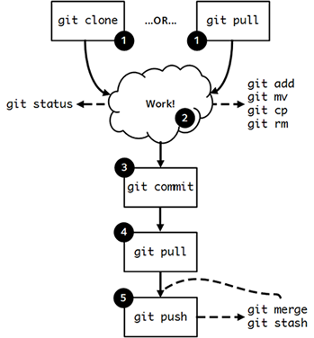

#A Git Crash Course {#chapter-git}
We strongly recommend that you spend some time familiarising yourself with a [version control](https://en.wikipedia.org/wiki/Version_control) system for your application's codebase. This chapter provides you with a crash course in how to use [Git](http://en.wikipedia.org/wiki/Git_(software)), one of the many version control systems available. Originally developed by [Linus Torvalds](http://en.wikipedia.org/wiki/Linus_Torvalds), Git is today [one of the most popular version control systems in use](https://en.wikipedia.org/wiki/Comparison_of_source_code_hosting_facilities#Popularity), and is used by open-source and closed-source projects alike.

This tutorial demonstrates at a high level how Git works, explains the basic commands that you can use, and provides an explanation of Git's workflow. By the end of this chapter, you'll be able to make contributions to a Git repository, enabling you to work solo, or in a team.

## Why Use Version Control?
As your software engineering skills develop, you will find that you are able to plan and implement solutions to ever more complex problems. As a rule of thumb, the larger the problem specification, the more code you have to write. The more code you write, the greater the emphasis you should put on software engineering practices. Such practices include the use of design patterns and the *DRY (Don't Repeat Yourself)* principle.

Think about your experiences with programming thus far. Have you ever found yourself in any of these scenarios?

* Made a mistake to code, realised it was a mistake and wanted to go back?
* Lost code (through a faulty drive), or had a backup that was too old?
* Had to maintain multiple versions of a product (perhaps for different organisations)?
* Wanted to see the difference between two (or more) versions of your codebase?
* Wanted to show that a particular change broke of fixed a piece of code?
* Wanted to submit a change (patch) to someone else's code?
* Wanted to see how much work is being done (where it was done, when it was done, or who did it)?

Using a version control system makes your life easier in *all* of the above cases. While using version control systems at the beginning may seem like a hassle it will pay off later - so it's good to get into the habit now!

We missed one final (and important) argument for using version control. With ever more complex problems to solve, your software projects will undoubtedly contain a large number of files containing source code. It'll also be likely that you *aren't working alone on the project; your project will probably have more than one contributor.* In this scenario, it can become difficult to avoid conflicts when working on files. 

## How Git Works
Essentially, Git comprises of four separate storage locations: your **workspace**, the **local index**, the **local repository** and the **remote repository**. As the name may suggest, the remote repository is stored on some remote server, and is the only location stored on a computer other than your own. This means that there are two copies of the repository - your local copy, and the remote copy. Having two copies is one of the main selling points of Git over other version control systems. You can make changes to your local repository when you may not have Internet access, and then apply any changes to the remote repository at a later stage. Only once changes are made to the remote repository can other contributors see your changes.

D> ### What is a Repository?
D> We keep repeating the word *repository*, but what do we actually mean by that? When considering version control, a repository is a data structure which contains metadata (a set of data that describes other data, hence *meta*) concerning the files which you are storing within the version control system. The kind of metadata that is stored can include aspects such as the historical changes that have taken place within a given file, so that you have a record of all changes that take place.
D>
D> If you want to learn more about the metadata stored by Git, there is a [technical tutorial available](http://www.sbf5.com/~cduan/technical/git/git-1.shtml) for you to read through.

For now though, let's provide an overview of each of the different aspects of the Git system. We'll recap some of the things we've already mentioned just to make sure it makes sense to you.

* As already explained, the **remote repository** is the copy of your project's repository stored on some remote server. This is particularly important for Git projects that have more than one contributor - you require a central place to store all the work that your team members produce. You could set up a Git server on a computer with Internet access and a properly configured firewall (check out [this Server Fault question](http://serverfault.com/questions/189070/what-firewall-ports-need-to-be-open-to-allow-access-to-external-git-repositories), for example), or simply use one of many services providing free Git repositories. One of the most widely used services available today is [GitHub](https://github.com/). In fact, this book has a Git [repository](https://github.com/leifos/tango_with_django_19) on GitHub!
* The **local repository** is a copy of the remote repository stored on your computer (locally). This is the repository to which you make all your additions, changes and deletions. When you reach a particular milestone, you can then *push* all your local changes to the remote repository. From there, you can instruct your team members to retrieve your changes. This concept is known as *pulling* from the remote repository. We'll subsequently explain pushing and pulling in a bit more detail.
* The **local index** is technically part of the local repository. The local index stores a list of files that you want to be managed with version control. This is explained in more detail [later in this chapter](#section-git-workflow). You can have a look [here](http://stackoverflow.com/questions/4084921/what-does-the-git-index-exactly-contains) to see a discussion on what exactly a Git index contains.
* The final aspect of Git is your **workspace**. Think of this folder or directory as the place on your computer where you make changes to your version controlled files. From within your workspace, you can add new files or modify or remove previously existing ones. From there, you then instruct Git to update the repositories to reflect the changes you make in your workspace. This is important - *don't modify code inside the local repository - you only ever edit files in your workspace.*

Next, we'll be looking at how to [get your Git workspace set up and ready to go](#section-git-setup). We'll also [discuss the basic workflow](#section-git-workflow) you should use when using Git.

## Setting up Git {#section-git-setup}
We assume that you've got Git installed with the software to go. One easy way to test the software out is to simply issue `git` to your terminal or Command Prompt. If you don't see a `command not found` error, you're good to go. Otherwise, have a look at how to install Git to your system.

I> ### Using Git on Windows
I> Like Python, Git doesn't come as part of a standard Windows installation. However, Windows implementations of the version control system can be downloaded and installed. You can download the official Windows Git client from the Git [website](http://git-scm.com/download/win). The installer provides the `git` command line program, which we use in this crash course. You can also download a program called *TortoiseGit*, a graphical extension to the Windows Explorer shell. The program provides a really nice right-click Git context menu for files. This makes version control really easy to use. You can [download TortoiseGit](https://code.google.com/p/tortoisegit/) for free. Although we do not cover how to use TortoiseGit in this crash course, many tutorials exist online for it. Check [this tutorial](http://robertgreiner.com/2010/02/getting-started-with-git-and-tortoisegit-on-windows/) if you are interested in using it.
I>
I> We recommend however that you stick to the command line program. We'll be using the commands in this crash course. Furthermore, if you switch to a UNIX/Linux development environment at a later stage, you'll be glad you know the commands!

Setting up your Git workspace is a straightforward process. Once everything is set up, you will begin to make sense of the directory structure that Git uses. Assume that you have signed up for a new account on [GitHub](https://github.com/) and [created a new repository on the service](https://help.github.com/articles/create-a-repo) for your project. With your remote repository setup, follow these steps to get your local repository and workspace setup on your computer. We'll assume you will be working from your `<workspace>` directory.

1.  Open a terminal and navigate to your home directory (e.g. `$ cd ~`).
2.  *Clone* the remote repository - or in other words, make a copy of it. Check out how to do this below.
3.  Navigate into the newly created directory. That's your workspace in which you can add files to be version controlled!

### How to Clone a Remote Repository {#section-git-setup-clone}
Cloning your repository is a straightforward process with the `git clone` command. Supplement this command with the URL of your remote repository - and if required, authentication details, too. The URL of your repository varies depending on the provider you use. If you are unsure of the URL to enter, it may be worth querying it with your search engine or asking someone in the know.

For GitHub, try the following command, replacing the parts below as appropriate:

{lang="text",linenos=off}
	$ git clone https://<USER>:<PASS>@github.com/<OWNER>/<REPO_NAME>.git <workspace>

where you replace

* `<USER>` with your GitHub username;
* `<PASS>` with your GitHub password;
* `<OWNER>` with the username of the person who owns the repository;
* `<REPO_NAME>` with the name of your project's repository; and
* `<workspace>` with the name for your workspace directory. This is optional; leaving this option out will simply create a directory with the same name as the repository.

If all is successful, you'll see some text like the example shown below.

{lang="text",linenos=off}
	$ git clone https://github.com/leifos/tango_with_django_19
	Cloning into 'tango_with_django_19'...
	remote: Counting objects: 18964, done.
	remote: Total 18964 (delta 0), reused 0 (delta 0), pack-reused 18964
	Receiving objects: 100% (18964/18964), 99.69 MiB | 3.51 MiB/s, done.
	Resolving deltas: 100% (13400/13400), done.
	Checking connectivity... done.

If the output lines end with `done`, everything should have worked. Check your filesystem to see if the directory has been created.

T> ### Not using GitHub?
T> There are many websites that provide Git repositories - some free, some paid. While this chapter uses GitHub, you are free to use whatever service you wish. Other providers include [Atlassian Bitbucket](https://bitbucket.org/) and [Unfuddle](https://unfuddle.com/). You will of course have to change the URL from which you clone your repository if you use a service other than GitHub.

### The Directory Structure
Once you have cloned your remote repository onto your local computer, navigate into the directory with your terminal, Command Prompt or GUI file browser. If you have cloned an empty repository the workspace directory should appear empty. This directory is therefore your blank workspace with which you can begin to add your project's files.

However, the directory isn't blank at all! On closer inspection, you will notice a hidden directory called `.git`. Stored within this directory are both the local repository and local index. **Do not alter the contents of the `.git` directory.** Doing so could damage your Git setup and break version control functionality. *Your newly created workspace therefore actually contains within it the local repository and index.*

### Final Tweaks {#section-git-setup-tweaks}
With your workspace setup, now would be a good time to make some final tweaks. Here, we discuss two cool features you can try which could make your life (and your team members') a little bit easier.

When using your Git repository as part of a team, any changes you make will be associated with the username you use to access your remote Git repository. However, you can also specify your full name and e-mail address to be included with changes that are made by you on the remote repository. Simply open a Command Prompt or terminal and navigate to your workspace. From there, issue two commands: one to tell Git your full name, and the other to tell Git your e-mail address.

{lang="text",linenos=off}
	$ git config user.name "John Doe"
	$ git config user.email "johndoe123@me.com"

Obviously, replace the example name and e-mail address with your own - unless your name actually is John Doe.

Git also provides you with the capability to stop - or ignore - particular files from being added to version control. For example, you may not wish a file containing unique keys to access web services from being added to version control. If the file were to be added to the remote repository, anyone could theoretically access the file by cloning the repository. With Git, files can be ignored by including them in the `.gitignore` file, which resides in the root of `<workspace>`. When adding files to version control, Git parses this file. If a file that is being added to version control is listed within `.gitignore`, the file is ignored. Each line of `.gitignore` should be a separate file entry.

Check out the following example of a `.gitignore` file:

{lang="text",linenos=off}
	`config/api_keys.py`
	`*.pyc`

In this example file, there are two entries - one on each line. The first entry prompts Git to ignore the file `api_keys.py` residing within the `config` directory of your repository. The second entry then prompts Git to ignore *all* instance of files with a `.pyc` extension, or compiled Python files. This is a really nice feature: you can use *wildcards* to make generic entries if you need to!

I> ### `.gitignore` - What else should I ignore?
I> There are many kinds of files you could safely ignore from being committed and pushed to your Git repositories.
I> Examples include temporary files, databases (that can easily be recreated) and operating system-specific files. Operating system-specific files include configurations for the appearance of the directory when viewed in a given file browser. Windows computers create `thumbs.db` files, while OS X creates `.DS_Store` files.
I>
I> When you create a new repository on GitHub, the service can offer to create a `.gitignore` file based upon the languages you will use in your project, which can save you some time setting everything up.

{pagebreak}

## Basic Commands and Workflow {#section-git-workflow}
With your repository cloned and ready to go on your local computer, you're ready to get to grips with the Git workflow. This section shows you the basic Git workflow - and the associated Git commands you can issue.

{id="fig-git-sequence"}

We have provided a pictorial representation of the basic Git workflow as shown above. Match each of the numbers in the black circles to the numbered descriptions below to read more about each stage. **Refer to this diagram whenever you're unsure about the next step you should take - it's very useful!**

### 1. Starting Off
Before you can start work on your project, you must prepare Git. If you haven't yet sorted out your project's Git workspace, you'll need to [`clone` your repository to set it up](#section-git-setup-clone).

If you've already cloned your repository, it's good practice to get into the habit of updating your local copy by using the `git pull` command. This *pulls* the latest changes from the remote repository onto your computer. By doing this, you'll be working from the same page as your team members. This will reduce the possibility of conflicting versions of files, which really does make your life a bit of a nightmare.

To perform a `git pull`, first navigate to your `<workspace>` directory within your Command Prompt or terminal, then issue `git pull`. Check out the snippet below from a Bash terminal to see exactly what you need to do, and what output you should expect to see.

{lang="text",linenos=off}
	$ cd <workspace>
	$ git pull
	remote: Counting objects: 3, done.
	remote: Compressing objects: 100% (2/2), done.
	remote: Total 3 (delta 0), reused 0 (delta 0), pack-reused 0
	Unpacking objects: 100% (3/3), done.
	From https://github.com/someuser/somerepository
	    86a0b3b..a7cec3d  master     -> origin/master
	Updating 86a0b3b..a7cec3d
	Fast-forward
	  README.md | 1 +
	  1 file changed, 1 insertion(+)
	  create mode 100644 README.md

This example shows that a `README.md` file has been updated or created from the latest pull. 

E> ### Getting an Error?
E>
E> If you receive `fatal: Not a git repository (or any of the parent directories): .git`, you're not in the correct directory. You need `cd` to your workspace directory - the one in which you cloned your repository to. A majority of Git commands only work when you're in a Git repository.

T> ### Pull before you Push!
T>
T> Always `git pull` on your local copy of your repository before you begin to work. **Always!**
T>
T> Before you are about to push, do another pull.
T>
T> Remember to talk to your team to coordinate your activity so you are not working on the same files, or using branching.

### 2. Doing Some Work!
Once your workspace has been cloned or updated with the latest changes, it's time for you to get some work done! Within your workspace directory, you can take existing files and modify them. You can delete them too, or add new files to be version controlled.

When you modify your repository in any way, you need to keep Git up-to-date of any changes. Doing so allows Git to update your local index. The list of files stored within the local index are then used to perform your next *commit*, which we'll be discussing in the next step. To keep Git informed, there are several Git commands that let you update the local index. Three of the commands are near identical to those that were discussed in the [Unix Crash Course](#section-unix-commands) (e.g. `cp`, `mv`), with the addition of a `git` prefix.

* The first command `git add` allows you to request Git to add a particular file to the next commit for you. A common newcomer mistake is to assume that `git add` is used for adding new files to your repository only - *this is not the case. You must tell Git what modified files you wish to commit, too.* The command is invoked by typing `git add <filename>`, where `<filename>` is the name of the file you wish to add to your next commit. Multiple files and directories can be added with the command `git add .` - [**but be careful with this**](http://stackoverflow.com/a/16969786).
* `git mv` performs the same function as the Unix `mv` command - it moves files. The only difference between the two is that `git mv` updates the local index for you before moving the file. Specify the filename with the syntax `git mv <current_filename> <new_filename>`. For example, with this command you can move files to a different directory within your repository. This will be reflected in your next commit. The command is also used to rename files - from the old filename to the new.
* `git cp` allows you to make a copy of a file or directory while adding references to the new files into the local index for you. The syntax is the same as `git mv` above where the filename or directory name is specified thus: `git cp <current_filename> <copied_filename>`.
* The command `git rm` adds a file or directory delete request into the local index. While the `git rm` command does not delete the file straight away, the requested file or directory is removed from your filesystem and the Git repository upon the next commit. The syntax is similar to the `git add` command, where a filename can be specified thus: `git rm <filename>`. Note that you can add a large number of requests to your local index in one go, rather than removing each file manually. For example, `git rm -rf media/` creates delete requests in your local index for the `media/` directory. The `r` switch enables Git to *recursively* remove each file within the `media/` directory, while `f` allows Git to *forcibly* remove the files. Check out the [Wikipedia page](http://en.wikipedia.org/wiki/Rm_(Unix)#Options) on the `rm` command for more information.

Lots of changes between commits can make things pretty confusing. You may easily forget what files you've already instructed Git to remove, for example. Fortunately, you can run the `git status` command to see a list of files which have been modified from your current working directory, but haven't been added to the local index for processing. Check out typical output from the command below to get a taste of what you can see.

I> ### Working with `.gitignore`
I> If you have [set up your `.gitignore` file correctly](#section-git-setup-tweaks), you'll notice that files matching those specified within the `.gitignore` file are...ignored when you `git add` them. This is the intended behaviour - these files are not supposed to be committed to version control! If you however do need a file to be included that is in `.gitignore`, you can *force* Git to include it if necessary with the `git add -f <filename>` command.

{lang="text",linenos=off}
    $ git status
    On branch master
    Your branch is up-to-date with 'origin/master'.
    Changes to be committed:
      (use "git reset HEAD <file>..." to unstage)
        modified:   chapter-unix.md
    Changes not staged for commit:
      (use "git add <file>..." to update what will be committed)
      (use "git checkout -- <file>..." to discard changes in working directory)
        modified:   chapter-git.md

From this example above, we can see that the file `chapter-unix.md` has been added to the latest commit, and will therefore be updated in the next `git push`. The file `chapter-git.md` has been updated, but `git add` hasn't been run on the file, so the changes won't be applied to the repository.

I> ### Checking Status
I> For further information on the `git status` command, check out the [official Git documentation](http://git-scm.com/docs/git-status).

### 3. Committing your Changes
We've mentioned *committing* several times in the previous step - but what does it mean? Committing is when you save changes - which are listed in the local index - that you have made within your workspace. The more often you commit, the greater the number of opportunities you'll have to revert back to an older version of your code if things go wrong. Make sure you commit often, but don't commit an incomplete or broken version of a particular module or function. There's a lot of discussion as to when the ideal time to commit is. [Have a look at this Stack Overflow page](http://stackoverflow.com/questions/1480723/dvcs-how-often-and-when-to-commit-changes) for the opinions of several developers. It does however make sense to commit only when everything is working. If you find you need to roll back to a previous commit only to find nothing works, you won't be too happy.

To commit, you issue the `git commit` command. Any changes to existing files that you have indexed will be saved to version control at this point. Additionally, any files that you've requested to be copied, removed, moved or added to version control via the local index will be undertaken at this point. When you commit, you are updating the [*HEAD* of your local repository](http://stackoverflow.com/questions/2304087/what-is-git-head-exactly).

I> ### Commit Requirements
I> In order to successfully commit, you need to modify at least one file in your repository and instruct Git to commit it, through the `git add` command. See the previous step for more information on how to do this.

As part of a commit, it's incredibly useful to your future self and others to explain why you committed when you did. You can supply an optional message with your commit if you wish to do so. Instead of simply issuing `git commit`, run the following amended command.

{lang="text",linenos=off}
	$ git commit -m "Updated helpers.py to include a Unicode conversion function."

From the example above, you can see that using the `-m` switch followed by a string provides you with the opportunity to append a message to your commit. Be as explicit as you can, but don't write too much. People want to see at a glance what you did, and do not want to be bored or confused with a long essay. At the same time, don't be too vague. Simply specifying `Updated helpers.py` may tell a developer what file you modified, but they will require further investigation to see exactly what you changed.

T> ### Sensible Commits
T> Although frequent commits may be a good thing, you will want to ensure that what you have written actually *works* before you commit. This may sound silly, but it's an incredibly easy thing to not think about. To reiterate, committing code which doesn't actually work can be infuriating to your team members if they then rollback to a version of your project's codebase which is broken!

### 4. Synchronising your Repository
T> ### Important when Collaborating
T> Synchronising your local repository before making changes is crucial to ensure you minimise the chance for conflicts occurring. Make sure you get into the habit of doing a `pull` before you `push`.

After you've committed your local repository and committed your changes, you're just about ready to send your commit(s) to the remote repository by *pushing* your changes. However, what if someone within your group pushes their changes before you do? This means your local repository will be out of sync with the remote repository, meaning that any `git push` command that you issue will fail.

It's therefore always a good idea to check whether changes have been made on the remote repository before updating it. Running a `git pull` command will pull down any changes from the remote repository, and attempt to place them within your local repository. If no changes have been made, you're clear to push your changes. If changes have been made and cannot be easily rectified, you'll need to do a little bit more work.

In scenarios such as this, you have the option to *merge* changes from the remote repository. After running the `git pull` command, a text editor will appear in which you can add a comment explaining why the merge is necessary. Upon saving the text document, Git will merge the changes from the remote repository to your local repository.

T> ### Editing Merge Logs
T> If you do see a text editor on your Mac or Linux installation, it's probably the [`vi`](http://en.wikipedia.org/wiki/Vi) text editor. If you've never used vi before, check out [this helpful page containing a list of basic commands](http://www.cs.colostate.edu/helpdocs/vi.html) on the Colorado State University Computer Science Department website. If you don't like vi, [you can change the default text editor](http://git-scm.com/book/en/Customizing-Git-Git-Configuration#Basic-Client-Configuration) that Git calls upon. Windows installations most likely will bring up Notepad.

### 5. Pushing your Commit(s)
*Pushing* is the phrase used by Git to describe the sending of any changes in your local repository to the remote repository. This is the way in which your changes become available to your other team members, who can then retrieve them by running the `git pull` command in their respective local workspaces. The `git push` command isn't invoked as often as committing - *you require one or more commits to perform a push.* You could aim for one push per day, when a particular feature is completed, or at the request of a team member who is after your updated code.

To push your changes, the simplest command to run is:

{lang="text",linenos=off}
    $ git push origin master

As explained on [this Stack Overflow question and answer page](http://stackoverflow.com/questions/7311995/what-is-git-push-origin-master-help-with-gits-refs-heads-and-remotes) this command instructs the `git push` command to push your local master branch (where your changes are saved) to the *origin* (the remote server from which you originally cloned). If you are using a more complex setup involving [branching and merging](http://git-scm.com/book/en/Git-Branching-Basic-Branching-and-Merging), alter `master` to the name of the branch you wish to push.

T> ### Important Push?
T> If your `git push` is particularly important, you can also alert other team members to the fact they should really update their local repositories by pulling your changes. You can do this through a *pull request.* Issue one after pushing your latest changes by invoking the command `git request-pull master`, where master is your branch name (this is the default value). If you are using a service such as GitHub, the web interface allows you to generate requests without the need to enter the command. Check out [the official GitHub website's tutorial](https://help.github.com/articles/using-pull-requests) for more information.

## Recovering from Mistakes
This section presents a solution to a coder's worst nightmare: what if you find that your code no longer works? Perhaps a refactoring went terribly wrong, or another team member without discussion changed something. Whatever the reason, using a form of version control always gives you a last resort: rolling back to a previous commit. This section details how to do just that. We follow the information given from [this Stack Overflow](http://stackoverflow.com/questions/2007662/rollback-to-an-old-commit-using-git) question and answer page.

W> ### Changes may be Lost!
W> You should be aware that this guide will rollback your workspace to a previous iteration. Any uncommitted changes that you have made will be lost, with a very slim chance of recovery! Be wary. If you are having a problem with only one file, you could always view the different versions of the files for comparison. Have a look [at this Stack Overflow page](http://stackoverflow.com/a/3338145) to see how to do that.

Rolling back your workspace to a previous commit involves two steps: determining which commit to roll back to, an performing the rollback. To determine what commit to rollback to, you can make use of the `git log` command. Issuing this command within your workspace directory will provide a list of recent commits that you made, your name and the date at which you made the commit. Additionally, the message that is stored with each commit is displayed. This is where it is highly beneficial to supply commit messages that provide enough information to explain what is going on. Check out the following output from a `git log` invocation below to see for yourself.

{lang="text",linenos=off}
    commit 88f41317640a2b62c2c63ca8d755feb9f17cf16e                 <- Commit hash
    Author: John Doe <someaddress@domain.com>                       <- Author
    Date:   Mon Jul 8 19:56:21 2013 +0100                           <- Date/time
        Nearly finished initial version of the requirements chapter <- Message
    commit f910b7d557bf09783b43647f02dd6519fa593b9f
    Author: John Doe <someaddress@domain.com>
    Date:   Wed Jul 3 11:35:01 2013 +0100
        Added in the Git figures to the requirements chapter.
    commit c97bb329259ee392767b87cfe7750ce3712a8bdf
    Author: John Doe <someaddress@domain.com>
    Date:   Tue Jul 2 10:45:29 2013 +0100
        Added initial copy of Sphinx documentation and tutorial code.
    commit 2952efa9a24dbf16a7f32679315473b66e3ae6ad
    Author: John Doe <someaddress@domain.com>
    Date:   Mon Jul 1 03:56:53 2013 -0700
        Initial commit

From this list, you can choose a commit to rollback to. For the selected commit, you must take the commit hash - the long string of letters and numbers. To demonstrate, the top (or `HEAD`) commit hash in the example output above is `88f41317640a2b62c2c63ca8d755feb9f17cf16e`. You can select this in your terminal and copy it to your computer's clipboard.

With your commit hash selected, you can now rollback your workspace to the previous revision. You can do this with the `git checkout` command. The following example command would rollback to the commit with hash `88f41317640a2b62c2c63ca8d755feb9f17cf16e`.

{lang="text",linenos=off}
    $ git checkout 88f41317640a2b62c2c63ca8d755feb9f17cf16e .

Make sure that you run this command from the root of your workspace, and do not forget to include the dot at the end of the command! The dot indicates that you want to apply the changes to the entire workspace directory tree. After this has completed, you should then immediately commit with a message indicating that you performed a rollback. Push your changes and alert your collaborators - perhaps with a pull request. From there, you can start to recover from the mistake by putting your head down and getting on with your project.

X> ### Exercises
X> If you haven't undertaken what we've been discussing in this chapter already, you should go through everything now to ensure your Git repository is ready to go. To try everything out, you can create a new file `README.md` in the root of your `<workspace>` directory. The file [will be used by GitHub](https://help.github.com/articles/github-flavored-markdown) to provide information on your project's GitHub homepage.
X>
X> * Create the file, and write some introductory text to your project.
X> * Add the file to the local index upon completion of writing, and commit your changes.
X> * Push the new file to the remote repository and observe the changes on the GitHub website.
X>
X> Once you have completed these basic steps, you can then go back and edit the readme file some more. Add, commit and push - and then try to revert to the initial version to see if it all works as expected.

D> ### There's More!
D> There are other more advanced features of Git that we have not covered in this chapter. Examples include **branching** and **merging**, which are useful for projects with different release versions, for example. There are many fantastic tutorials available online if you are interested in taking you super-awesome version control skills a step further. For more details about such features take a look at this [tutorial on getting started with Git](http://veerasundar.com/blog/2011/06/git-tutorial-getting-started/), the [Git Guide](http://rogerdudler.github.io/git-guide/) or [Learning about Git Branching](http://pcottle.github.io/learnGitBranching/).
D> 
D> However, if you're only using this chapter as a simple guide to getting to grips with Git, everything that we've covered should be enough. Good luck!

<!---
DMAX COMMENTS THIS OUT - IT DOESN'T FIT HERE ANYMORE.
Upon completion of the above exercise, all that is left for us to discuss
is the environment you just setup. While all may be good just now, what
if you have another Python application that requires a different version
to run? This is where the concept of [virtual
environments](http://simononsoftware.com/virtualenv-tutorial/) comes
into play. Virtual environments allow multiple installations of Python
and their relevant packages to exist in harmony, without disrupting one
another. This is the generally accepted approach to configuring a Python
setup nowadays. We don't go into much detail about them in this chapter
now but you will be using a virtual environment when it comes to
deploying your application. For now though, [check out this
article](http://dabapps.com/blog/introduction-to-pip-and-virtualenv-python/)
to read up on what they are, and how they can benefit you.
-->