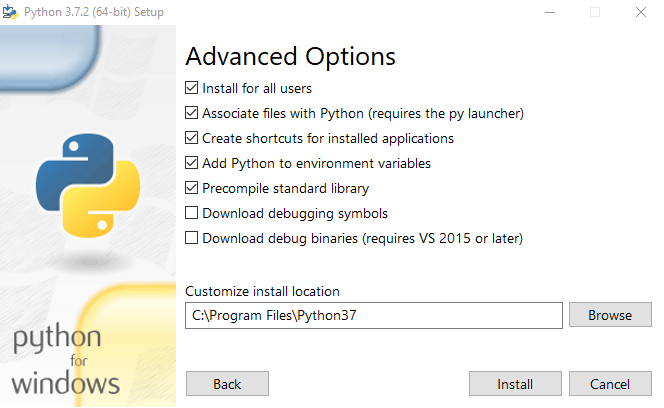
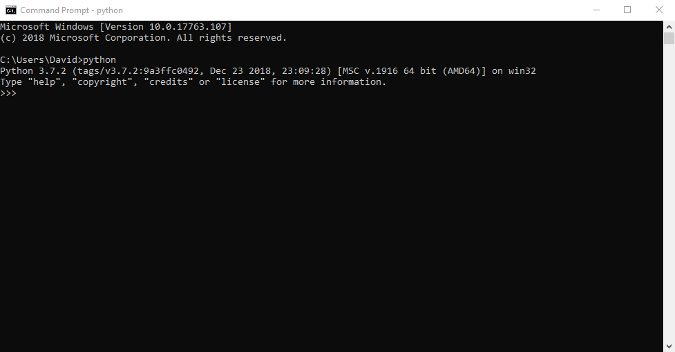

#Setting up your System {#chapter-system-setup}
This supplementary chapter provides additional setup guides that complement the [initial setup chapter](#chapter-getting-ready). We provide setup guides for installing and configuring the various technologies that you will be using within Tango with Django. Refer to the section that is relevant to you; you do not need to work through all of this chapter if things are already working for you.

I> ### Common Guides
I>
I> This chapter provides instructions on how to set up the various technologies that you'll be using throughout Tango with Django that we believe will work on the largest number of systems. However, every computer setup is different -- different versions of software, different operating systems, etc. These differences make providing universal setup guides very difficult to do.
I> 
I> If you are using this book as part of a course, you may be provided with setup instructions unique to your lab computers. Follow these instructions instead -- a majority of the setup work will likely be taken care of for you already.
I>
I> However, if you are working solo and you follow the instructions provided in this chapter without success, we recommend heading to your favourite search engine and entering the problem you're having. Typically, this will involve copying and pasting the error message you see at whatever step you're struggling at. By pasting in the message verbatim, chances are you'll find someone who suffered the same issue as you -- and from that point, you'll hopefully find a solution to resolve your problem.

## Installing Python 3 and `pip` {#section-system-setup-python}
How do you go about installing Python 3.7 on your computer? This section answers that question. As we [discussed previously](#chapter-getting-ready-python3), you may find that you already have Python installed on your computer. If you are using a Linux distribution or macOS, you will definitely have it installed. Some of your operating system's functionality [is implemented in Python](http://en.wikipedia.org/wiki/Yellowdog_Updater,_Modified), hence the need for an interpreter! Unfortunately, most modern operating systems that come preloaded with Python use a version that is much older than what we require. Exceptions include Ubuntu, coming with version 3.6.5 which should be sufficient for your needs. If you do need to install 3.7, we must install this version of Python side-by-side with the old one.

There's many different ways in which you can install Python. We demonstrate here the most common approaches that you can use on Apple's macOS, various Linux distributions and Windows 10. Pick the section associated with your operating system to proceed. Note that we favour the use of [package managers](https://en.wikipedia.org/wiki/Package_manager) where appropriate to ensure that you have the means of maintaining and updating the software easily (when required).

### Apple macOS
The simplest way to acquire Python 3 for macOS is to download a `.dmg` image file from the [official Python website](https://www.python.org/downloads/mac-osx/). This will provide you with a step-by-step installation interface that makes setting everything up straightforward. If your development environment will be kept lightweight (i.e. Python only), this option makes sense. Simply download the installer, and Python 3 should then be available on your Mac's terminal!

However, [package managers make life easier](https://softwareengineering.stackexchange.com/questions/372444/why-prefer-a-package-manager-over-a-library-folder) when development steps up and involves a greater number of software tools. Installing a package manager makes it easy to maintain and update software on your computer -- and even to install new software, too. macOS does not come preinstalled with a package manager, so you need to download and install one yourself. If you want to go down this route, we'll introduce you to *MacPorts*, a superb package manager offering a [large host of tools](https://www.macports.org/ports.php) for you to download and use. We recommend that you follow this route. Although more complex, the end result will be a complete development environment, ready for you to get coding.

A prerequisite for using MacPorts is that you have Apple's *Xcode* environment installed. This download is several gigabytes in size. The easiest way to acquire this is through the App Store on your macOS installation. You'll need your Apple account to download that software. Once XCode has been installed, follow the following steps to setup MacPorts.

1. Verify that XCode is installed by launching it. You should see a welcome screen. If you see this, quit the app.
2. Open a Terminal window. Install the XCode command line tools by entering the command `$ xcode-select --install`. This will download additional software tools that will be required by XCode and additional development software that you later install.
3. Agree to the XCode license, if you have not already. You can do this by entering the command `$ xcode-build license`. Read the terms to the bottom of the page, and type `Y` to complete -- but only if you agree to the terms!
4. From [the MacPorts installation page](https://www.macports.org/install.php), download the MacPorts installer for your correct macOS version.
5. On your Mac's Finder, open the directory where you downloaded the installer to, and double-click the file to launch the installation process.
6. Follow the steps, and provide your password to install the software.
7. Once complete, delete the installer file -- you no longer require it. Close down any Terminal windows that are still open.

Once the MacPorts installation has been completed, installing Python is straightforward.

1. Open a new Terminal window. It is important that you launch a new window after MacPorts installation!
2. Enter the command `$ sudo port install python37`. After entering your password, this will take a few minutes. Several dependencies will be required -- agree to these being installed by responding with `Y`.
3. Once installation completes, activate your new Python installation. Enter the command `$ sudo port select --set python python37`.
4. Test that the command succeeds by issuing the command `$ python`. You should then see the interpreter for Python 3.7.2 (or whatever version you just installed).

Once this has been completed, Python has been successfully installed and is ready to use. However, we still need to setup virtual environments to work with your installation.

1. Enter the following commands to install `virtualenv` and helper functions provided in the user-friendly wrapper.
   
   {lang="bash",linenos=off}
    $ sudo port install py37-virtualenv
	$ sudo port install py37-virtualenvwrapper
   
2. Activate `py37-virtualenv` with the following command.
   
   {lang="bash",linenos=off}
    $ sudo port select --set virtualenv virtualenv37

3. Edit your `~/.profile` file. Add the following four lines at the end of the file.
   
   {lang="bash",linenos=off}
    export VIRTUALENVWRAPPER_PYTHON='/opt/local/bin/python3.7'
	export VIRTUALENVWRAPPER_VIRTUALENV='/opt/local/bin/virtualenv-3.7'
	export VIRTUALENVWRAPPER_VIRTUALENV_CLONE='/opt/local/bin/virtualenv-clone-3.7'
	source /opt/local/bin/virtualenvwrapper.sh-3.7

4. Save the file and close all open Terminals. Open a new Terminal. Everything should now be working and ready for you to use.

N> ### Installating Additional Software with MacPorts
N>
N> MacPorts provides an extensive, preconfigured library of open-source software suited specifically for development environments. When you need something new, it's a cinch to install. **For example,** you want to install the *LaTeX* typesetting system, search [the MacPorts ports list](https://www.macports.org/ports.php) -- the resultant package name being `texlive-latex`. This could then be installed with the command `$ sudo port install texlive-latex`. All software that LaTeX is dependent upon is also installed. This saves you significant amounts of time trying to find all the right bits of software to make things work.
N>
N> To view the packages MacPorts has already installed on your system, issue the command `$ port list installed`. You will see `python37` listed!

### Linux Distributions
There are many different ways in which you can download, install and run an updated version of Python on your Linux distribution. Methodologies unfortunately vary from distribution to distribution. To compound this, almost all distributions of Linux don't have a precompiled version of Python 3.7 ready for you to download and start using (at the time of writing), although the latest release of Ubuntu use Python 3.6 (which is sufficient).

If you do choose to install a new version of Python, we've put together a series of steps that you can follow. These will allow you to install Python 3.7.2 from scratch. The steps have been tested thoroughly in Ubuntu 18.04 LTS; other distributions should also work with minor tweaks, especially in relation to the package manager being used in step 1. A cursory search on your favorite search engine should reveal the correct command to enter. For example, on a *Red Hat Enterprise Linux* installation, the system package manager is `yum` instead of `apt`.

W> ## Assumption of Knowledge
W>
W> In order to complete these steps, we assume you know the basics for Bash interaction, including what the tilde (`~`) means, for example. Be careful with the `sudo` command, and do not execute it except for the steps we list requiring it below.

1. Install the required packages for Python to be built successfully. These are listed below, line by line. These can be entered into an Ubuntu Terminal as-is; slight modifications will be required for other Linux distributions.
   
   {lang="bash",linenos=off}
    $ apt install wget
   	$ apt install build-essential
	$ apt install libssl-dev
	$ apt install libffi-dev
	$ apt install python-dev
	$ apt install zlib1g-dev
	$ apt install libbz2-dev
	$ apt install libreadline-dev
	$ apt install libsqlite3-dev

2. Once the above packages are installed, download the source for Python 3.7.2. We create a `pytemp` directory to download the file to. We'll delete this once everything has completed.
   
   {lang="bash",linenos=off}
    $ mkdir ~/pytemp
	$ cd ~/pytemp
    $ wget https://www.python.org/ftp/python/3.7.2/Python-3.7.2.tgz

3. Extract the `.tgz` file.
   
   {lang="bash",linenos=off}
    $ tar zxf Python-3.7.2.tgz
	$ cd Python-3.7.2

4. Configure the Python source code for your computer, and build it. `altinstall` tells the installer to install the new version of Python to a different directory from the prexisting version of Python on your computer. You'll need to enter your password for the system to make the necessary changes. This process will take a few minutes, and you'll see a lot of output. Don't panic. This is normal. If the build fails, you haven't installed all of the necessary prerequisites. Check you have installed everything correctly from step 1, and try again.
   
   {lang="bash",linenos=off}
    $ sudo ./configure --enable-optimizations
	$ sudo make altinstall

5. Once complete, delete the source files. You don't need them anymore.
   
   {lang="bash",linenos=off}
    $ cd ~
	$ rm -rf ~/pytemp

6. Attempt to run the new installation of Python. You should see the interpreter prompt for version 3.7.2, as expected.
   
   {lang="bash",linenos=off}
    $ python3.7
	Python 3.7.2 (default, Jan. 8 2019, 20:05:08)
	[GCC 7.3.0] on linux
	Type "help", "copyright", "credits" or "license" for more information
	>>> quit()
	$

7. By default, Python executables install to `/usr/local/bin`. Check this is correct for you. If not, run the `which` command to find out where it is installed. You'll need this path later.
   
   {lang="bash",linenos=off}
    $ which python3.7
	/usr/local/bin/python3.7

8. Install `virtualenv` and `virtualenvwrapper` for your new Python installation.
   
   {lang="bash",linenos=off}
    $ pip3.7 install virtualenv
	$ pip3.7 install virtualenvwrapper

9. Modify your `~/.bashrc` file, and include the following lines at the very bottom of the file. Note that if you are not using Ubuntu, you might need to edit `~/.profile` instead. Check the documentation of your distribution for more information. A simple text editor will allow you to do this, like `nano`.
   
   {lang="bash",linenos=off}
    EXPORT VIRTUALENVWRAPPER_PYTHON=/usr/local/bin/python3.7
	source /usr/local/bin/virtualenvwrapper.sh

10. Restart your Terminal. Python 3.7.2 will now be setup and ready for you to use, along with the `pip` and `virtualenv` tools.

### Windows {#section-system-setup-python-windows}
By default, Microsoft Windows comes with no installation of Python. This means that you do not have to worry about leaving existing installations alone; installing from scratch should work just fine. You can download a 64-bit of 32-bit version of Python from [the official Python website](http://www.python.org/download/). If you aren't sure what one to download, you can determine if your computer is 32-bit or 64-bit by looking at the instructions provided [on the Microsoft website](https://support.microsoft.com/en-gb/help/13443/windows-which-operating-system).

1. Download the appropriate installer from the [official Python website](http://www.python.org/download/). At the time of writing, the latest release was version 3.7.2.
2. Run the installer. You'll want to make sure that you check the box saying that Python 3.7 is added to `PATH`. You'll want to install for all users, too. Choose the `Customize` option.
3. Proceed with the currently selected check boxes, and choose `Next`.
4. Make sure that the check box for installing Python for all users is checked. The installation location will change. Refer to [the figure below](#fig-ch4setup-pywin-3) for an example.
5. Click `Next` to install Python. You will need to give the installer elevated privileges to install the software.
6. Close the installer when completed, and delete the file you downloaded -- you no longer require it.

Once the installer is complete, you should have a working version of Python 3.7 installed and ready to go. Following the instructions above, Python 3.7 is installed to the directory `C:\Program Files\Python37`. If you checked all of the options correctly, the `PATH` environment variable used by Windows should also have been updated to incorporate the new installation of Python. To test this, launch a Command Prompt window and type `$ python`. Execute the command. You should see the Python interpreter launch, as demonstrated in [the screenshot below](#fig-ch4setup-pywin-4). If this fails, check your `PATH` environment variable is set correctly by following [an online guide](https://www.architectryan.com/2018/03/17/add-to-the-path-on-windows-10/).

Once you are sure that Python is installed correctly, you need to install virtual environment support. Issue the following two commands, and then restart all open Command Prompt windows.

{lang="bash",linenos=off}
$ pip install virtualenv
$ pip install virtualenvwrapper-win

Once completed, everything should be set up and ready for you to use.

{id="fig-ch4setup-pywin-3"}

{id="fig-ch4setup-pywin-4"}

## Virtual Environments {#section-system-setup-virtualenv}
By default, when you install software for Python, it is installed *system-wide*. All Python applications can see the new software and make use of it. However, issues can occur with this setup. [Earlier in the book](#chapter-getting-ready-venv), we discussed a scenario of two pieces of software requiring two different versions of the *same dependency*. This presents a headache; you cannot typically install two differing versions of the same software into your Python environment!

The solution to this is to use a *virtual environment*. Using a virtual environment, each different piece of software that you wish to run can be given its own environment, and by definition, its own set of installed dependencies. If you have `ProjectA` requiring Django 1.11 and `ProjectB` requiring Django 2.1, you could create a virtual environment for each with their own packages installed.

The four basic commands one would use to manipulate virtual environments are listed below.

* `mkvirtualenv <name>` creates and activates a new virtual environment of name `<name>`.
* `workon <name>` switches on a virtual environment of name `<name>`.
* `deactivate` switches off a virtual environment you are currently using.
* `rmvirtualenv <name>` deletes a virtual environment of name `<name>`.
* `lsvirtualenv` lists all user-created virtual environments.

Following the examples above, we can then create an environment for each, installing the required software in the relevant environment. For `ProjectA`, the environment is called `projAENV` -- `projBENV` is used for `ProjectB`. Note that to install software to the respective environments, we use `pip`. The commands used for `pip` [are discussed below.](#section-system-setup-pip)

{lang="bash",linenos=off}
	$ mkvirtualenv projAENV
	(projAENV) $ pip install Django==1.11
	(projAENV) $ pip freeze
	Django==1.11
	
	(projAENV) $ deactive
	$ pip
	<Command not found>
	
	$ workon projAENV
	$ pip freeze
	Django=1.11
	
	(projAENV) $ cd ProjectA/
	(projAENV) $ python manage.py runserver
	...

The code blocks above create the new virtual environment, `projAENV`. We then install Django 1.11 to that virtual environment, before issuing `pip freeze` to list the installed packages -- confirming that Django was installed. We then deactivate the virtual environment. `pip` then cannot be found as we are no longer in the virtual environment! By switching the virtual environment back on with `workon`, our Django package can once again be found. The final two commands launch the Django development server for `ProjectA`.

We can then create a secondary virtual environment, `projBENV`.

{lang="bash",linenos=off}
	$ mkvirtualenv projBENV
	(projBENV) $ pip install Django==2.1
	(projBENV) $ pip freeze
	Django==2.1
	
	(projBENV) $ cd ProjectA/
	(projBENV) $ python manage.py runserver
	<INCORRECT PYTHON VERSION!>
	
	(projBENV) $ workon projAENV
	(projAENV) $ python manage.py runserver
	
	(projAENV) $ workon projBENV
	(projBENV) $ cd ProjectB/
	$ python manage.py runserver
	...

We create our new environment with the `mkvirtualenv` command. This creates and activates `projBENV`. However, when trying to launch the code for `ProjectA`, we get an error! We are using the wrong virtual environment. By switching to `projAENV` with `workon projAENV`, we can then launch the software correctly. This demonstrates the power of virtual environments, and the advantages that they can bring. [Further tutorials can be found online.](https://realpython.com/python-virtual-environments-a-primer/)

T> ## `workon` and `deactivate`
T>
T> Start your session by switching on your virtual environment with the `workon` command. Finish your session by closing it with `deactivate`.
T>
T> You can tell if a virtual environment is active by the brackets before your prompt, like `(envname) $`. This means that virtual environment `envname` is currently switched on, with its settings loaded. Turn it off with `deactivate` and the brackets will disappear.

T> ## Multiple Python Versions
T>
T> If you have multiple versions of Python installed, you can choose what version of Python to use when you create a virtual environment. If you have installations for `python` (which launches 2.7.15) and `python3` (which launches 3.7.2), you can issue the following command to create a Python 3 virtual environment.
T>
T> {lang="bash",linenos=off}
T> 	$ mkvirtualenv -p python3 someenv
T> 	$ python
T> 	$ Python 3.7.2
T> 	>>>
T>
T> Note that when you enable your virtual environment, the command you enter to start Python is simply `python`. The same is applied for `pip` -- if you launch `pip3` outside a virtual environment, `pip` will be the command you use inside the virtual environment.

## Using `pip` {#section-system-setup-pip}
The Python package manager is very straightforward to use, and allows you to keep track of the various Python packages (software) that you have installed. We highly recommend that you use `pip` alongside a virtual environment, as packages installed using `pip` appear only within the said virtual environment.

When you find a package that you want to install, the command required is `$ pip install <packagename>==<version>`. Note that the version component is optional; omitting the version of a particular package will meant that the latest available version is installed.

You can find the name of a package by examining the [*PyPi package index*](https://pypi.org/), from which `pip` downloads software. Simply search or browse the index to find what you are looking for. Once you know the package's name, you can issue the installation command in your Terminal or Command Prompt.

`pip` is also super useful for listing packages that are installed in your environment. This can be achieved through the `pip freeze` command. Sample output is issued below.

{lang="bash",linenos=off}
	(rangoenv) $ pip freeze
	Django==2.1.5
	Pillow==5.0.0
	pytz==2018.9

This shows that three packages are installed in a given environment: `Django`, `Pillow` and `pytz`. The output from this command is typically saved to a file called `requirements.txt`, stored in the root directory of a Python project. If somebody wants to use your software, they can then download your software -- complete with the `requirements.txt` file. Using this file, they can then create a new virtual environment set up with the required packages to make the software work.

If you find yourself in a situation like this, you run `pip` with the `-r` switch. Given a `requirements.txt` in a directory `downloaded_project` with only `pytz==2018.9` listed, an example CLI session would therefore involve something like the following.

{lang="bash",linenos=off}
	$ cd downloaded_project
	$ mkvirtualenv someenv
	(someenv) $ pip install -r requirements.txt
	...
	(someenv) $ pip freeze
	pytz==2018.9

`pip install` installs packages from `requirements.txt`, and `pip freeze`, once everything has been installed, demonstrates that the packages have been installed correctly.

## Version Control System
When developing code, it's highly recommended that you house your codebase within a version controlled respository such as [SVN](http://subversion.tigris.org/) or [Git](http://git-scm.com/). We have provided a [chapter on how to use Git](#chapter-git) if you haven't used Git and GitHub before. We highly recommend that you set up a Git repository for your own projects. Doing so could save you from disaster.

To use Git, we recommend that you use the command-line tool to interact with your repositories. This is done through the `git` command. On Windows, you'll need to [download Git from the Git website](https://git-scm.com/download/win). If using macOS or Linux, the [Git website also has downloadable installers for you to use](https://git-scm.com/downloads). However, why not get into the habit of using a package manager to install the software? This is generally the recommended way for downloading and using software developed on the UNIX design principles (including macOS).

For example, installing Git is as simple as typing `$ sudo apt install git`. Let the software download, and the `apt` package manager takes care of the rest. If you installed MacPorts on your macOS installation as described above, Git will already be present for you as it is part of the Apple XCode Command Line Developer Tools.

Once installed, typing `git` will show the commands you can use, as shown in the example below.

{lang="bash",linenos=off}
	$ git
	usage: git [--version] [--help] [-C <path>] [-c name=value]
	       [--exec-path[=<path>]] [--html-path] [--man-path] [--info-path]
	       [-p | --paginate | --no-pager] [--no-replace-objects] [--bare]
	       [--git-dir=<path>] [--work-tree=<path>] [--namespace=<name>]
	       <command> [<args>]