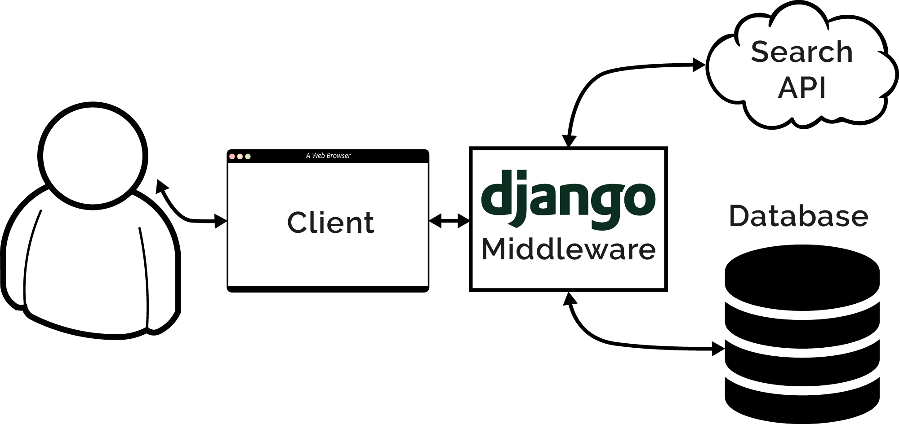
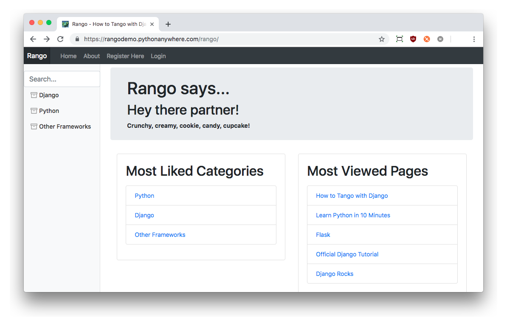
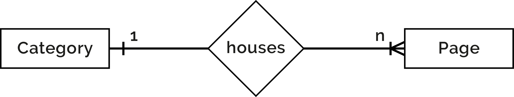

# Overview 
The aim of this book is to provide you with a practical guide to web development using *Django* and *Python*. The book is designed primarily for students, providing a walkthrough of the steps involved in getting a web application up and running with Django.

This book seeks to complement the [official Django Tutorials](https://docs.djangoproject.com/en/1.9/intro/tutorial01/) and many of the other excellent tutorials available online. By putting everything together in one place, this book fills in many of the gaps in the official Django documentation providing an example-based design driven approach to learning the Django framework. Furthermore, this book provides an introduction to many of the aspects required to master web application development (e.g. HTML, CSS, JavaScript, etc.).

## Why Work with this Book?
**This book will save you time.** On many occasions we've seen clever students get stuck, spending hours trying to fight with Django and other aspects of web development. More often than not, the problem was usually because a key piece of information was not provided, or something was not made clear. While the occasional blip might set you back 10-15 minutes, sometimes they can take hours to resolve. We've tried to remove as many of these hurdles as possible. This will mean you can get on with developing your application instead of stumbling along.

**This book will lower the learning curve.** Web application frameworks can save you a lot of hassle and lot of time. Well, that is if you know how to use them in the first place! Often the learning curve is steep. This book tries to get you going - and going fast by explaining how all the pieces fit together.

**This book will improve your workflow.** Using web application frameworks requires you to pick up and run with a particular design pattern - so you only have to fill in certain pieces in certain places. After working with many students, we heard lots of complaints about using web application frameworks - specifically about how they take control away from them (i.e. [inversion of control](https://en.wikipedia.org/wiki/Inversion_of_control)).  To help you, we've created a number of *workflows* to focus your development process so that you can regain that sense of control and build your web application in a disciplined manner.

**This book is not designed to be read.** Whatever you do, *do not read this book!* It is a hands-on guide to building web applications in Django. Reading is not doing. To increase the value you gain from this experience, go through and develop the application. When you code up the application, *do not just cut and paste the code.* Type it in, think about what it does, then read the explanations we have provided to describe what is going on. If you still do not understand, then check out the Django documentation, go to [Stack Overflow](http://stackoverflow.com/questions/tagged/django) or other helpful websites and fill in this gap in your knowledge. If you are really stuck, get in touch with us, so that we can improve this resource - we've already had contributions from [numerous other readers](#chapter-acks)!

## What you will Learn
In this book, we will be taking an exampled-based approach. The book will show you how to design a web application called *Rango* ([see the Design Brief below](#overview-design-brief-label)). Along the way, we'll show you how to perform the following key tasks.

* **How to setup your development environment** - including how to use the terminal, your virtual environment, the `pip` installer, how to work with Git, and more.
* **Setup a Django project** and create a basic Django application.
* **Configure the Django project** to serve static media and other media files.
* Work with Django's *Model-View-Template* design pattern.
* **Create database models** and use the [*object relational mapping (ORM)*](https://en.wikipedia.org/wiki/Object-relational_mapping) functionality provided by Django.
* **Create forms** that can utilise your database models to create dynamically generated webpages.
* Use the **user authentication** services provided by Django.
* Incorporate **external services** into your Django application.
* Include *Cascading Styling Sheets (CSS)* and *JavaScript* within a web application.
* **Apply CSS** to give your application a professional look and feel.
* Work with **cookies and sessions** with Django.
* Include more advanced functionality like *AJAX* into your application.
* **Deploy your application** to a web server using *PythonAnywhere.*

At the end of each chapter, we have included a number of exercises designed to push you harder and to see if you can apply what you have learned. The later chapters of the book provide a number of open development exercises along with coded solutions and explanations.

X> ### Exercises will be clearly delineated like this!
X> In each chapter we have added a number of exercises to test your knowledge and skill.
X>
X> *You will need to complete these exercises as the subsequent chapters are dependent on them.*
X>
X> Don't worry if you get stuck, though, as you can always check out our solutions to all the exercises on our [*GitHub* repository](https://github.com/leifos/tango_with_django_19).

{pagebreak}

## Technologies and Services
Through the course of this book, we will used various technologies and external services including:

* the [Python](http://www.python.org) programming language;
* the [Pip package manager](http://www.pip-installer.org);
* [Django](https://www.djangoproject.com);
* the [Git](http://git-scm.com) version control system;
* [GitHub](https://github.com);
* [HTML](http://www.w3.org/html/);
* [CSS](http://www.w3.org/Style/CSS/);
* the [JavaScript](https://www.javascript.com/) programming language;
* the [JQuery](http://jquery.com) library;
* the [Twitter Bootstrap](http://getbootstrap.com/) framework;
* the [Webhose API](https://webhose.io/) (referred to as the *search API*); and
* the [PythonAnywhere](https://www.pythonanywhere.com) hosting service;

We've selected these technologies and services as they are either fundamental to web development, and/or enable us to provide examples on how to integrate your web application with CSS toolkits like *Twitter Bootstrap*, external services like those provided by the *Webhose API* and deploy your application quickly and easily with *PythonAnywhere*.

{pagebreak}

## Rango: Initial Design and Specification {#overview-design-brief-label}
The focus of this book will be to develop an application called *Rango*. As we develop this application, it will cover the core components that need to be developed when building any web application. To see a fully functional version of the application, you can visit the [How to Tango with Django website](http://www.tangowithdjango.com/).

### Design Brief
Your client would like you to create a website called *Rango* that lets users browse through user-defined categories to access various web pages. In [Spanish, the word rango](https://www.vocabulary.com/dictionary/es/rango) is used to mean *"a league ranked by quality"* or *"a position in a social hierarchy"*.

* For the **main page** of the Rango website, your client would like visitors to be able to see:
	* the *five most viewed pages*;
	* the *five most viewed (or rango'ed) categories*; and
	* *some way for visitors to browse or search* through categories.
* When a user views a **category page**, your client would like Rango to display:
	* the *category name, the number of visits, the number of likes*, along with the list of associated pages in that category (showing the page's title, and linking to its URL); and
	* *some search functionality (via the search API)* to find other pages that can be linked to this category.
* For a particular category, the client would like: the *name of the category to be recorded*; the *number of times each category page has been visited*; and how many users have *clicked a "like" button* (i.e. the page gets rango'ed, and voted up the social hierarchy).
* *Each category should be accessible via a readable URL* - for example, `/rango/books-about-django/`.
* Only *registered users will be able to search and add pages to categories*. Visitors to the site should therefore be able to register for an account.

At first glance, the specified application to develop seems reasonably straightforward. In essence, it is just a list of categories that link to pages. However, there are a number of complexities and challenges that need to be addressed. First, let's try and build up a better picture of what needs to be developed by laying down some high-level designs.

X> ### Exercises
X> Before going any further, think about these specifications and draw up the following design artefacts.
X>
X> * An **N-Tier or System Architecture** diagram.
X> * **Wireframes** of the main and category pages.
X> * A series of **URL mappings** for the application.
X> * An [***Entity-Relationship (ER)***](https://en.wikipedia.org/wiki/Entity%E2%80%93relationship_model) diagram to describe the data model that we'll be implementing.
X>
X> Try these exercises out before moving on - even if you aren't familiar with system 
X> architecture diagrams, wireframes or ER diagrams, how would you explain and describe what 
X> you are going to build.

{pagebreak}

### N-Tier Architecture

The high-level architecture for most web applications is a *3-Tier architecture.* Rango will be a variant on this architecture as it interfaces with an external service.

{id="fig-ntier"}

Since we are building a web application with Django, we will use the following technologies for the following tiers.

* The **client** will be a Web browser (such as *Chrome*, *Firefox*, and *Safari*) which will render HTML/CSS pages.
* The **middleware** will be a *Django* application, and will be dispatched through Django's built-in development Web server while we develop.
* The **database** will be the Python-based *SQLite3* Database engine.
* The **search API** will be the search API.

For the most part, this book will focus on developing the middleware. It should however be quite evident from the [system architecture diagram](#fig-ntier) that we will have to interface with all the other components.

### Wireframes
Wireframes are great way to provide clients with some idea of what the application should look like when complete. They save a lot of time, and can vary from hand drawn sketches to exact mockups depending on the tools that you have at your disposal. For our Rango application, we'd like to make the index page of the site look like the [screenshot below](#fig-index-page). Our category page is also [shown below](#fig-cat-page).

{id="fig-index-page"}

{id="fig-cat-page"}

### Pages and URL Mappings
From the specification, we have already identified two pages that our application will present to the user at different points in time. To access each page we will need to describe URL mappings. Think of a URL mapping as the text a user will have to enter into a browser's address bar to reach the given page. The basic URL mappings for Rango are shown below.

* ``/`` or ``/rango/`` will point to the main / index page.
* ``/rango/about/`` will point to the about page.
* ``/rango/category/<category_name>/`` will point to the category page for ``<category_name>``, where the category might be:
	* games;
	* python-recipes; or
	* code-and-compilers.

As we build our application, we will probably need to create other URL mappings. However, the ones listed above will get us started and give us an idea of the different pages. Also, as we progress through the book, we will flesh out how to construct these pages using the Django framework and use its [Model-View-Template](https://docs.djangoproject.com/en/1.9/) design pattern. However, now that we have a gist of the URL mappings and what the pages are going to look like, we need to define the data model that will house the data for our Web application.

### Entity-Relationship Diagram {#overview-er}
Given the specification, it should be clear that we have at least two entities: a *category* and a *page*. It should also be clear that a *category* can house many *pages*. We can formulate the following ER Diagram to describe this simple data model.

{id="fig-rango-erd"}

Note that this specification is rather vague. A single page could in theory exist in one or more categories. Working with this assumption, we could model the relationship between categories and pages as a [many-to-many relationship](https://en.wikipedia.org/wiki/Many-to-many_(data_model)). This approach however introduces a number of complexities, so we will make the simplifying assumption that *one category contains many pages, but one page is assigned to one category.* This does not preclude that the same page can be assigned to different categories - but the page would have to be entered twice, which is not ideal.

D> ### Take Note!
D> Get into the habit of noting down any working assumptions that you make, just like the one-to-many relationship assumption that we assume above. You never know when they may come back to bite you later on! By noting them down, this means you can communicate it with your development team and make sure that the assumption is sensible and that they are happy to proceed under such an assumption.

With this assumption, we then produce a series of tables that describe each entity in more detail. The tables contain information on what fields are contained within each entity.  We use Django `ModelField` types to define the type of each field (i.e. `IntegerField`, `CharField`, `URLField` or `ForeignKey`). Note that in Django *primary keys* are implicit such that Django adds an `id` to each Model, but we will talk more about that later in the Models and Database chapter.

#### Category Model

| Field   | Type            |
|---------|-----------------|
| `name`  | `CharField`     | 
| `views` | `IntegerField`  |
| `likes` | `IntegerField`  |

#### Page Model

| Field      | Type           |
|------------|----------------|
| `category` | `ForeignKey`   | 
| `title`    | `CharField`    |
| `url`      | `URLField`     |
| `views`    | `IntegerField` |

We will also have a model for the `User` so that they can register and login. We have not shown it here, but shall introduce it later in the book when we discuss User Authentication. In the following chapters, will we see how to instantiate these models in Django and how to use the built-in ORM to connect to the database.

## Summary
These high level design and specifications will serve as a useful reference point when building our Web application. While we will be focusing on using specific technologies, these steps are common to most database driven websites. It's a good idea to become familiar with reading and producing such specifications and designs so that you can communicate your designs and ideas with others. Here we will be focusing on using Django and the related technologies to implement this specification.

T> ### Cut and Paste Coding
T>
T> As you progress through the tutorial, you'll most likely be tempted to cut and paste the code from the book to your code editor.
T> **However, it is better to type in the code.** We know that this is a hassle, but it will help you to remember the process better and the commands that you will be using later on.
T>
T> Furthermore, cutting and pasting Python code is asking for trouble. Whitespace can end up being interpreted as spaces, tabs or a mixture of spaces and tabs. This will lead to all sorts of weird errors, and not necessarily indent errors. If you do cut and paste code be wary of this. Pay particular attention to this if you're using Python 3 - inconsistent use of tabs and spaces in your code's indentation will lead to a `TabError`.
T> 
T> Most code editors will show the whitespace and whether it is tabs or spaces. If so, turn it on and save yourself a lot of confusion.

