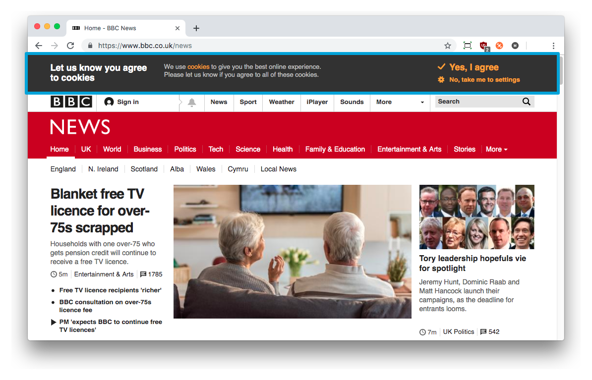

# Cookies and Sessions
In this chapter, we will be touching on the basics of handling *sessions* and storing *cookies*. Both go hand in hand with each other, and are of paramount importance in modern day Web applications. In the previous chapter, the Django framework used sessions and cookies to handle the login and logout functionality. However, all this was done behind the scenes. Here we will explore exactly what is going on under the hood, and how we can use cookies ourselves for other purposes.

## Cookies, Cookies Everywhere!
Whenever a request to a website is made, the webserver returns the content of the requested page. In addition, one or more cookies may also be sent as part of the request. Consider a cookie as a small piece of information sent from the server to the client. When a request is about to be sent, the client checks to see if any cookies that match the address of server exist on the client. If so, they are included in the request. The server can then interpret the cookies as part of the request's context and generate a response to suit.

As an example, you may login to a site with a particular username and password. When you have been authenticated, a cookie may be returned to your browser containing your username, indicating that you are now logged into the site. At every request, this information is passed back to the server where your login information is used to render the appropriate page - perhaps including your username in particular places on the page. Your session cannot last forever, however - cookies *have* to expire at some point in time - they cannot be of infinite length. A Web application containing sensitive information may expire after only a few minutes of inactivity. A different Web application with trivial information may expire half an hour after the last interaction - or even weeks into the future.

I> ### Cookie Origins
I> The term *cookie* wasn't actually derived from the food that you eat, but from the term *magic cookie*, a packet of data a program receives and sends again unchanged. In 1994, *MCI* sent a request to *Netscape Communications* to implement a way of implementing persistence across HTTP requests. This was in response to their need to reliably store the contents of a user's virtual shopping basket for an e-commerce solution they were developing. Netscape programmer Lou Montulli took the concept of a magic cookie and applied it to Web communications.
I> 
I> You can find out more about [cookies and their history on Wikipedia](http://en.wikipedia.org/wiki/HTTP_cookie#History). Of course, with such a great idea came a software patent - and you can read [US patent 5774670](http://patft.uspto.gov/netacgi/nph-Parser?Sect1=PTO1&Sect2=HITOFF&d=PALL&p=1&u=%2Fnetahtml%2FPTO%2Fsrchnum.htm&r=1&f=G&l=50&s1=5774670.PN.&OS=PN/5774670&RS=PN/5774670) that was submitted by Montulli himself.

The passing of information in the form of cookies can open up potential security holes in your Web application's design. This is why developers of Web applications need to be extremely careful when using cookies. When using cookies, a designer must always ask himself or herself: *does the information you want to store as a cookie **really** need to be sent and stored on a client's machine?* In many cases, there are more secure solutions to the problem. Passing a user's credit card number on an e-commerce site as a cookie for example would be highly insecure. What if the user's computer is compromised? A malicious program could take the cookie. From there, hackers would have his or her credit card number - all because your Web application's design is fundamentally flawed. This chapter examines the fundamental basics of client-side cookies - and server-side session storage for Web applications.

{id="fig-ch10-bbcnews"}

I> ### Cookies in the EU
I> In 2011, the European Union (EU) introduced an EU-wide *'cookie law'*, where all hosted sites within the EU should present a cookie warning message when a user visits the site for the first time. The [figure above](#fig-ch10-bbcnews) demonstrates such a warning on the BBC News website. You can read about [the law here](https://ico.org.uk/for-organisations/guide-to-pecr/cookies-and-similar-technologies/).
I>
I> If you are developing a site, you'll need to be aware of this law, and other laws especially regarding accessibility.

## Sessions and the Stateless Protocol
All correspondence between Web browsers (clients) and servers is achieved through the [HTTP protocol](http://en.wikipedia.org/wiki/Hypertext_Transfer_Protocol). As previously mentioned, HTTP is a [stateless protocol](http://en.wikipedia.org/wiki/Stateless_protocol). This means that a client computer running a Web browser must establish a new network connection (a [TCP](https://en.wikipedia.org/wiki/Transmission_Control_Protocol) connection) to the server each time a resource is requested (HTTP `GET`) or sent (HTTP `POST`) [^1].

Without a persistent connection between the client and server, the software on both ends cannot simply rely on connections alone to *hold session state*. For example, the client would need to tell the server each time who is logged on to the Web application on a particular computer. This is known as a form of *dialogue* between the client and server, and is the basis of a *session* - a [semi-permanent exchange of information](http://en.wikipedia.org/wiki/Session_(computer_science)). Being a stateless protocol, HTTP makes holding session state pretty challenging, but there are luckily several techniques we can use to circumnavigate this problem.

The most commonly used way of holding state is through the use of a *session ID* stored as a cookie on a client's computer. A session ID can be considered as a token (a sequence of characters, or a *string*) to identify a unique session within a particular Web application. Instead of storing all kinds of information as cookies on the client (such as usernames, names, or passwords), only the session ID is stored, which can then be mapped to a data structure on the Web server. Within that data structure, you can store all of the information you require. This approach is a **much more secure** way to store information about users. This way, the information cannot be compromised by a insecure client or a connection which is being snooped.

If you're using a modern browser that's properly configured, it'll support cookies. Pretty much every website that you visit will create a new *session* for you when you visit. You can see this for yourself now -- check out the [screenshot below](#fig-ch10-sessionid). For Google Chrome, you can view cookies for the currently open website by accessing Chrome's Developer Tools, by accessing *Chrome Settings > More Tools > Developer Tools*. When the Developer Tools pane opens, click the *Application* tab, and look for *Cookies* down the left hand side, within the *Storage* menu. If you're running this with a Rango page open, you should then hopefully see a cookie called `sessionid`. The `sessionid` cookie contains a series of letters and numbers that Django uses to uniquely identify your computer with a given session. With this session ID, all your session details can be accessed -- but they are only stored on the *server side*.

{id="fig-ch10-sessionid"}

I> ### Without Cookies
I> An alternative way of persisting state information *without cookies* is to encode the Session ID within the URL. For example, you may have seen PHP pages with URLs like this one: `http://www.site.com/index.php?sessid=someseeminglyrandomandlongstring1234`. This means you don't need to store cookies on the client machine, but the URLs become pretty ugly. These URLs go against the principles of Django - clean, human-friendly URLs.

## Setting up Sessions in Django
Although this should already be setup and working correctly, it's nevertheless good practice to learn which Django modules provide which functionality. In the case of sessions, Django provides [middleware](https://docs.djangoproject.com/en/1.9/topics/http/middleware/) that implements session functionality.

To check that everything is in order, open your Django project's `settings.py` file. Within the file, locate the `MIDDLEWARE` list. You should find within this list a module represented by the string `django.contrib.sessions.middleware.SessionMiddleware`. If you can't see it, add it to the list now. It is the `SessionMiddleware` middleware that enables the creation of unique `sessionid` cookies.

The `SessionMiddleware` is designed to work flexibly with different ways to store session information. There are many approaches that can be taken - you could store everything in a file, in a database, or even in a in-memory cache. The most straightforward approach is to use the `django.contrib.sessions` application to store session information in a Django model/database (specifically, the model `django.contrib.sessions.models.Session`). To use this approach, you'll also need to make sure that `django.contrib.sessions` is in the `INSTALLED_APPS` tuple of your Django project's `settings.py` file. Remember, if you add the application now, you'll need to update your database with the usual migration commands.

T> ### Caching Sessions
T> If you want faster performance, you may want to consider a cached approach for storing session information. You can check out the [official Django documentation for advice on cached sessions](https://docs.djangoproject.com/en/1.9/topics/http/sessions/#using-cached-sessions).

## A Cookie Tasting Session
While all modern Web browsers support cookies, certain cookies may get blocked depending on your browser's security level. Check that you've enabled support for cookies before continuing. It's likely however that everything is ready for you to proceed.

### Testing Cookie Functionality
To test out cookies, you can make use of some convenience methods provided by Django's `request` object. The three of particular interest to us are `set_test_cookie()`, `test_cookie_worked()` and `delete_test_cookie()`. In one view, you will need to set the test cookie. In another, you'll need to test that the cookie exists. Two different views are required for testing cookies because you need to wait to see if the client has accepted the cookie from the server.

We'll use two pre-existing views for this simple exercise, `index()` and `about()`. Instead of displaying anything on the pages themselves, we'll be making use of the terminal output from the Django development server to verify whether cookies are working correctly.

In Rango's `views.py` file, locate your `index()` view. Add the following line to the view. To ensure the line is executed, make sure you put it as the first line of the view.

{lang="python",linenos=off}
	request.session.set_test_cookie()

In the `about()` view, add the following three lines to the top of the function.

{lang="python",linenos=off}
	if request.session.test_cookie_worked():
	    print("TEST COOKIE WORKED!")
	    request.session.delete_test_cookie()

With these small changes saved, run the Django development server and navigate to Rango's homepage, `http://127.0.0.1:8000/rango/`. Now navigate to the about page, you should see `TEST COOKIE WORKED!` appear in your Django development server's console, like in the [figure below](#fig-ch10-test-cookie).

{id="fig-ch10-test-cookie"}

If the message isn't displayed, you'll want to check your browser's security settings. The settings may be preventing the browser from accepting the cookie.

## Client Side Cookies: A Site Counter Example
Now we know how cookies work, let's implement a very simple site visit counter. To achieve this, we're going to be creating two cookies: one to track the number of times the user has visited the Rango app, and the other to track the last time he or she accessed the site. Keeping track of the date and time of the last access will allow us to only increment the site counter once per day (for example) and thus avoid people spamming the site to increment the counter.

The sensible place to assume where a user enters the Rango site is at the index page. Open Rango's `view.py` file. Let's first make a function -- given a handle to both the `request` and `response` objects -- to handle cookies (`visitor_cookie_handler()`). We can then make use of this function in Rango's `index()` view. In `views.py`, add in the following function. Note that it is not technically a view, because it does not return a `response` object -- it is just a [*helper function*](https://web.cs.wpi.edu/~cs1101/a05/Docs/creating-helpers.html).

{lang="python",linenos=off}
	def visitor_cookie_handler(request, response):
	    # Get the number of visits to the site.
	    # We use the COOKIES.get() function to obtain the visits cookie.
	    # If the cookie exists, the value returned is casted to an integer.
	    # If the cookie doesn't exist, then the default value of 1 is used.
	    visits = int(request.COOKIES.get('visits', '1'))
	
	    last_visit_cookie = request.COOKIES.get('last_visit', str(datetime.now()))
	    last_visit_time = datetime.strptime(last_visit_cookie[:-7],
	                                        '%Y-%m-%d %H:%M:%S')
	
	    # If it's been more than a day since the last visit...
	    if (datetime.now() - last_visit_time).days > 0:
	        visits = visits + 1
	        # Update the last visit cookie now that we have updated the count
	        response.set_cookie('last_visit', str(datetime.now()))
	    else:
	        # Set the last visit cookie
	        response.set_cookie('last_visit', last_visit_cookie)
	    
	    # Update/set the visits cookie
	    response.set_cookie('visits', visits)

This helper function takes the `request` and `response` objects -- because we want to be able to access the incoming cookies from the `request`, and add or update cookies in the `response`. In the function, you can see that we call the `request.COOKIES.get()` function, which is a further helper function provided by Django. If the cookie exists, it returns the value. If it does not exist, we can provide a default value.  Once we have the values for each cookie, we can calculate whether a day (`.days`) has elapsed between the last visit.

If you want to test this code out without having to wait a day, change `days` to `seconds`. That way the visit counter can be updated every second, as opposed to every day.

**Note that all cookie values are returned as strings**; *do not assume that a cookie storing whole numbers will return an integer.* You have to manually cast this to the correct type yourself because there's no place in which to store additional information within a cookie telling us of the value's type.

If a cookie does not exist, you can create a cookie with the `set_cookie()` method of the `response` object you create. The method takes in two values, the name of the cookie you wish to create (as a string), and the value of the cookie. In this case, it doesn't matter what type you pass as the value - it will be automatically cast to a string.

Since we are using the `datetime` we need to `import` this into `views.py` at the top of the file.

{lang="python",linenos=off}
	from datetime import datetime

Next, update the `index()` view to call the `cookie_handler_function()` helper function. To do this, we need to extract the `response` first.

{lang="python",linenos=off}
	def index(request):
	    category_list = Category.objects.order_by('-likes')[:5]
	    page_list = Page.objects.order_by('-views')[:5]
	    context_dict = {'categories': category_list, 'pages': page_list}
	    
	    # Obtain our Response object early so we can add cookie information.
	    response = render(request, 'rango/index.html', context_dict)
	
	    # Call the helper function to handle the cookies
	    visitor_cookie_handler(request, response)
	
	    # Return response back to the user, updating any cookies that need changed.
	    return response

{id="fig-ch10-cookie-visits"}

Now if you visit the Rango homepage and open the cookie inspector provided by your browser (e.g. Google Chrome's Developer Tools), you should be able to see the cookies `visits` and `last_visit`. The [figure above](#fig-ch10-cookie-visits) demonstrates the cookies in action. Instead of using the developer tools, you could update the `index.html` and add `
visits: {{ visits }}
` to the template to show the number of visits.

<!-->
> ###Time
>
> You may notice that the `visits` cookie doesn't increment when you
> refresh your web browser. Why? The sample code we provide above only
> increments the counter *at least one whole day* after a user revisits
> the Rango homepage. This is an unacceptable time to wait when
> testing - so why not temporarily change the delay to a shorter time
> period? In the updated `index` view, find the following line.
>
> `if (datetime.now() - last_visit_time).days > 0:`
>
> We can easily change this line to compare the number of *seconds*
> between visits. In the example below, we check if the user visited at
> least five seconds prior.
>
> `if (datetime.now() - last_visit_time).seconds > 5:`
>
> This means you need only wait five seconds to see your `visits` cookie
> increment, rather than a whole day. When you're happy your code works,
> you can revert the comparison back to the original per-day timespan.
>
> Being able to find the difference between times using the `-` operator
> is one of the many awesome features that Python provides. When times
> are subtracted, a `timedelta` object is returned, which provides the
> `days` and `seconds` attributes we use in the code snippets above. You
> can check out the [official Python
> documentation](http://docs.python.org/2/library/datetime.html#timedelta-objects)
> for more information on this type of object, and what other attributes
> it provides.

-->

## Session Data
The previous example shows how we can store and manipulate client side cookies - or the data stored on the client. However, a more secure way to save session information is to store any such data on the server side. We can then use the session ID cookie that is stored on the client side (but is effectively anonymous) as the key to access the data.

To use session-based cookies you need to perform the following steps.

1.  Make sure that the `MIDDLEWARE_CLASSES` list found in the `settings.py` module contains `django.contrib.sessions.middleware.SessionMiddleware`.
2.  Configure your session backend. Make sure that `django.contrib.sessions` is in your `INSTALLED_APPS` in `settings.py`. If not, add it, and run the database migration command, `python manage.py migrate`.
3.  By default a database backend is assumed, but you might want to a different setup (i.e. a cache). See the [official Django Documentation on Sessions for other backend configurations](https://docs.djangoproject.com/en/1.9/topics/http/sessions/).

Instead of storing the cookies directly in the request (and thus on the client's machine), you can access server-side data via the method `request.session.get()` and store them with `request.session[]`. Note that a session ID cookie is still used to remember the client's machine (so technically a browser side cookie exists). However, all the user/session data is stored server side. Django's session middleware handles the client side cookie and the storing of the user/session data. 

To use the server side data, we need to refactor the code we have written so far. First, we need to update the `visitor_cookie_handler()` function so that it accesses the cookies on the server side. We can do this by calling `request.session.get()`, and store them by placing them in the dictionary `request.session[]`. To help us along, we have made a helper function called `get_server_side_cookie()` that asks the request for a cookie. If the cookie is in the session data, then its value is returned. Otherwise, the default value is returned.

Since all the cookies are stored server side, we won't be changing the response directly. Because of this, we can remove `response` from the `visitor_cookie_handler()` function definition.

{lang="python",linenos=off}
	# A helper method
	def get_server_side_cookie(request, cookie, default_val=None):
	    val = request.session.get(cookie)
	    if not val:
	        val = default_val
	    return val
	
	# Updated the function definition
	def visitor_cookie_handler(request):
	    visits = int(get_server_side_cookie(request, 'visits', '1'))
	    last_visit_cookie = get_server_side_cookie(request,
	                                               'last_visit',
	                                               str(datetime.now()))
	    last_visit_time = datetime.strptime(last_visit_cookie[:-7],
	                                        '%Y-%m-%d %H:%M:%S')
	
	    # If it's been more than a day since the last visit...
	    if (datetime.now() - last_visit_time).days > 0:
	        visits = visits + 1
	        #update the last visit cookie now that we have updated the count
	        request.session['last_visit'] = str(datetime.now())
	    else:
	        # set the last visit cookie 
	        request.session['last_visit'] = last_visit_cookie
	
	    # Update/set the visits cookie
	    request.session['visits'] = visits

Now that we have updated the handler function, we can now update the `index()` view. First change `visitor_cookie_handler(request, response)` to `visitor_cookie_handler(request)`. Then add in the following line to pass the number of visits to the context dictionary.

{lang="python",linenos=off}
	context_dict['visits'] = request.session['visits']

Make sure that these lines are executed before `render()` is called, or your changes won't be executed. The `index()` view should look like the code below.

{lang="python",linenos=off}
	def index(request):
	    request.session.set_test_cookie()
	    category_list = Category.objects.order_by('-likes')[:5]
	    page_list = Page.objects.order_by('-views')[:5]
	    context_dict = {'categories': category_list, 'pages': page_list}
	        
	    visitor_cookie_handler(request)
	    context_dict['visits'] = request.session['visits']
	    
	    response = render(request, 'rango/index.html', context=context_dict)
	    return response

Before you restart the Django development server, delete the existing client side cookies to start afresh. See the warning below for more information.

W> ### Avoiding Cookie Confusion
W> It's highly recommended that you delete any client-side cookies for Rango *before* you start using session-based data. You can do this in your browser's cookie inspector by deleting each cookie individually, or simply clear your browser's cache entirely -- ensuring that cookies are deleted in the process.

I> ### Data Types and Cookies
I> An added advantage of storing session data server-side is its ability to cast data from strings to the desired type. This only works however for [built-in types](http://docs.python.org/2/library/stdtypes.html), such as `int`, `float`, `long`, `complex` and `boolean`. If you wish to store a dictionary or other complex type, don't expect this to work. In this scenario, you might want to consider [pickling your objects](https://wiki.python.org/moin/UsingPickle).

## Browser-Length and Persistent Sessions
When using cookies you can use Django's session framework to set cookies as either *browser-length sessions* or *persistent sessions*. As the names of the two types suggest:

-   browser-length sessions expire when the user closes his or her browser; and
-   persistent sessions can last over several browser instances - expiring at a time of your choice. This could be half an hour, or even as far as a month in the future.

By default, browser-length sessions are disabled. You can enable them by modifying your Django project's `settings.py` module. Add the variable `SESSION_EXPIRE_AT_BROWSER_CLOSE`, setting it to `True`.

Alternatively, persistent sessions are enabled by default, with `SESSION_EXPIRE_AT_BROWSER_CLOSE` either set to `False`, or not being present in your project's `settings.py` file. Persistent sessions have an additional setting, `SESSION_COOKIE_AGE`, which allows you to specify the age of which a cookie can live to. This value should be an integer, representing the number of seconds the cookie can live for. For example, specifying a value of `1209600` will mean your website's cookies expire after a two week (14 day) period.

Check out the available settings you can use on the [official Django documentation on cookies](https://docs.djangoproject.com/en/1.9/ref/settings/#session-cookie-age) for more details. You can also check out [Eli Bendersky's blog](http://eli.thegreenplace.net/2011/06/24/django-sessions-part-i-cookies/) for an excellent tutorial on cookies and Django.

## Clearing the Sessions Database
Sessions accumulate easily, and the data store that contains session information does too. If you are using the database backend for Django sessions, you will have to periodically clear the database that stores the cookies. This can be done using `$ python manage.py clearsessions`. The [official Django documentation](https://docs.djangoproject.com/en/1.9/topics/http/sessions/#clearing-the-session-store) suggests running this daily as a [Cron job](https://en.wikipedia.org/wiki/Cron). If you don't, you could find your app's performance begin to degrade when it begins to experience more and more users.

## Basic Considerations and Workflow
When using cookies within your Django application, there are a few things you should consider.

- First, consider what type of cookies your Web application requires. Does the information you wish to store need to persist over a series of user browser sessions, or can it be safely disregarded upon the end of one session?
- Think carefully about the information you wish to store using cookies. Remember, storing information in cookies by their definition means that the information will be stored on client's computers, too. This is a potentially huge security risk: you simply don't know how compromised a user's computer will be. Consider server-side alternatives if potentially sensitive information is involved.
- As a follow-up to the previous bullet point, remember that users may set their browser's security settings to a high level that could potentially block your cookies. As your cookies could be blocked, your site may function incorrectly. You *must* cater for this scenario - *you have no control over the client browser's setup*.

If client-side cookies are the right approach for you, then work through the following steps.

1. You must first perform a check to see if the cookie you want exists. Checking the `request` parameter parameter will allow you to do this. The `request.COOKIES.has_key('<cookie_name>')` function returns a boolean value indicating whether a cookie `<cookie_name>` exists on the client's computer or not.
2. If the cookie exists, you can then retrieve its value - again via the `request` parameter - with `request.COOKIES[]`. The `COOKIES` attribute is exposed as a dictionary, so pass the name of the cookie you wish to retrieve as a string between the square brackets. Remember, cookies are all returned as strings, regardless of what they contain. You must therefore be prepared to cast to the correct type (with `int()` or `float()`, for example).
3. If the cookie doesn't exist, or you wish to update the cookie, pass the value you wish to save to the response you generate. `response.set_cookie('<cookie_name>', value)` is the function you call, where two parameters are supplied: the name of the cookie, and the `value` you wish to set it to.

If you need more secure cookies, then use session based cookies.

1.  Firstly, ensure that the `MIDDLEWARE_CLASSES` list in your Django project's `settings.py` module contains `django.contrib.sessions.middleware.SessionMiddleware`. If it doesn't, add it to the list.
2.  Configure your session backend `SESSION_ENGINE`. See the [official Django Documentation on Sessions](https://docs.djangoproject.com/en/1.9/topics/http/sessions/) for the various backend configurations.
3.  Check to see if the cookie exists via `requests.sessions.get()`.
4.  Update or set the cookie via the session dictionary, `requests.session['<cookie_name>']`.

X> ### Exercises
X>
X> Now you've read through this chapter and tried out the code, give these exercises a go.
X> 
X> - Check that your cookies are server side. Clear the browser's cache and cookies, then check to make sure you can't see the `last_visit` and `visits` variables in the browser. Note you will still see the `sessionid` cookie. Django uses this cookie to look up the session in the database where it stores all the server side cookies about that session.
X> - Update the *About* page view and template telling the visitors how many times they have visited the site. Remember to call the `visitor_cookie_handler()` before you attempt to get the `visits` cookie from the `request.session` dictionary, otherwise if the cookie is not set it will raise an error. 

[^1]: The latest version of the HTTP standard HTTP 1.1 actually supports the ability for multiple requests to be sent in one TCP network connection. This provides huge improvements in performance, especially over high-latency network connections (such as via a traditional dial-up modem and satellite). This is referred to as *HTTP pipelining*, and you can read more about this technique on [Wikipedia](http://en.wikipedia.org/wiki/HTTP_pipelining).