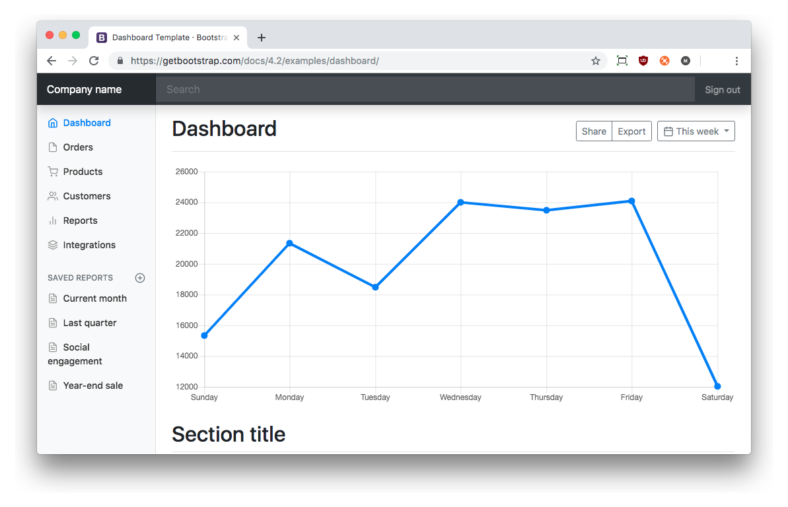
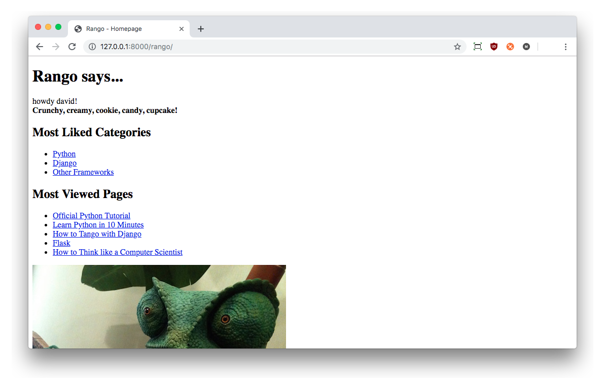
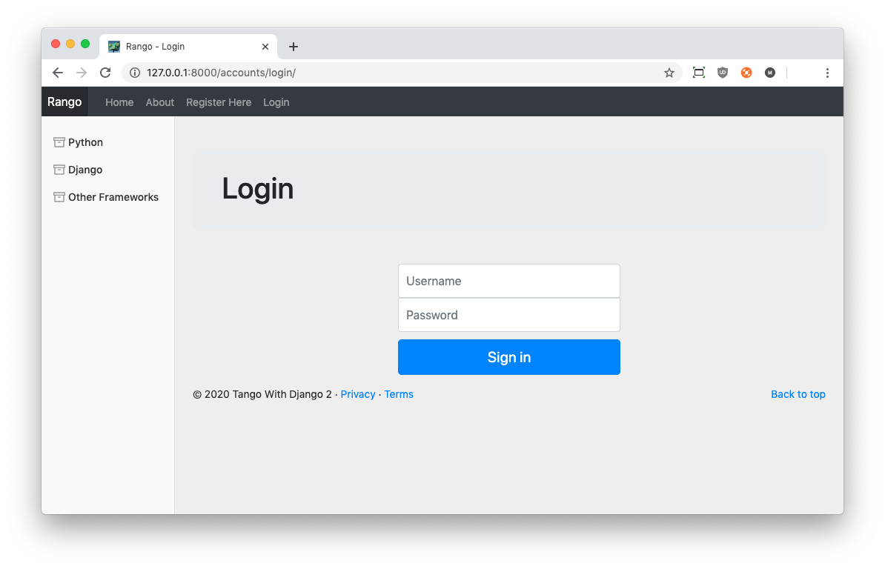
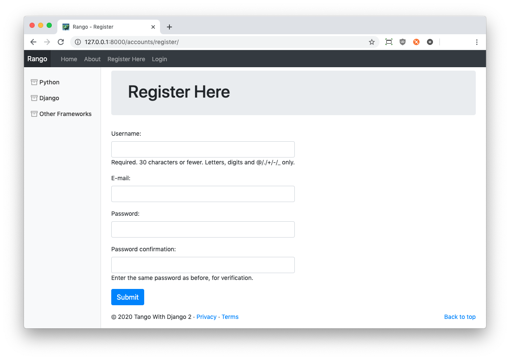

# Bootstrapping Rango {#chapter-bootstrap}
In this chapter, we will be styling Rango using the *Twitter Bootstrap 4* toolkit. Bootstrap is one of the most popular toolkits for styling HTML pages, utilising both CSS and JavaScript (JavaScript is used to provide functionality for user interface components such as menus). The toolkit lets you design and style [*responsive* web applications](https://en.wikipedia.org/wiki/Responsive_web_design), and is pretty easy to use once you familiarise yourself with it.

I> ### Cascading Style Sheets
I> If you are not familiar with CSS, have a look at the [CSS crash course](#chapter-css). We provide a quick guide on the basics of using Cascading Style Sheets.

Now take a look at the [Bootstrap 4.0 website](http://getbootstrap.com/). The website provides you with sample code and examples of the different components that the toolkit provides, and provides you with examples and documentation on how to style them by adding in the appropriate markup and/or code. In addition, the website also provides a number of [complete example layouts](http://getbootstrap.com/examples/) from which we can base our design for Rango on.

To style Rango we have identified that the [dashboard layout](https://getbootstrap.com/docs/4.2/examples/dashboard/) more or less meets our needs. The layout provides us with a menu bar at the top, a sidebar (which we will use to show categories), and a main content pane in which we can display page-specific information. You can see the example layout in [the figure below](#fig-bootstrap-dashboard).

{id="fig-bootstrap-dashboard"}

To tailor the dashboard HTML source to our Rango app, we need to make a number of modifications. Rather than going through and doing this yourself, the modified HTML source is available from our [GitHub Repository](http://bit.ly/twd-bootstrap-base), but for completeness is also shown below.

Download and save the HTML source for our modified dashboard layout to a file called `bootstrap-base.html`. Like all other templates specific to Rango, this should be placed within your `<Workspace>/tango_with_django_project/templates/rango/` directory.

Below is a list of all the different modifications we made to the original dashboard HTML source.

- First, we replaced all references of `../../` (which symbolises to go look two directories back from where we are currently) to be `http://getbootstrap.com/docs/4.2/`. This ensures that we use external files (such as stylesheets and JavaScript files) that are part of Bootstrap 4.2.
- We replaced the reference to the Bootstrap dashboard stylesheet `dashboard.css` to `http://getbootstrap.com/docs/4.2/examples/dashboard/dashboard.css`. This provides an absolute reference to the file, once again removing doubt as to what version we are referring to.
- We took out the search form from the *navigation bar* at the top of the page.
- We stripped out all the non-essential content from the original HTML page, and replaced it with the Rango `body_block` code ``.
- We set the `<title>` element of the page to fit with what we worked on earlier: `<title>How to Tango with Django!</title>`
- We changed `project name` to be `Rango`.
- We added the links to the index page, login page, register page and so forth to the navigation bar at the top.
- We added in a side block from earlier in the tutorial, ``
- Finally, we added in ``  and `` after the `DOCTYPE` tag to ensure all the necessary imports are present and correct.

We appreciate that this all seems rather hacky -- and to some extent it is -- but the main point of this exercise is to provide a consistent style to the application and learn by experimenting with the CSS. Taking an off-the-shelf example gets us up and running quickly so we can focus on adapting it for use with Rango.

## The Template

W> ### Copying and Pasting
W> In the introductory chapter, we said not the copy and paste -- but this is an exception. 
W> However, if you directly cut and paste you will end up bringing additional text you do not want. To get started quickly, go to our GitHub page and get the [base template](http://bit.ly/twd-bootstrap-base) shown below.
W> 
W> If you don't understand what the specific Bootstrap classes do, check out the [Bootstrap documentation](https://getbootstrap.com/docs/4.3/getting-started/introduction/) to improve your understanding.

{lang="html",linenos=on}
	<!DOCTYPE html>
	
	
	
	
	<html lang="en">
	<head>
	    <meta charset="utf-8">
	    <meta name="viewport" 
	          content="width=device-width, initial-scale=1, shrink-to-fit=no">
	    <meta name="description" content="">
	    <meta name="author" 
	          content="Mark Otto, Jacob Thornton, and Bootstrap contributors">
	    <meta name="generator" 
	          content="Jekyll v3.8.5">
	    <link rel="icon" href="">
	    <title>
	        Rango - How to Tango with Django!
	    </title>
	    <!-- Bootstrap core CSS -->
	    <link href="https://getbootstrap.com/docs/4.2/dist/css/bootstrap.min.css" 
	          rel="stylesheet">
	    <!-- Custom styles for this template -->
	    <link href="https://getbootstrap.com/docs/4.2/examples/dashboard/dashboard.css" 
	          rel="stylesheet">
	</head>
	<body>
	<header>
	    <nav class="navbar navbar-expand-md navbar-dark fixed-top bg-dark p-0">
	    <a class="navbar-brand p-2" href="">Rango</a>
	
	    <button class="navbar-toggler" type="button" data-toggle="collapse" 
	        data-target="#navbarCollapse" aria-controls="navbarCollapse" 
	        aria-expanded="false" aria-label="Toggle navigation">
	    
	    </button>
	    

	    <ul class="navbar-nav mr-auto">
	    <li class="nav-item">
	        <a class="nav-link" href="">Home</a></li>
	    <li class="nav-item ">
	        <a class="nav-link" href="">About</a></li>
	    
	    <li class="nav-item ">
	        <a class="nav-link" 
	        href="">Restricted</a></li>
	    <li class="nav-item">
	        <a class="nav-link" 
	        href="">Add Category</a></li>
	    <li class="nav-item">
	        <a class="nav-link" 
	        href="?next=/rango/">Logout</a></li>
	    
	    <li class="nav-item">
	        <a class="nav-link" 
	        href="">Register Here</a></li>
	    <li class="nav-item ">
	        <a class="nav-link" 
	        href="">Login</a></li>
	    
	    </ul>
	    

	    </nav>
	</header>
	
	

	    

	    <nav class="col-md-2 d-none d-md-block bg-light sidebar">
	    

	    
	        
	    
	    

	    </nav> 
	    <main role="main" class="col-md-9  ml-sm-auto col-lg-10 px-4">		
	    
	    
	    <footer>
	        
<a href="#">Back to top</a>

	        
&copy; 2019 Tango With Django 2 &middot; <a href="#">Privacy</a> &middot; 
	            <a href="#">Terms</a>

	    </footer>
	    </main>
	    

	    

	    <!-- Bootstrap core JavaScript -->
	    <!-- Placed at the end of the document so the pages load faster -->
	    
	    
	    
	    
	    
	    </body>
	</html>

Once you have prepared the new `bootstrap_base.html` template, download the [Rango Favicon](https://raw.githubusercontent.com/leifos/tango_with_django_2/master/code/tango_with_django_project/static/images/favicon.ico). This is the small icon that appears next to the URL in your browser! Save this file to `<Workspace>/tango_with_django_project/static/images/`.

If you take a close look at the modified Bootstrap dashboard HTML source, you'll notice it has a lot of structure in it created by a series of `
` tags. Essentially the page is broken into two parts -- the top navigation bar which is contained by `<header>` tags, and the main content pane denoted by the `<main ... >` tag. Within the main content pane, there is a `
` which houses two other `
`s for the `sidebar_block` and the `body_block`.
	
	
The code above assumes that you have completed the chapters on user authentication and used `django-registration-redux`, as outlined in the previous chapter. If you haven't done both of these activities, you will need to update the template and remove/modify the references to those links in the navigation bar in the header. 
	
Also of note is that the HTML template makes references to external websites to request the required `css` and `js` files. So you will need to be connected to the internet for the style to be loaded when you run the application.

I> ### Working Offline?
I> Rather than including external references to the `css` and `js` files, you could download all the associated files and store them in your static directory. If you do this, simply update the base template to reference the static files stored locally. 

	
## Quick Style Change
To give Rango a much needed facelift, we need to update our base template to make use of the new `base_bootstrap.html` template. It's now ready to go! There are many ways to do this, with one option being to rename `base.html` to `base_bootstrap.html` in all your other templates. However, a quicker solution would be to do the following.

1. Rename the `base.html` template in `templates/rango/` to `base-old.html`.
2. Rename the `base_bootstrap.html` template in `templates/rango/` to `base.html`.

This ensures you keep a copy of your old `base.html` template, and switch the active template that all other Rango templates inherit from to the Bootstrapped version.

T> ### Using `git`?
T> If you are using Git, it would be prudent to use the `git mv` commands in your terminal or Command Prompt to ensure that Git can keep track of these filename changes. If you are using a GUI to manage your Git repository, use that to perform the renaming instead.

Now reload Rango in your browser. You should see a screen that looks similar to the one below.

{id="fig-bootstrap-initial"}

Have a look through the different pages of your app. Since they all inherit from `base.html`, they will all now employ the Bootstrap dashboard layout. However, they aren't perfect yet! In the remainder of this chapter, we will go through a number of changes to the templates, and use various Bootstrap components to improve the look and feel of Rango further. But to remind yourself of what Rango looked like before, compare and contrast to the figure below!

{id="fig-bootstrap-initial"}

<!--
## Page Headers
Now that we have the `base.html` all set up and ready to go, we can do a
really quick face lift to Rango by going through the Bootstrap
components and selecting the ones that suit the pages.

Let's start by updating all our templates by adding in the class `page-header` to the `<h1>` title tag at the top of each page. For example the `about.html` would be updated as follows.

{lang="html",linenos=off}
	
	
	
		About
	
	
	
		

		<h1 class="page-header">About Page</h1>			
			This tutorial has been put together by: leifos and maxwelld90 
		
	
		 
	

This doesn't visually appear to change the look and feel, but it informs the toolkit what is the title text, and if we change the theme then it will be styled appropriately.

-->

### Sidebar Categories
For of all the sidebar categories are not displaying very nicely. If we take a look at the HTML source code for the [Dashboard page](https://getbootstrap.com/docs/4.2/examples/dashboard/), we can notice that a few classes have been added to the `<ul>` and `<li>` tags to denote that they are nav-items and nav-links respectively. So update the template as shown below.

{lang="html",linenos=off}
	<ul class="nav flex-column">
	
		
		
			<li  class="nav-item">
			<a  class="nav-link active" href="">
			
			{ c.name }}</a>
			</li>
		
			<li class="nav-item">
			<a  class="nav-link" href="">
			{{ c.name }}</a>
			</li>
		
	
	
		<li class="nav-item">No Categories Yet!</li>
	
	</ul>

Also, rather than using `<strong>` to show that the category page has been selected, we have added the `active` class to the active category. We can also add in a `feather-icon` using the `<span. ... >' tag. Here we chose the `archive` icon, but you can see that there are loads of icons to choose from at Feather Icons (https://feathericons.com/)

### The Index Page
For the index page it would be nice to show the top categories and top pages in two separate columns, while the title is at the top.

 Looking at the Bootstrap examples, we can see that in the [Jumbotron](https://getbootstrap.com/docs/4.2/examples/jumbotron/)  example, they have a neat header element (i.e. the jumbotron) which we can put our title message in. And so we can update the index.html as follows:
 
{lang="html",linenos=off}
	

	

		<h1 class="jumbotron-heading">Rango says...</h1>
		

		<h2 class="h2">
		
			Howdy {{ user.username }}!
		
			Hey there partner!
		
		</h2>
		<strong>{{ boldmessage }}</strong>
		

	

	

	
	
You might notice that after the `jumbotron` we have put `p-4`. The `p-4` controls the [spacing](https://getbootstrap.com/docs/4.2/utilities/spacing/) around the jumbotron. Try changing the padding to be `p-6` or `p-1`. You can also control the space of the top, bottom, left and right by specifically setting `pt`, `pb`, `pr` and `pl`. 
  
  
 X> ### Site Styling Exercise
 X> Update all other templates so that the page heading is encapsulated within a jumbotron. This will make the whole application have a consistent look and feel.
  
 
 Then to create the two columns, we draw upon the [Album](https://getbootstrap.com/docs/4.2/examples/album/) example. While it has three columns, called cards, we only need two. Most, if not all, CSS frameworks use a [grid layout](https://getbootstrap.com/docs/4.2/layout/grid/)  consisteing of 12 blocks. If you inspect the HTML souce for the Album you will see that within a row there is a `
` which sets the size of the cards `
` followed by `
`. This sets each card to be 4 units in length relative to the width (and 4 by 3 is 12). Since we want two cards (one for the most popular pages and most popular categories) then we can change the 4 to a 6 (i.e. 2 by 6 is 12). And so you can update the `index.html` with the following HTML.
 
{lang="html",linenos=off}
	

	

	

	

	

		<h2 >Most Liked Categories</h2>
		

		
		<ul>
			
				<li>
				<a href="">
					{{ category.name }}</a>
				</li>
			
			</ul>
		
			<strong>There are no categories present.</strong>
		
		

	

	

	

	

	

	

		<h2>Most Viewed Pages</h2>
		

		
			<ul>
			
				<li>
				<a href="{{ page.url }}">{{ page.title }}</a>
				</li>
			
			</ul>
		
			<strong>There are no pages present.</strong>
		
		

	

	

	

	

	

 
Once you have updated the template, reload the page - it should look a lot better now, but the way the list items are presented is pretty horrible. 

Let's use the [list group styles provided by Bootstrap](https://getbootstrap.com/docs/4.2/components/list-group/) to improve how they look. We can do this quite easily by changing the `<ul>` elements to `<ul class="list-group">` and the `<li>` elements to `<li class="list-group-item">`. Reload the page, any better?

###The Login Page
Now let's turn our attention to the login page. On the Bootstrap website you can see they have already made a [nice login form](https://getbootstrap.com/docs/4.2/examples/sign-in/). If you take a look at the source, you'll notice that there are a number of classes that we need to include to stylise the basic login form. Update the `body_block` in the `login.html` template as follows:

{lang="html",linenos=off}
	
	<link href="https://getbootstrap.com/docs/4.0/examples/signin/signin.css"
		rel="stylesheet">
	

		<h1 class="jumbotron-heading">Login</h1>
	

	

	<form class="form-signin" role="form" method="post" action=".">
		
		<h2 class="form-signin-heading">Please sign in</h2>
		<label for="inputUsername" class="sr-only">Username</label>
		<input type="text" name="username" id="id_username" class="form-control" 
			placeholder="Username" required autofocus>
		<label for="inputPassword" class="sr-only">Password</label>
		<input type="password" name="password" id="id_password" class="form-control"
			placeholder="Password" required>
		<button class="btn btn-lg btn-primary btn-block" type="submit" 
			value="Submit" />Sign in</button>
	</form>
	

	

Besides adding in a link to the bootstrap `signin.css`, and a series of changes to the classes associated with elements, we have removed the code that automatically generates the login form, i.e. `form.as_p`. Instead, we took the elements, and importantly the `id` of the elements generated and associated them with the elements in this bootstrapped form. To find out what these `id`s were, we ran Rango, navigated to the page, and then inspected the source to see what HTML was produced by the `form.as_p` template tag. 

In the button, we have set the class to `btn` and `btn-primary`. If you check out the [Bootstrap section on buttons](https://getbootstrap.com/docs/4.2/components/buttons/) you can see there are lots of different colours, sizes and styles that can be assigned to buttons.

### Other Form-based Templates
You can apply similar changes to `add_cagegory.html` and `add_page.html` templates. For the `add_page.html` template, we can set it up as follows.

{lang="html",linenos=off}
	
	Add Page
	
		

			

			<h1 class="jumbotron-heading">Add Page to {{category.name}}</h1>
			

		

		

			

			<form role="form" id="page_form" method="post" 
				action="/rango/category/{{category.slug}}/add_page/">
			
			
				{{ hidden }}
			
			
				{{ field.errors }}
				{{ field.help_text }} 
				{{ field }} 
				

			
			 
			<button class="btn btn-primary"
				type="submit" name="submit">
					Add Page
			</button>
			

			</form>
			

		

	

X> ### Category Form Style Exercise
X> Create a similar template for the Add Category page called `add_category.html`.

###The Registration Template
For the `registration_form.html`, we can update the form as follows:

{lang="python",linenos=off}
	
	
	

		

		<h1 class="jumbotron-heading">Register Here</h1>	
		

	

	

		

		

		<form role="form"  method="post" action=".">
			
			

			
<label class="required" for="id_username">
				Username:</label>
			<input class="form-control" id="id_username" maxlength="30" 
				name="username" type="text" />
			
				Required. 30 characters or fewer.
				Letters, digits and @/./+/-/_ only.
			
			

			
<label class="required" for="id_email">
				E-mail:</label>
			<input class="form-control" id="id_email" name="email" 
				type="email" />
			

			
<label class="required" for="id_password1">
				Password:</label>
			<input class="form-control" id="id_password1" name="password1"
				type="password" />
			

			

			<label class="required" for="id_password2">
				Password confirmation:</label>
			<input class="form-control" id="id_password2" name="password2" 
				type="password" />
			
				Enter the same password as before, for verification.
			
			

			

			<button type="submit" class="btn btn-primary">Submit</button>
		</form>
		

	

	

	

Again we have manually transformed the form created by the `{{ form.as_p }}` template tag, and added the various bootstrap classes.

W> ### Bootstrap, HTML and Django Kludge
W> This is not the best solution - we have kind of kludged it together. 
W> It would be much nicer and cleaner if we could instruct Django when building the HTML for the form to insert the appropriate classes. But we will leave that to you to figure out :-)

###Next Steps
In this chapter we have described how to quickly style your Django application using the Bootstrap toolkit. Bootstrap is highly extensible and it is relatively easy to change themes - check out the [StartBootstrap Website](http://startbootstrap.com/) for a whole series of free themes. Alternatively, you might want to use a different CSS toolkit like: [Zurb](http://zurb.com), [Gridism](http://cobyism.com/gridism/), [Pure](https://purecss.io) or [GroundWorkd](https://groundworkcss.github.io/groundwork/). Now that you have an idea of how to hack the templates and set them up to use a responsive CSS toolkit, we can now go back and focus on finishing off the extra functionality that will really pull the application together.

X> ### Another Style Exercise
X> While this tutorial uses Bootstrap, an additional, and optional exercise, would be to style Rango using one of the other responsive CSS toolkits.  If you do create your own style, let us know and we can link to it to show others how you have improved Rango's styling!