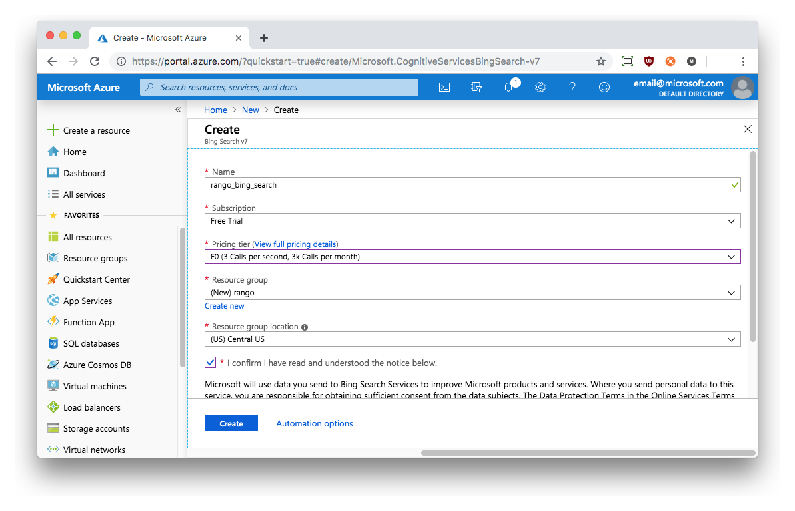
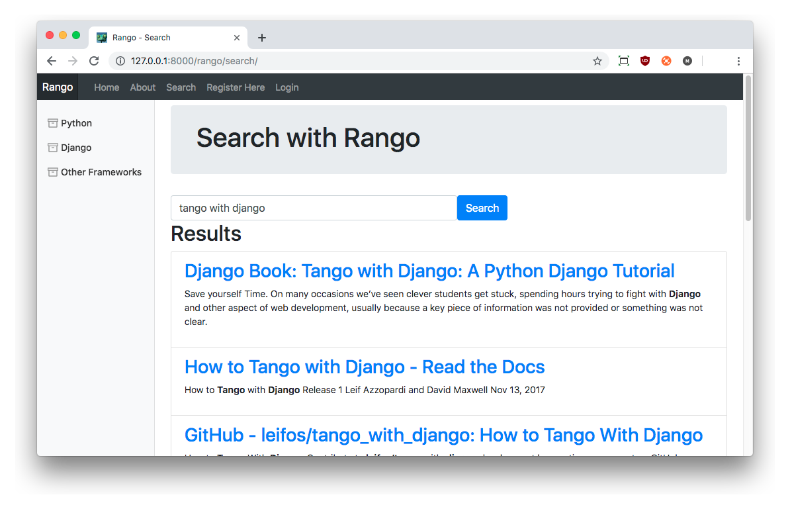

# Adding Search to Rango {#chapter-bing}
Now that most of the core functionality of Rango has been implemented (and it looks good, too!), we can move to address some more advanced functionality. In this chapter, we will connect Rango up to a *search API* so that users can also *search* for pages, rather than simply *browse* categories. Therefore, the main point of this chapter is to show you how you can connect and use other web services -- and how to integrate them within your own Django app.

The search API that we will be using will be *Microsoft's Bing Search API*. However, you could just as readily use any available search API, such as those provided by [Webhose](https://webhose.io/) or [Yandex](https://yandex.com/support/search/robots/search-api.html).

To use the Bing Search API, we will need to write a [wrapper](https://en.wikipedia.org/wiki/Adapter_pattern), which enables us to send a query and obtain the results from Bing's API -- all the while returning results to us in a convenient format that we can readily use in our code. However, before we can do so, we first need to set up a Microsoft Azure account to use the Bing Search API.

## The Bing Search API
The [Bing Search API](https://docs.microsoft.com/en-gb/rest/api/cognitiveservices/bing-web-api-v7-reference) provides you with the ability to embed search results from the Bing search engine within your own applications. Through a straightforward interface, you can request results from Bing's servers to be returned in either XML or JSON. The data returned can then be interpreted by an XML or JSON parser, with the results then, for example, rendered as part of a template within your application.

Although the Bing API can handle requests for different kinds of content, we'll be focusing on web search only for this tutorial, with JSON-formatted responses. To use the Bing Search API, you will need to sign up for an *API key*. The key currently provides subscribers with access to 3000 queries per month, which should be more than enough for our experimental purposes.

I> ### Application Programming Interface (API)
I> An [Application Programming Interface](http://en.wikipedia.org/wiki/Application_programming_interface) specifies how software components should interact with one another. In the context of web applications, an API is considered as a set of HTTP requests along with a definition of the structures of response messages that each request can return. Any meaningful service that can be offered over the Internet can have its API. We aren't limited to web search! For more information on web APIs, [Luis Rei provides an excellent tutorial on APIs](http://blog.luisrei.com/articles/rest.html).

### Registering for a Bing API Key
To obtain a Bing API key, you must first register for a Microsoft Azure account. The account provides you with access to a wide range of Microsoft services. If you already have a Microsoft account, you do not need to register you can log in. Otherwise, you can go online and create a free account with Microsoft at [`https://account.windowsazure.com`](https://account.windowsazure.com).

When your account has been created, log in and go to the portal. The link is at the top right of the page.

Once the portal has loaded, you should see a list of options down the left-hand side of the viewport. Find the top option called `Create a resource` and click it. The right-hand side of the page will then be populated with more lists. From there, find the `AI + Machine Learning` option and select that. Scroll through the options on the subsequent menu that appears, and select the `Bing Search v7` option.

W> ### Entering Personal Information
W> At this stage, you may be redirected to a page where you have to supply details such as your address and payment card. Microsoft says that this information is required to ensure that spammers and bots do not infiltrate their services -- and rest assured, if you need to provide payment details, no money will be taken from your bank account unless you specifically authorise it. We will be using the free Bing Search API allowance, so no money will need to be transferred.
W> If you do need to provide this information, you'll need to head back to the portal and look for the `Bing Search v7` option once more.

You'll then be greeted with a page similar to [the one below](#fig-azure-create). Here, you need to provide a name for your Bing Search service -- something like `rango_bing_search` will do the job nicely. Ensure that you select `Free Trial` for the subscription, and pricing tier `T0` (allowing 3000 free requests per month). Selecting these options will ensure that you will not be charged for access to the API. You'll also need to make a new group -- we made one called `rango`. The resource location doesn't matter as we won't be worrying about things like response times and the like. Once you are happy, click `Create` at the bottom of the page.

{id="fig-azure-create"}

You'll then need to wait for the resource to be created -- this will take a few minutes. After it has been created, you should see a screen confirming that your new resource has been created. On that screen, click the `Go to resource` button.

A new page will then load. Here, you should look for the `Keys` option under the `Resource Management` header. You should see the screen [like the one below](#fig-azure-keys). The keys in this figure are deliberately obscured. Take note of each of the three items on this page -- `name`, `key 1` and `key 2`. Copy the value of `key1` into a text file, as we will need this later! The key you save here will be required when we attempt to access the Bing Search API later on.

{id="fig-azure-keys"}

## Adding Search Functionality {#sec-bing-pyfunc}
With your keys in hand, it's now time to get coding. Below, we have provided the necessary code so that we can programmatically issue search queries to the Bing Search API. Create a file called `bing_search.py` inside your `rango` app directory -- the same directory with modules like `views.py` and `models.py`. Add the code shown below.

I> ### The `requests` Package
I> For this code to work, you'll need to add the `requests` package to Rango's environment. You can do this by running the command `$ pip install requests` in your terminal or Command Prompt. If you don't do this, the code won't work.

{lang="python",linenos=on}
	import json
	import requests
	
    
	# Add your Microsoft Account Key to a file called bing.key
	def read_bing_key():
	    """
	    reads the BING API key from a file called 'bing.key'
	    returns: a string which is either None, i.e. no key found, or with a key
	    remember to put bing.key in your .gitignore file to avoid committing it.
	
	    See Python Anti-Patterns - it is an awesome resource to improve your python code
	    Here we using "with" when opening documents
	    http://bit.ly/twd-antipattern-open-files
	    """
	    bing_api_key = None
	    try:
	        with open('bing.key','r') as f:
	            bing_api_key = f.readline().strip()
	    except:
	        try:
	            with open('../bing.key') as f:
	                bing_api_key = f.readline().strip()
	        except:
	            raise IOError('bing.key file not found')
	    
	    if not bing_api_key:
	        raise KeyError('Bing key not found')
	
	    return bing_api_key
	
	def run_query(search_terms):
	    """
	    See the Microsoft's documentation on other parameters that you can set.
	    http://bit.ly/twd-bing-api
	    """
	    bing_key = read_bing_key()
	    search_url = 'https://api.cognitive.microsoft.com/bing/v7.0/search'
	    headers = {"Ocp-Apim-Subscription-Key" : bing_key}
	    params  = {"q": search_terms, "textDecorations":True, "textFormat":"HTML"}
	    
	    # Issue the request, given the details above.
	    response = requests.get(search_url, headers=headers, params=params)
	    response.raise_for_status()
	    search_results = response.json()
	
	    # With the response now in play, build up a Python list.
	    results = []
	    for result in search_results["webPages"]["value"]:
	        results.append({
	            'title': result['name'],
	            'link': result['url'],
	            'summary': result['snippet']})
	    return results

I> ### Python Anti-Patterns
I> In the wrapper we avoided problems with opening files (and not remembering to close them) by using the `with` command.
I> Opening the file directly is a common anti-pattern that should be avoided.
I> To find out more about anti-patterns in Python, then check out the [Little Book of Python Anti-Patterns](http://bit.ly/twd-python-anti-patterns).
I> It is an awesome resource that will help you to improve your python code.

I> ### Reading `bing.key`
I> In function `read_bing_key()`, you may be a bit unsure as to why we attempt to read the `bing.key` file from a different location if the first attempt fails. This block of code is present to make future exercise that little bit easier for you.

In the module(s) above, we have implemented two functions: one to retrieve your Bing API key from a local file, and another to issue a query to the Bing search engine. Below, we discuss how both of the functions work.

### `read_bing_key()` -- Reading the Bing Key {#section-bing-adding-key}
The `read_bing_key()` function reads in your key from a file called `bing.key`, located in your Django project's root directory (i.e. `<workspace>/tango_with_django/`). Putting your API key in a different file from the logic of handling API *requests separates your concerns.* We have created this function because if you are putting your code into a public repository on GitHub for example, you should take some precautions to avoid sharing your API Key publicly. 

Take the value of `key 1` that you took from the Azure portal earlier, and paste it into `<workspace>/tango_with_django/bing.key`. The key should be the only contents of the file -- nothing else should exist within it. **This file should NOT be committed to your GitHub repository.** To make sure that you do not accidentally commit it, add or update your [repository's `.gitignore` file](#section-git-setup-tweaks) to exclude any files with a `.key` extension, by adding the line `*.key`. This way, your key file will only be stored locally and will reduce the risk of individuals from acquiring and using your key without your knowledge.

T> ### Keep your Keys Safe!
T> Keys to access APIs are exclusively yours to use. Keep them secret, keep them safe! Do not publish them online. If your app requires the use of an API key, then provide clear instructions describing how people can acquire their key, and what they should do with it.

### `run_query()` -- Executing the Query
The `run_query()` function takes a query as a string, and by default returns the top ten results from Bing in a list that contains a dictionary of the result items (including the `title`, a `link`, and a `summary`). 

To summarise though, the logic of the `run_query()` function can be broadly split into six main tasks.

* First, the function prepares for connecting to Bing by preparing the URL that we'll be requesting.
* The function then prepares authentication, making use of your Bing API key. This is obtained by calling `read_bing_key()`, which in turn pulls your Account key from the `bing.key` file that you created earlier.
* The response is then parsed into a Python dictionary object using the `json` Python package.
* We loop through each of the returned results, populating a `results` dictionary. For each result, we take the `title` of the page, the `link` (or URL), and a short `summary` of each returned result.
* The list of dictionaries is then returned by the function.

I> ###Bing it on!
I> There are many different parameters that the Bing Search API can handle which we don't cover here. 
I> If you want to know more about the API, and maybe even try out some different settings, check out the [Bing Search API Documentation](https://docs.microsoft.com/en-gb/rest/api/cognitiveservices/bing-web-api-v7-reference).

X> ### Exercises
X> Extend your `bing_search.py` module so that it can be run independently, i.e. running `python bing_search.py` from your terminal or Command Prompt. Specifically, you should implement functionality that:
X> 
X> - prompts the user to enter a query, i.e. use `raw_input()`; and
X> - issues the query via `run_query()`, and prints the results.
X>
X> Update the `run_query()` method so that it handles network errors gracefully.

T> ### Hint
T> Add the following code, so that when you run `python bing_search.py` it calls the `main()` function:
T> 	
T> {lang="python",linenos=off}
T>		def main():
T>		    # Insert your code here. What will you write?
T>		
T>		if __name__ == '__main__':
T>		    main()
T>
T> When you run the module explicitly via `python bing_search.py`, the `bing_search` module is treated as the `__main__` module, and thus triggers `main()`. However, when the module is imported by another module, then `__name__` will not equal `__main__`, and thus the `main()` function not be called. This way you can `import` it with your application without having to call `main()`.
T>
T> You'll also most likely want to make use of the built-in `input()` function to complete this exercise.

## Putting Search into Rango
Now that we have successfully implemented (and tried out!) the search functionality module, we need to integrate it into our Rango app. There are two main steps that we need to complete for this to work.

- We must first create a `search.html` template that extends from our `base.html` template. The `search.html` template will include an HTML `<form>` to capture the user's query as well as the necessary template code to present any results.
- We then create a view to handle the rendering of the `search.html` template. This new view will also call the `run_query()` function we provided you with earlier.

### Adding a Search Template
Let's first create a template called `rango/search.html`. Add the following HTML markup and Django template code to the template.

{lang="html",linenos=on}
	
	
	
	
	    Search
	
	
	
	    

	        

	            <h1 class="jumotron-heading">Search with Rango</h1>
	        

	    

	    

	        <form class="form-inline"
	              id="user-form"
	              method="post"
	              action="">
	            
	            
	            

	                <input class="form-control"
	                       type="text"
	                       size="50"
	                       name="query"
	                       id="query" />
	            

	            
	            <button class="btn btn-primary"
	                    type="submit"
	                    name="submit">Search</button>
	        </form>
	    

	    

	        
	            <h2>Results</h2>
	            
	            

	                
	                    

	                        <h3 class="list-group-item-heading">
	                            <a href="{{ result.link }}">
	                                {{ result.title|safe|escape }}
	                            </a>
	                        </h3>
	                        

	                            {{ result.summary|safe|escape }}
	                        

	                    

	                
	            

	        
	    

	

The template code above performs two key tasks.

- In all scenarios, the template provides a search box and a search button within an HTML `<form>`. The `<form>` allows users to enter and submit their search queries.
- If a `result_list` object is passed to the template's context when being rendered, the template assumes that the user has issued a query and is looking for results. As such, the template takes the `result_list` object and iterates through it, displaying each result contained within.
	
To style the HTML, we have made use of the Bootstrap [jumbotron](https://getbootstrap.com/docs/4.2/components/jumbotron/), [list groups](https://getbootstrap.com/docs/4.2/components/list-group/), and [forms](https://getbootstrap.com/docs/4.2/components/forms/) components.

To render the title and summary correctly, we have used the built-in `safe` and `escape` template tags to inform the template that the `result.title` and `result.summary` should be rendered as is (i.e. as HTML). This is because some results can be returned from Bing complete with HTML tags (i.e. `<strong>` or `<b>` to bold the surrounded terms).

### Adding the View
With our template defined, we can now code up the associated view. We'll be calling this view `search()`, and as usual this will be located within Rango's `views.py` module. Matching up with the assumptions made in our template defined above, the `search()` view assumes that with a `POST` request, users will be expecting to see results -- with a basic form only being displayed with a `GET` request.

{lang="python",linenos=off}	
	def search(request):
	    result_list = []
	    
	    if request.method == 'POST':
	        query = request.POST['query'].strip()
	        if query:
	            # Run our Bing function to get the results list!
	            result_list = run_query(query)
	    
	    return render(request, 'rango/search.html', {'result_list': result_list})

The code should by now be pretty self-explanatory to you. If the request's method is `POST`, `query` is taken from the request and used as the query (the `strip()` method removes any leading or trailing whitespace). We then call the `run_query()` function we defined earlier to get the results, and then call the `render()` function, passing the results (referred to by `result_list`) to the context dictionary.

However, for this to work, we need to import our new `run_query()` function. To do that, make sure you include the `import` statement at the top of your `views.py` module.

{lang="python",linenos=off}
	from rango.bing_search import run_query

As is standard for adding new functionality to your app, you'll also need to do the following steps to get everything working as it should.

- Add a new URL mapping between your `search()` view and the `/rango/search/` URL. To make sure it works with everything above, give it a `name` of `search`. Remember, this should go into Rango's `urls.py` module.
- You must also update the `base.html` navigation bar (at the top of the template) to include a link to the search page. Remember to use the `url` template tag to reference the link (``). This link should be available to anyone, regardless of whether they are logged into Rango or not.
- Again, check that your `bing.key` is in your project's root directory (`<workspace>/tango_with_django_project`, alongside `manage.py`).

Once you have completed the preceding three steps, you should now be able to navigate to your Rango app in your browser and search! The result should look something like [what you see below](#fig-bing-rango).

{id="fig-bing-rango"}

Well done! You have successfully added search to Rango and thus learnt how to integrate your app with an external API. Integrating other APIs is broadly the same -- you may find that some provide their Python wrappers so you can literally `import` a module and query the API using Python commands.

X> ### Search Box Exercise
X> One last little exercise. You may have noticed that when you issue a query, the query disappears when the results are shown. This is not very user-friendly, because research has shown that people like to *reformulate* their queries (or in different words, *tweak* their original query). Your exercise here is to figure out how to update the view and template so that the user's query is displayed within the search box when results are returned.

T> ### Hint
T> You need to think about how to provide an `input` text field with a predetermined, default `value`. You know the query -- that's available to you in your `search()` view as the `query` variable. How can you make it display in the `query` `input` field?