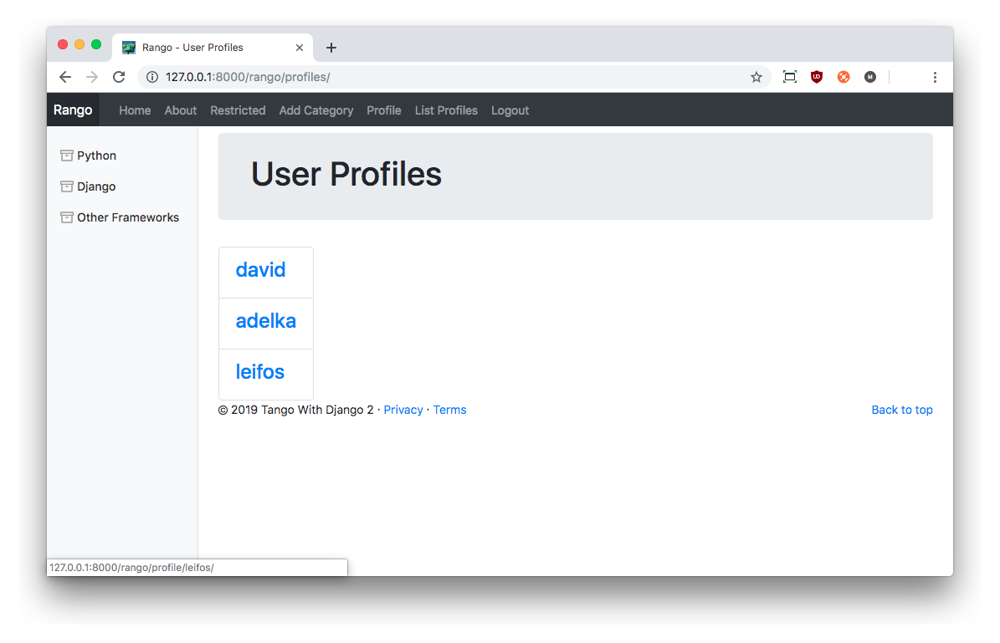

# Making Rango Tango Hints {#chapter-hints}
Hopefully, you will have been able to complete the exercises in the previous chapter using only the workflows we provided. If not, or if you need a little push in the right direction, this chapter is for you. We provide model solutions to each of the exercises we set, and you can incorporate them within your version of Rango if you need some help.

I> ### Got a better solution?
I> The solutions provided in this chapter are only one way to solve each problem. There are many ways you could approach each problem, and use solutions that exclusively use techniques that we have learnt so far.
I> However, if you successfully implement them differently, please feel free to share your solution(s) with us -- and tweet links to [@tangowithdjango](https://www.twitter.com/tangowithdjango) for others to see!

## Track Page Clickthroughs
As we said when we introduced [this problem earlier](#chapter-ex-clickthroughs), Rango provides only a direct link to the pages of external pages saved to each category. This approach limits our ability to track (or simply count) the number of times a particular link is clicked. To be able to track clicks, we'll need to work on the following steps. The subsections we provide here correspond to the four main steps we [outlined earlier](#chapter-ex-clickthroughs) in our workflow.

### Creating a URL Tracking View
First, create a new view called `goto_url()` in Rango's `views.py` module. The view which takes a parameterised HTTP `GET` request (i.e. `rango/goto/?page_id=1`) and updates the number of views for the page. The view should then redirect to the actual URL.

{lang="python",linenos=off}
	def goto_url(request):
	    if request.method == 'GET':
	        page_id = request.GET.get('page_id')
	        
	        try:
	            selected_page = Page.objects.get(id=page_id)
	        except Page.DoesNotExist:
	            return redirect(reverse('rango:index'))
	        
	        selected_page.views = selected_page.views + 1
	        selected_page.save()
	        
	        return redirect(selected_page.url)
	    
	    return redirect(reverse('rango:index'))

Be sure that you import the `redirect()` function to `views.py` if it isn't included already! As the function defined above also makes use of `reverse()` to perform URL lookups, you'll want to make sure that is included, too -- it should be present from prior efforts, however.

{lang="python",linenos=off}
	from django.shortcuts import redirect
	from django.urls import reverse

### Mapping the View to a URL
The second major step involves mapping the new `goto_url()` view to the URL `/rango/goto/`. To do this, update Rango's `urls.py` module. Add the following code to the `urlpatterns` list.

{lang="python",linenos=off}
	path('goto/', views.goto_url, name='goto'),

Note that we are complying with the specification in the previous chapter and using a mapping `name` of `goto`.

### Updating the `category.html` Template
The third step involves updating the `category.html` template. We were tasked to implement two changes, the first of which changed page links to use the new `goto_view()` view, rather than providing a direct URL link. Secondly, we were tasked to report back to users how many clicks each page had received.

Find the block of code that handles looping through the `pages` context variable. Update it accordingly.

{lang="python",linenos=off}
	
	     <li>
	        <a href="?page_id={{ page.id }}">{{ page.title }}</a>
	        
	            ({{ page.views }} views)
	        
	            ({{ page.views }} view)
	        
	    </li>
	

Notice the change to the URL's `href` attribute, and the inclusion of some new template code to control what is displayed immediately after the hyperlink -- a count on the number of views for the given page. As we also check how many clicks each page has received (one or more clicks?), we can also control our grammar, too!

### Updating the Category View
The fourth and final step for this particular exercise was to update the existing `show_category()` view to reflect the change in the way we present our list of pages for each category. The specification now requires us to order the pages for each category by the number of clicks each page has received. This has to be descending, meaning the page with the largest number of clicks will appear first.

This involves the simple addition of chaining on an `order_by()` call to our ORM request. Find the line dealing with the `Page` model in `show_category()` and update it to look like the line shown below.

{lang="python",linenos=off}
	pages = Page.objects.filter(category=category).order_by('-views')

Now that this is all done, confirm it all works by clicking on categories and then pages. Go back to the category and refresh the page to see if the number of clicks has increased. Remember to refresh your browser; the updated count may not show up straight away!

## Searching Within a Category Page
The main aim of Rango is to provide users of the app with a helpful directory of page links. At the moment, the search functionality is essentially independent of the categories. It would be better to integrate the search functionality within an actual category page.

Let us assume that a user will first navigate to and browse their category of interest first. If they cannot find the page that they want, they will then be able to search for it. Once they examine their search results and find the page they are looking for, they will be able to add the page to the category they are browsing.

We'll tackle the first part of the description here -- adding search functionality to the category page. To accomplish this, we first need to remove the [search functionality that we added in a previous chapter](#chapter-bing). This will essentially mean decommissioning the current search page and associated infrastructure (including the view and URL mapping). After this, there are several tasks we will need to undertake. The subsections listed here again correspond to the five main steps we outlined in the [previous chapter](#chapter-ex-searching).

W> ### Don't Delete your Code!
W> When decommissioning your existing search functionality, don't delete it. Simply comment things out where appropriate (such as in the `urls.py` module). You'll be copying some of the code across to a new home later on, anyway.

### Decommissioning Generic Search
The first step for this exercise is to decommission the existing search functionality that you implemented in a [previous chapter](#chapter-bing).

1. First, open Rango's `base.html` template and find the navigation bar markup (found at the top of the page). Locate the `<li>` element for the `Search` link that you added earlier on and delete it. This needs to be deleted as you'll be commenting out the URL mapping shortly, meaning that a reverse URL lookup for `rango:search` will no longer work. Wrapping this with an HTML comment tag (`<!-- ... -->`) won't work either, as the Django template engine will still process what's inside of it!
2. Second, open Rango's `urls.py` module and locate the URL mapping for the `/rango/search/` URL. Comment this line out by adding a `#` to the start of the line. This will prevent users from reaching the `search` URL.
3. Finally, open Rango's `views.py` module and locate the `search()` view you implemented previously. Again, comment out this function by prepending a `#` to the start of each line.

You'll still have the `search.html` template in Rango's templates directory; don't remove this as we will be using the contents of this template as the basis for integrating search functionality within the category template.

### Migrating `search.html` to `category.html`
As we will be wanting to provide search functionality to users who are browsing a category, we need to add in the search presentation functionality (e.g. displaying the search form and results area) to the `category.html` template. This is essentially a simple copy and paste job!

Let's split this into two main steps. First, open your decommissioned `search.html` template and locate the `
` element containing the entire search form. This will be the `
` whose child is a `<form>` element. Select and copy the `
` and its contents, then open Rango's `category.html` file.

We now need to paste the code from `search.html` into `category.html`. As the brief for this problem was to add the search functionality *underneath* the list of pages in the category, find and locate the link inside the `` to add a page. Paste the contents from `search.html` underneath that link.

You can then go back to `search.html` and repeat the process, this time selecting the `
` for displaying the results list. You can identify this by looking for the `
` with Django template code that iterates through the `result_list` list. Copy that and then move back over to `category.html`. Now paste that in underneath the `
` containing the form that you previously pasted in.

### Updating the `category.html` Search Form
Now that the markup required has been added to `category.html`, we need to make one simple change. Instead of submitting the contents of the search form to the `/rango/search/` URL, we instead will simply direct submitted responses to the category URL (`/rango/category/<slug:category_name_slug>`). This is as simple as finding the `<form>` definition in `category.html` and changing the `action` attribute to Rango's `show_category()` URL mapping.

{lang="html",linenos=off}
	<form class="form-inline"
	      id="user-form"
	      method="post"
	      action="">

### Updating the `show_category()` View
You should have identified that since we are now redirecting search requests to the `show_category()` view, we'll need to make some changes within that view so that it can handle the processing of the search request, as well as being able to handle the generation of a list of pages for a given category.

This is again a relatively straightforward process in which we update the view based upon code from our decommissioned `search()` view. We provide the complete listing of our model `show_category()` view below. Notice the comments denoting the start of the code we have taken from our existing `search()` view.

{lang="python",linenos=on}
	def show_category(request, category_name_slug):
	    context_dict = {}
	    
	    try:
	        category = Category.objects.get(slug=category_name_slug)
	        pages = Page.objects.filter(category=category).order_by('-views')
	        
	        context_dict['pages'] = pages
	        context_dict['category'] = category
	    except Category.DoesNotExist:
	        context_dict['category'] = None
	        context_dict['pages'] = None
	    
	    # Start new search functionality code.
	    if request.method == 'POST':
	        if request.method == 'POST':
	            query = request.POST['query'].strip()
	            
	            if query:
	                context_dict['result_list'] = run_query(query)
	    # End new search functionality code.
	    
	    return render(request, 'rango/category.html', context_dict)

We keep the `show_category()` view the same at the top, and add in an additional block of code towards the end to handle the processing of a search request. If a `POST` request is made, we then attempt to take the `query` from the request and issue the query to the `run_query()` function we defined in the [Bing Search chapter](#sec-bing-pyfunc). This then returns a list of results which we put into the `context_dict` with a key of `result_list` -- exactly the variable name that is expected in the updated `category.html` template.

Search functionality should then all work as expected. Try it out! Navigate to a category page, and you should see a search box. Enter a search query, submit it, and see what happens.

### Restricting Access to Search Functionality
Our final requirement was to restrict the migrated search functionality only to those who are logged into Rango. This step is straightforward -- one can simply wrap the search-handling template code added to `category.html` with a conditional template check to determine if the user is authenticated.

{lang="python",linenos=off}
	
	

	    ....
	

	

Too easy! You could also go further and add checks within the `show_category()` view to ensure the search functionality part is not executed when the current user is not logged in. Be wary, though -- don't be inclined to add the `login_required()` decorator to the view. Doing so will restrict all category-viewing functionality to logged in users only -- you only want to restrict the *search* functionality!

### Query Box Exercise
At the end of the Bing Search API chapter, we set an exercise. We noted that in its current state, users would issue a query and then be presented with the results. However, the query box would then be blanked again -- thus making *query reformulation* more taxing.

In our code examples above, we've deliberately kept our model solution to this particular exercise out. How could you allow the results page to *'remember'* the query that was entered, and place it back in the search box?

The easiest solution to this problem would be to simply place the `query` variable into the `context_dict` of `show_category()`, and then make use of the variable within the `category.html` template by specifying its value as the `value` attribute for the search box `<input>` element.

In Rango's `show_category()` view, locate the code block that deals with the search functionality, and add the `query` to the `context_dict`, like so.

{lang="python",linenos=off}
	# Start new search functionality code.
	if request.method == 'POST':
	    if request.method == 'POST':
	        query = request.POST['query'].strip()
	        
	        if query:
	            context_dict['result_list'] = run_query(query)
	            context_dict['query] = query
	# End new search functionality code.

Once this has been completed, open Rango's `category.html` template and modify the `query` `<input>` field like so.

{lang="html",linenos=off}
	<input class="form-control"
	       type="text"
	       size="50"
	       name="query"
	       value="{{ query }}"
	       id="query" />

Template variable `{{ query }}` will be replaced with the user's query, thus setting it to be the default value for the `<input>` field when the page loads.

Once everything has been completed, you should have a category page that looks similar to the example below. Well done!

{id="fig-exercises-categories"}

## Creating a `UserProfile` Instance {#section-hints-profiles}
This section provides one solution for creating Rango `UserProfile` accounts in conjunction with the `django-registration-redux` package. Recall that the standard `django.contrib.auth.models.User` model contains several standard fields related to user accounts, such as a `username` and `password`. However, we chose to implement an additional `UserProfile` model within Rango to store additional information such as a user's website URL, and a profile image. Here, we'll go through the steps required to implement this functionality. The steps that we'll work on are listed below, and each corresponds to a subsection below.

1. We first will create a new `profile_registration.html` template that will be our pre-existing `UserProfileForm` Django form.
2. We'll then work on creating a new `register_profile()` view to capture the details for a new `UserProfile` instance.
3. After that, the standard procedure applies. We'll first map the new view to a new URL -- in this instance, the URL will be `/rango/register_profile/`. Even though this details with user accounts, it is *Rango specific*, so it makes sense to place it within the `/rango/` URL pattern.
4. We'll then need to write some code for the `django-registration-redux` package to tell it to redirect to a different place when a `User` object has been created -- or in other words, redirect the user to the new `/rango/registrer_profile/` URL.

The fourth step requires some additional code that requires some specialist knowledge of the `django-registration-redux` package. We've taken care of that for you, but we'll point to the relevant parts of the associated documentation to show you how we figured everything out.

Once complete, the basic flow/experience for a user registering with Rango will be as follows.

1. The user will jump to the Rango website.
2. They will then click the `Register Here` link on the navigation bar.
3. They will then be redirected to the `django-registration-redux` registration form. This form is located at the URL `/accounts/register`.
4. Once this form has been completed, the form will be submitted and processed. If successful, they will then be redirected to the new `/rango/register_profile/` page, allowing them to create a `UserProfile` instance.
5. Once this has been completed and submitted, the user will be redirected to the homepage. Registration will then be complete.

Order here is important as the way we implement the new `register_profile()` view will assume that a user has created a standard `User` instance beforehand. This will be required to link to their new `UserProfile` instance and ensure referential integrity is maintained!

### Creating a Profile Registration Template
First, let's focus on creating a simple template that will provide the necessary HTML markup for displaying the `UserProfileForm` form fields. As we mentioned previously, we'll be keeping the `django-registration-redux` forms separate from the new profile registration form -- this new template will belong in the `rango` `templates` directory. Remember, we're not dealing with built-in Django models here -- we are dealing with the creation of an instance of a custom-made model.

Create a new template in `templates/rango/` called `profile_registration.html`. Within this new template, add in the following HTML markup and Django template code. 

{lang="html",linenos=on}
	
	
	
	
	    Register - Step 2
	
	
	
	    

	        

	            <h1 class="jumotron-heading">Register for Rango - Step 2</h1>
	        

	    

	    
	    

	        

	            <form method="post"
	                  action=""
	                  enctype="multipart/form-data">
	                
	                {{ form.as_p }}
	                <input type="submit" value="Create Profile" />
	            </form>
	        

	    

	

Like the `django-registration-redux` forms that we created previously (with an example [here](#section-redux-templates-login)), this template inherits from Rango's `base.html` template. Recall that this template incorporates the basic layout for our Rango app. We also create an HTML `<form>` within the `body_block` block. This will be populated with fields from the `form` objects that we'll be passing to the template from the corresponding view -- we'll work on this next. You should also be aware of the new URL mapping that we use, `register_profile`. We'll be defining this in the third step.

W> ### Don't Forget `multipart/form-data`!
W> When creating your form, don't forget to include the `enctype="multipart/form-data"` attribute in the `<form>` tag. We need to set this to [instruct the web browser and server that no character encoding should be used](https://stackoverflow.com/questions/4526273/what-does-enctype-multipart-form-data-mean). Why? Here, we could be performing *file uploads* (a user profile image). If you don't include this attribute, uploading images with this form will not work.

### Creating a Profile Registration View
The second step in this process is to create the corresponding view for our new `profile_registration.html` template. This new view will handle the processing of the `UserProfileForm` form we created way back in the [User Authentication chapter](#sec-user-forms), and instructing Django to render any response with our new template.

By now, this sequence of actions should be pretty straightforward for you to implement. Handling a form means being able to handle a request to render the form (via an HTTP `GET` request), and being able to process any entered information (via an HTTP `POST` request). A possible implementation for this view is shown below. You can add it to Rango's `views.py` module.

{lang="python",linenos=off}
	@login_required
	def register_profile(request):
	    form = UserProfileForm()
	    
	    if request.method == 'POST':
	        form = UserProfileForm(request.POST, request.FILES)
	        
	        if form.is_valid():
	            user_profile = form.save(commit=False)
	            user_profile.user = request.user
	            user_profile.save()
	            
	            return redirect('rango:index')
	        else:
	            print(form.errors)
	    
	    context_dict = {'form': form}
	    return render(request, 'rango/profile_registration.html', context_dict)

Remember to check that you also have the relevant `import` statements at the top of the `views.py` module. You should have them all by now from previous chapters, but nevertheless it's good to check!

{lang="python",linenos=off}
	from django.contrib.auth.decorators import login_required
	from rango.forms import UserProfileForm
	from django.shortcuts import render, redirect

Upon creating a new `UserProfileForm` instance, we then check our `request` object to determine if a `GET` or `POST` request was made. If the request was a `POST`, we then recreate the `UserProfileForm`, this time using data gathered from the `POST` request (`request.POST`). As we are also handling a file image upload (for the user's profile image), we also need to pull the uploaded file from `request.FILES`. We then check if the submitted form was valid -- meaning that the form fields were filled out correctly. In this case, we only really need to check if the URL supplied is valid -- since the URL and profile picture fields are optional (we specified the `blank=True` attribute for both the `website` and `picture` fields in the `UserProfile` model).

With a valid `UserProfileForm`, we can then create a new instance of the `UserProfile` model with the line `user_profile = form.save(commit=False)`. Setting `commit=False` gives us the time to manipulate the new `UserProfile` instance that is created before we commit it to the database. This is where we can then add in the necessary step to associate the new `UserProfile` instance with the associated `User` instance (refer to the user flow/experience list [at the top of this section](#section-hints-profiles) to refresh your memory). After then saving the new `UserProfile` instance, we then redirect the user with a new account to Rango's `index` view, using the `reverse()` URL lookup. If form validation failed for any reason, errors are simply printed to the console. You'll most likely want to deal with this in a better way to make error handling more robust, and thus more intuitive for the user.

If the request was instead sent as an HTTP `GET`, the user simply wants to request a blank form to fill out. In this scenario, we respond by simply rendering the `rango/profile_registration.html` template created above with a blank instance of the `UserProfileForm`, passed to the rendering context dictionary as `form`. Doing this satisfies the requirement that we created previously in our new template.

Therefore, this solution should handle all required scenarios for creating, parsing and saving data from a `UserProfileForm` form.

T> ### Why use `login_required`?
T> Remember, once a newly registered user hits this view, they will have had a new account created for them. This means that we can safely assume that he or she is now logged into Rango. This is why we are using the `@login_required` decorator at the top of our view to prevent individuals from accessing the view when they are unauthorised to do so.
T>
T> See the [Django Documentation for more details about Authentication](https://docs.djangoproject.com/en/2.1/topics/auth/default/).

### Mapping the `register_profile()` View to a URL
Now that our template and corresponding view have been implemented, a seasoned Djangoer should now be thinking: *map it!* We need to map our new view to a URL so that users can access the newly created content. Opening up Rango's `urls.py` module and adding the following line to the `urlpatterns` list will achieve this.

{lang="python",linenos=off}
	path('register_profile/', views.register_profile, name='register_profile'),

This maps out new `register_profile()` view to the URL `/rango/register_profile/`. Remember, the `/rango/` part of the URL comes from your *project's* `urls.py` module. The remainder of the URL is then handled by Rango's `urls.py`.

### Modifying the Registration Flow
Now that everything is (almost!) working, we need to tweak the process -- or flow -- that users undertake when registering. To do this, we need to do some *overriding* within the `django-registration-redux` package. Specifically, what we need to do is be able to tell the package where to redirect users who successfully create an account. We want to redirect them to the new `register_profile()` view!

To accomplish this, we need to use something called a *class-based view* to override a method provided by the `django-registration-redux` package. Given that we are working towards overriding a URL, it makes sense to add this to your *project's* `urls.py` -- the one that lives in the `tango_with_django_project` directory. Add the following code *above* the definition of your `urlpatterns` list, but after the `import` statements.

{lang="python",linenos=off}
	class MyRegistrationView(RegistrationView):
	    def get_success_url(self, user):
	        return reverse('rango:register_profile')

As we extend this class from the `RegistrationView` class, we need to add this to our imports at the top of the `urls.py` module. As we are also using the `reverse()` helper function, we'll need to import that, too!

{lang="python",linenos=off}
	from registration.backends.simple.views import RegistrationView
	from django.urls import reverse

With this complete, we now need to tell our project what to do with this extended class! It's just sitting there by itself at the moment, doing nothing. To tell the `django-registration-redux` package to use this class, we also need to update the `urlpatterns` list by adding a new entry. **Make sure you add this line directly above the existing entry for the `accounts/` URL -- not after!** To ensure you get it in the right place, we have included a complete copy of what your `urlpatterns` list should look like.

{lang="python",linenos=off}
	urlpatterns = [
	    path('', views.index, name='index'),
	    path('rango/', include('rango.urls')),
	    path('admin/', admin.site.urls),
	    
	    # New line below!
	    path('accounts/register/', 
	         MyRegistrationView.as_view(),
	         name='registration_register'),
	    
	    path('accounts/', include('registration.backends.simple.urls')),
	] + static(settings.MEDIA_URL, document_root=settings.MEDIA_ROOT)

This overrides the existing `registration_register` URL mapping, provided to us in the standard, out-of-the-box `django-registration-redux` `urls.py` module, and replaces the URL we jump to with a mapping to our new class-based view.

## Class-Based Views {#section-hints-class-based-views}
What is a class-based view, though? What *exactly* have we made implement up in the example solution above? Class-based views are a more sophisticated and elegant mechanism for handling requests. Rather than taking a functional approach as we have done so far in this tutorial -- that is creating *functions* in Rango's `views.py` module to serve requests -- the class-based approach means creating classes that inherit and implement a series of methods to handle your app's requests.

For example, rather than checking if a request was an HTTP `GET` or an HTTP `POST` request, class-based viewed allow you to implement a `get()` and `post()` method within the class handling your request for a given view. When your project and handlers become more complex, using a class-based approach is the more preferable solution. You can look at the [Django Documentation for more information about class-based views](https://docs.djangoproject.com/en/2.1/topics/class-based-views/).

To give you more of an idea about how class-based views work, let's try converting the `about()` view from a functional-based to a class-based approach. First, in Rango's `views.py` module, define a class called `AboutView` which inherits from the `View` base class. This base class needs to be imported from `django.views`, as shown in the example code below.

{lang="python",linenos=off}
	from django.views import View
	
	class AboutView(View):
	    def get(self, request):
	        context_dict = {}
	        context_dict['visits'] = request.session['visits']
	        
	        return render(request,
	                      'rango/about.html',
	                      context_dict)

Note that we have simply taken the code from the existing `about()` functional-based view, and added it to the `get()` method of our new class-based `AboutView` approach.

T> ### Defining Methods in Classes
T> When defining a method within a class in Python, the method must always take at minimum one parameter, `self`. `self` denotes the instance of the class being used, and you can use it to obtain access to other methods within the instance, or instance variables defined using the `self.object_name`. This is the same technique as accessing instance-specific items in Java using the `this.` approach.
T>
T> You *can* create static methods in Python classes, meaning that the `self` parameter need not be passed -- but you should use the `staticmethod` decorator. This is more advanced, and we don't make use of static methods here. However, you can [read more about this online](https://docs.python.org/3/library/functions.html#staticmethod).

Next, you need to update Rango's `urls.py` module. Find and update the entry in the `urlpatterns` list that deals with the `about` mapping to make use of the new `AboutView`.

{lang="python",linenos=off}
	urlpatterns = [
	    ...
	    
	    #Updated path that point to the new about class-based view.
	    path('about/', views.AboutView.as_view(), name='about')
	    
	    ...
	]

As our existing `import` statement simply imports Rango's `views.py`, we must specify `views.AboutView` to tell Python exactly where the new class is. You can always of course `import` the `AboutView` separately, like in the example below.

{lang="python",linenos=off}
	from rango.views import AboutView
	
	urlpatterns = [
	    ...
	    
	    #Updated path that point to the new about class-based view.
	    path('about/', AboutView.as_view(), name='about')
	    
	    ...
	]

Note that we also call the `as_view()` function. This is part of the base `View` class that provides the necessary code for Django to be able to process the view using your logic defined in the `get()` method.

For such a simple view, you may think that switching to a class-based approach doesn't save you much time or space. However, you should now get the idea -- and you should now be able to begin refactoring more complex views to use the class-based approach.

A more complex view that considers both a HTTP `GET` and HTTP `POST` could be the `add_category()` view. To convert this from a functional- to class-based view, we can create a new `AddCategoryView` class in Rango's `views.py`. From there, we can begin the process of moving our code over from the function to the new class, as we show below. Look at the code in the `get()` and `post()` methods -- where does it come from?

{lang="python",linenos=off}
	class AddCategoryView(View):
	    @method_decorator(login_required)
	    def get(self, request):
	        form = CategoryForm()
	        return render(request, 'rango/add_category.html', {'form': form})
	    
	    @method_decorator(login_required)
	    def post(self, request):
	        form = CategoryForm(request.POST)
	        
	        if form.is_valid():
	            form.save(commit=True)
	            return index(request)
	        else:
	            print(form.errors)
	        
	        return render(request, 'rango/add_category.html', {'form': form})

Compare the code you've got currently written in your `add_category()` function-based view against the code we have above -- the logic for a HTTP `get()` request is mirrored in the `get()` method, with the same for a HTTP `POST` request in `post()`. You'll also notice that we are making use of a new decorator function called `method_decorator`. This needs to be imported, so add the following `import` statement to the top of your `views.py` module.

{lang="python",linenos=off}
	from django.utils.decorators import method_decorator

By associating the `@method_decorator(login_required)` line for both the `get()` and `post()` methods, we are ensuring that neither method can be accessed by users who are not logged into Rango. If we were to drop the decorator from the `get()` method, what do you think would happen? Users would see the form to add a new category, but given that the `post()` method is still protected, those who are not logged in wouldn't be able to create a new category!

T> ### Why do we need `@method_decorator`?
T> `@method_decorator` is required because function decorators [need to be transformed to method decorators](https://docs.djangoproject.com/en/2.2/topics/class-based-views/intro/#decorating-the-class) -- `method_decorator()` achieves this for us.

One last thing -- we also need to update Rango's `urls.py` module to reflect the fact we now want to use the class-based view. In the `urlpatterns` list, locate the `add_category` mapping, and change the entry to look like the example shown below.

{lang="python",linenos=off}
	path('add_category/', views.AddCategoryView.as_view(), name='add_category'),

Looking carefully at the example, we're only changing the target view. Instead of pointing to the `add_category()` view, we instead point to our new `AddCategoryView` class -- and call the `as_view()` method that Django provides which passes control to the relevant method for us depending on the request received (do I want to execute `get()` or `post()`?).

X> ### Class-based View Exercises
X> Now that you've seen the basics on how to implement class-based views in Django, it's a good time for you to put this to the test.
X>
X> - Have a look at the [Django documentation](https://docs.djangoproject.com/en/2.1/topics/class-based-views/) and look for some more examples on how you can create class-based views.
X> - Update your Rango app to make sure that *all* views in Rango's `views.py` module make use of class-based views!
X>
X> This won't take as long as you think. The hardest part here is for the more complex views with both HTTP `GET` and HTTP `POST` functionality. Being able to delineate between the flow for each type of request and put the necessary code in separate methods will test your understanding of the code!
X>
X> There's a couple of things we also want you to think about when you work through this exercise. We've listed them below as individual tips.

T> ### Naming Conventions
T> It's good practice to make sure your new class-based views conform to [Python naming conventions](https://www.python.org/dev/peps/pep-0008/).
T> For classes, use CamelCase. Capitalise the start of a class name, then capitalise each subsequent term -- without spaces between them. Hence the new add category view becomes `AddCategoryView`. Tack `View` on the end to make sure those who look at your code later will know they are dealing with a class-based view.
T>
T> Methods within your classes should follow the same convention as naming functions. Use lower case names, and separate individual terms with underscores -- like `some_method_name()`.

T> ### Mapping the `IndexView`
T> When you create a class-based view for your old `index()` view, be wary that you will have mapped it in both Rango's `urls.py` module *and your project's `urls.py` module, too!*

T> ### Passing URL parameters
T> Earlier on, you created a view `show_category()`. Aside from taking the obligatory `request` object, it also took a `category_name_slug` -- it was a *parameterised view*, with the parameter coming from the URL. For all views implemented like this, you'll need to make sure that their class-based equivalent not only contain `self` and `request` as parameters, but the one or more URL parameters, too. In the example above, a `get()` method definition may look like the example below.
T>
T> {lang="python",linenos=off}
T> 	class ShowCategoryView(View):
T> 	    def get(self, request, category_name_slug):
T> 	        ...
T>
T> If you're dealing with a view with both `get()` and `post()` methods, you'll need the parameter(s) for both!

T> ### Classes and Helper Methods
T> You may find that when you're implementing your class-based views that you are repeating yourself. For instance, in the `show_category()` function-based view, we have some reasonably extensive code that deals with populating a dictionary for use as the context dictionary when we pass it to `render()`. This code is executed for *both* HTTP `GET` and HTTP `POST` requests.
T> In a class-based implementation, one solution would be to simply add the code to the `get()` and `post()` methods... but remember, [DRY](https://en.wikipedia.org/wiki/Don't_repeat_yourself)! How could you engineer a solution that means you only need one instance of the context dictionary generating code?
T>
T> A possible solution would be to create a *helper method* within your class-based implementation. Name it whatever -- but to be able to successfully generate the basics for the context dictionary of the `show_category()` view, you'll also need the `category_name_slug`. How could you implement this? We give you a hint in the tip above. Once you have cracked it, you'll also be able to apply the same technique to other class-based views within your code.

## Viewing your Profile {#section-hints-profileview}
With the code now in place to reinstate the use of the `UserProfile` model, we can now implement functionality to allow a user to view his or her profile -- and edit it. The process is again similar to what we have done many times before. We'll need to consider the following three steps.

1. First, we will need to create a new template, this time called `profile.html`. This will live inside the `rango` `templates` directory.
2. We'll have to create a new view that renders the new template. We'll make this one a class-based view from the outset!
3. Finally, the new view must be mapped to a URL -- in this case, `/rango/profile`.

Of course, to make the new page accessible, we'll also need to provide an additional hyperlink in Rango's `base.html` template to provide simple access. For this solution, we'll be creating a generalised view that allows you access the information of any user of Rango. The code will also allow users who are logged into the app to also edit their profile -- *but only theirs* -- thus satisfying the [requirements of this exercise](#sec-ex-profiles).

### Creating the Template
First, let's work on creating a simple template for displaying a user's profile. The following HTML markup and Django template code should be placed within the new `profile.html` file within Rango's templates directory.

{lang="html",linenos=off}
	
	
	
	
	    Profile for {{ selecteduser.username }}
	
	
	
	    

	        

	            <h1 class="jumotron-heading">{{ selecteduser.username }}'s Profile</h1>
	        

	    

	    
	    

	        

	            
	             
	            

	                
	                <form method="post" action="." enctype="multipart/form-data">
	                    
	                    {{ form.as_p }}
	                    
	                    <input type="submit" value="Update" />
	                </form>
	                
	                

	                    <strong>Website:</strong>
	                    <a href="{{ userprofile.website }}">{{ userprofile.website }}</a>
	                

	                
	            

	        

	    

	

Note that in the template, we make use of a few variables (namely `selecteduser`, `userprofile` and `form`) that we need to make sure are defined in the template's context. In this template, we assume that:

- `selecteduser` represents a Django `User` instance of the user whose profile we want to display;
- `userprofile` represents a Rango `UserProfile` instance of the associated `User` that we want to display; and
- `form` represents a `UserProfileForm` instance that is used to display the necessary fields to allow a user to edit his or her profile (i.e. website and/or profile image), with the website field pre-populated where necessary.

We'll be making sure that this template is given the required variables to its context in the next section.

The template block of interest here is, of course, the `body_block` block. At the top, we display the selected user's profile image, set to dimensions of 300x300 pixels. We also provide `alt` text to display if the image cannot be located.

However, the interesting part of this template is underneath. We use a conditional statement to work out if the user who is currently looking at a given profile is the said user (`selecteduser == user`) -- and if he or she if, we display a form to allow the user to edit their profile. If the user does not match up, then we don't want to provide a form to edit -- so instead, we simply display the profile.

You should also note that we once again use `enctype="multipart/form-data"` when defining out `<form>` because users can upload a new profile image -- remember, whenever file uploads are involved, this attribute **must** be specified.

### Creating the `profile()` View
Based on the template created above, we can then implement a simple view to handle the viewing of user profiles and submission of form data. In Rango's `views.py` module, create a new class-based view called `ProfileView`. Add the code as we show below to the new view.

{lang="python",linenos=off}
	class ProfileView(View):
	    def get_user_details(self, username):
	        try:
	            user = User.objects.get(username=username)
	        except User.DoesNotExist:
	            return None
	        
	        userprofile = UserProfile.objects.get_or_create(user=user)[0]
	        form = UserProfileForm({'website': userprofile.website,
	                                'picture': userprofile.picture})
	        
	        return (user, userprofile, form)
	    
	    @method_decorator(login_required)
	    def get(self, request, username):
	        try:
	            (user, userprofile, form) = self.get_user_details(username)
	        except TypeError:
	            return redirect('rango:index')
	        
	        context_dict = {'userprofile': userprofile,
	                        'selecteduser': user,
	                        'form': form}
	        
	        return render(request, 'rango/profile.html', context_dict)
	    
	    @method_decorator(login_required)
	    def post(self, request, username):
	        try:
	            (user, userprofile, form) = self.get_user_details(username)
	        except TypeError:
	            return redirect('rango:index')
	        
	        form = UserProfileForm(request.POST, request.FILES, instance=userprofile)
	        
	        if form.is_valid():
	            form.save(commit=True)
	            return redirect('rango:profile', user.username)
	        else:
	            print(form.errors)
	        
	        context_dict = {'userprofile': userprofile,
	                        'selecteduser': user,
	                        'form': form}
	        
	        return render(request, 'rango/profile.html', context_dict)

We'll also need to `import` two classes that we haven't used before. One is the standard Django `User` model, and the other is Rango's `UserProfile` model. Note we did import the `UserProfileForm` earlier -- that's different!

{lang="python",linenos=off}
	from django.contrib.auth.models import User
	from rango.models import UserProfile

Our new class-based view requires that a user be logged in -- hence the use of the `@method_decorator(login_required)` decorator for both the `get()` and `post()` methods.

Within the `ProfileView` class, we also created a `get_user_details()` helper method to ensure that we don't repeat ourselves. This method begins by selecting the `django.contrib.auth.User` instance from the database -- if it exists. If it does not exist, the method simply returns None, which signals to both the `get()` and `post()` methods to do a simple `redirect` to Rango's homepage, rather than greet the user with a bespoke error message. We can't display information for a non-existent user! If the user does exist, the `get_user_details()` method selects the `UserProfile` instance (or creates a blank one, if one does not exist). We then take the selected user's details, and use those details to populate a `UserProfileForm` instance. The `user`, `userprofile` and populated `form` objects are then returned in a tuple and are [unpacked](https://www.geeksforgeeks.org/packing-and-unpacking-arguments-in-python/) by the `get()` and `post()` methods that call the helper method.

Within the `post()` method, we handle the case where a user wants to update their profile's information. To do this, we extract information from the form into a `UserProfileForm` instance that can refer to the `UserProfile` instance that it is saving to -- rather than creating a new `UserProfile` instance each time. Remember, we are *updating*, not creating! A valid form is then saved. An invalid form (or an HTTP `GET` request) triggers the rendering of the `profile.html` template, complete with the relevant variables that are passed through to the template via its context.

X> ### Authentication Exercise
X> How can we change the code above to prevent unauthorised users from changing the details of a user account that isn't theirs? What conditional statement do we need to add to enforce this additional check?

### Mapping the View to a URL
We then need to map our new `ProfileView` to a URL. This involves editing Rango's `urls.py` module. We want to add a further line to the `urlpatterns` list, as shown below.

{lang="python",linenos=off}
	path('profile/<username>/', views.ProfileView.as_view(), name='profile'),

Note the inclusion of a `username` variable -- this matches to anything after `/profile/`. This means that the URL `/rango/profile/maxwelld90/` would have a `username` of `maxwelld90`. This is in turn passed to the `get()` or `post()` methods in our class-based view as parameter `username`. This is how we are able to determine what user has been requested.

### Tweaking the Base Template
Everything should now be working as expected -- but how can users access the new functionality? We can provide a link by modifying Rango's `base.html` template. Find the series of `<li>` elements that you created earlier in the book that comprise the navigation bar. Add a new link to allow users to jump to their `Profile` -- ensuring that this link is *only visible when a user is logged in (authenticated).* If that is the case, what template conditional statement does the following link need to be placed within?

{lang="html",linenos=off}
	<li class="nav-item">
	    <a class="nav-link" href="">Profile</a>
	</li>

All being well, you should see something like [the following example](#fig-exercises-profile).

{id="fig-exercises-profile"}

## Listing all Users
Our final challenge is to create a further page that allows one to view a list of all users registered on the Rango app. This one is relatively straightforward -- implementing a further template, view and URL mapping are all once again required -- but the code in this view is simplistic to the code we added above. We'll be creating a list of users registered to Rango -- and providing a hyperlink to view their profile using the code we implemented in the previous section. *Note that this new view should only be accessible to those who are logged in.*

### Creating a Template for Listing User Profiles
You know the drill by now. Create a new template! Once again, this belongs to Rango, but this time, we will call it `list_profiles.html`. Within the file, add the following HTML markup and Django template code.

{lang="html",linenos=off}
	
	
	
	
	    User Profiles
	
	
	
	    

	        

	            <h1 class="jumotron-heading">User Profiles</h1>
	        

	    

	    
	    

	        

	            
	            

	                

	                    
	                    

	                        <h4 class="list-group-item-heading">
	                            <a href="">
	                                {{ listuser.user.username }}
	                            </a>
	                        </h4>
	                    

	                    
	                

	            

	            
	            
There are no users present on Rango.

	            
	        

	    

	

As mentioned previously, this template is pretty straightforward compared to what we have been doing as of late! A series of `
` tags have been created using various Bootstrap classes to style the list. For each user, we display their username and provide a link to their profile page. Notice that since we pass through a list of `UserProfile` objects, we need to pass through the `user` attribute to lead to the `username` of the user!

### Creating the View for Listing User Profiles
With our template created, we can now create the corresponding view that selects all users from the `UserProfile` model. We also assume that the current user must be logged in to view the other users of Rango, as stated above.

The following simple class-based view should satisfy these requirements nicely. Again, this is a straightforward view -- selecting all of the `UserProfile` instances via an ORM query is perhaps the trickiest part here. Remember, the list must have a name of `userprofile_list` in the context dictionary to match up with our template defined above. This code would live in `views.py`.

{lang="python",linenos=off}
	class ListProfilesView(View):
	    @method_decorator(login_required)
	    def get(self, request):
	        profiles = UserProfile.objects.all()
	        
	        return render(request,
	                      'rango/list_profiles.html',
	                      {'userprofile_list': profiles})

### Mapping and Linking the View
Our final step is to map a URL to the new `ListProfilesView` class-based view. Add the following pattern to the `urlpatterns` list provided in Rango's `urls.py`.

{lang="python",linenos=off}
	path('profiles/', views.ListProfilesView.as_view(), name='list_profiles'),

No parameters are required for this new mapping. The new page should now be accessible at [`http://127.0.0.1:8000/rango/profiles/`](http://127.0.0.1:8000/rango/profiles/) -- but what about providing a link to the new feature, too?

Once again, this will involve editing Rango's `base.html` template. Locate the list of links that make up the navigation bar, and add a further link that allows users to `List Profiles`. *Make sure that this new link is only visible to those who are logged into Rango.*

{lang="html",linenos=off}
	<li class="nav-item">
	    <a class="nav-link" href="">
	        List Profiles
	    </a>
	</li>

With this link in place, logged in users should now be able to navigate to the new view and see a list of all users registered with Rango. [The screenshot below](#fig-exercises-list) shows the completed list with three registered users.

{id="fig-exercises-list"}

X> ### Profile Page Exercises
X> With the above now completed, have a look at the following additional exercise to test your knowledge and understanding further.
X>
X> - Update the profile list to include a thumbnail of the user's profile picture.
X> - If a user does not have a profile picture, then insert a substitute picture by using the [service provide by LoremPixel](https://lorempixel.com/) that lets you automatically generate images.
X> - Update the user profile view (responsible for rendering `profile.html`) to also use a placeholder image if no profile image has been provided.

I> ### Hints
I> The following hints may help you complete the above exercises.
I> 
I> - For the first exercise, you will need to use the `` tag.
I> - Substitution images can be obtained from [`https://lorempixel.com`](https://lorempixel.com). As an example, you can use [``](https://lorempixel.com/64/64/people/) to obtain a 64x64 placeholder image. Adjust the dimensions as you see fit. Beware that the image may take a few seconds to load!