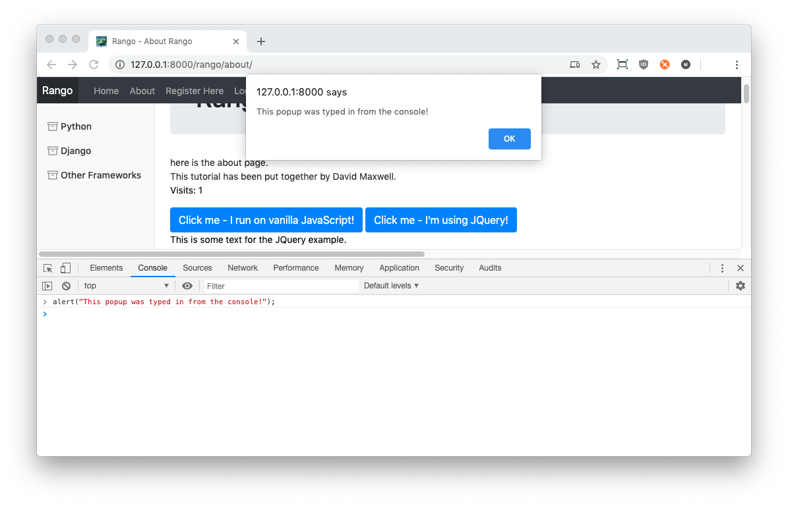

#JQuery Crash Course {#chapter-jquery}
So far in this tutorial, we have focused primarily on *server-side* coding. In other words, a lot of our energy has been spent on figuring out the mechanics of writing Python code to make Django do things *on the server.* We've also been writing HTML markup (and used the Twitter Bootstrap toolkit) for use on the *client-side,* or your web browser.

However, did you know you can do so much more on the client-side? You can use [JavaScript](https://developer.mozilla.org/en-US/docs/Web/JavaScript) to add functionality to your web application on the client-side, from changing the way things are presented to obtaining additional information from the server *without* having to reload the entire webpage.

In this chapter, we'll be introducing you to the basics of JavaScript while using the [JQuery](https://jquery.com/) framework. JQuery makes writing JavaScript code easier -- and much more enjoyable! A few lines of JQuery can encapsulate hundreds of lines of pure JavaScript. JQuery also provides a suite of APIs that are mainly focused on manipulating HTML elements. We'll be looking at:

- how to incorporate JQuery within Rango;
- explaining how to interpret basic JQuery code; and
- providing several small examples to show you how everything works.

## Including JQuery
To include JQuery (or any other JavaScript file), you need to tell the *client* where to find JQuery. At the end of the day, the web browser will be the part of the chain that utilises the JavaScript code to provide additional functionality to the user. Thinking about Rango, how can we do this? We will need to modify our *templates,* as when fully rendered, these are the files that are sent back to the client when something is requested.

In Rango's `base.html` template, let's make sure we have referenced JQuery. If you completed the [Bootstrap chapter](#chapter-bootstrap) earlier on in the tutorial, you may have noticed that Bootstrap uses JQuery! To make sure nothing breaks, we'll stick with the version that Bootstrap uses -- version 3.3.1. At the bottom of your `base.html` template (before the close of the `<body>` tag), look for the following line.

{lang="html",linenos=off}
	

It should already be there! The `

This now points the browser to look for JQuery in your `static/js` directory, rather than directly from the JQuery servers. Once you have done this, you'll want to then create a new, blank file in the `js` directory called `rango-jquery.js`. We'll be adding in some JavaScript code that uses JQuery to add functionality to our Rango app. Of course, we'll also need to add a reference to this new file in our `base.html` template, too. Underneath the line you just tweaked, add the following.

{lang="html",linenos=off}
	

Make sure this new markup is *underneath* the line including the JQuery framework. As a sanity check, make sure your static files have been set up correctly (see [Templates and Media Files](#chapter-templates-static)), and that you have `` at the top of `base.html`.

## Testing your Setup
With the above steps completed, you should now be ready to try things out! Open the new `rango-jquery.js` file, and add the following lines of code.

{lang="javascript",linenos=off}
	$(document).ready(function() {
	    alert('Hello, world!');
	});

This small piece of code utilises JQuery. But how does it work? We've broken it down into a series of different steps to show you what's going on.

1. We first select the `document` object via `$(document)`. The `$()` is the shortcut that you can use to access the JQuery framework -- everything that uses JQuery will have commands that start with a `$`. The command `$(document)` tells the JQuery framework to *select* the [HTML document object](https://www.w3schools.com/jsref/dom_obj_document.asp) -- the object that a complete HTML page becomes when a web browser loads it into memory. This object encapsulates the entirety of the page. When we select something like this, we call the mechanism a *selector.*
2. With the `document` selected, we then *chain* a function onto our selector. In this instance, we chain the `ready()` function. As stated in the [JQuery documentation](https://api.jquery.com/ready/), this is a function that JQuery executes *when the [DOM](https://www.w3.org/TR/WD-DOM/introduction.html)/page is fully loaded in memory, and is ready to go.* It's pretty typical to want to wait until everything on the page has been loaded (including external resources), so you can get a guarantee that everything will be there when the code starts executing. If you don't wait, the code can begin executing before everything that is expected to be present is ready -- and the user will get a broken website.
3. Inside `ready()`, we define an *anonymous function* to execute when the DOM is ready to go. Just like any other function in JavaScript, it can take parameters and is surrounded by braces (like `{` and `}`). This is different from Python in that Python relies solely on indentation to tell it what lines of code to execute, and when. With a C-style language such as JavaScript and Java, braces are used to this effect.
4. Inside the function, we have the line `alert("Hello, world!");`. Note that at the end of each line/command, place a semicolon (`;`). The `alert()` function takes a string, and displays it as a popup box in the browser. In this instance, it will display the string `Hello, world!`.

To summarise, this code displays the message `Hello, world!`, just like in the [screenshot we show below](#fig-jquery-alert). However, the key here is that the browser waits until everything is loaded, then displays the message. We strongly encourage you to keep the [JQuery API documentation](https://api.jquery.com/) open in a separate tab to help you understand the different concepts we demonstrate here better.

{id="fig-jquery-alert"}

You should, of course, remove the `alert()` function call once you have seen it working in front of your very eyes -- this is perhaps the simplest demonstration we can implement. Being greeted with this popup on every page is very annoying!

I> ### Select and Act Pattern
I> JQuery requires you to think in a more *functional* programming style, as opposed to typical JavaScript which is written in a more *procedural* way. For all JQuery commands, they follow a similar pattern: **Select and Act**. Select an element, and then perform some kind of action on/with the element.

### Acting on Mouse Clicks
In the previous example, we executed the `alert()` function call when the page had been loaded, and everything was ready to go. This is based upon an *event* being fired internally within the browser -- but what about trying different events? In this section, we'll work on a more concrete example making use of user interactions.

The goal of this simple exercise will be to add a button to Rango's `about.html` template and show you how events are bound to different elements of a page. When the user clicks the button, a popup alert appears. We will, of course, need to work with the `about.html` template and the new `rango-jquery.js` static JavaScript file.

Within the `about.html` template, let's first add a button that achieves what we want using vanilla JavaScript. This demonstrates a very simple way of *binding code to an event.* Add the code underneath the closing `
`, but before the closure of the `body_block` template block. If you still have your images of Rango and the cat from earlier, place this markup *before* the images so the button is easy to see. You may want to also add a line break (` `) to sepatate the button from the images.

{lang="html",linenos=off}
	<button class="btn btn-primary"
	        onclick="alert('You clicked the button using inline JavaScript.');">
	    Click me - I run on vanilla JavaScript!
	</button>

With this code in place, navigate to the about page in your browser. You should see a blue button underneath your image. Click it, and you will be greeted with a popup box with the message `'You clicked the button using inline JavaScript.'`. What happens with this markup is we use the `onclick` attribute that is present for HTML elements -- and add some simple JavaScript code within it. This binds the code you provide to the event for when a user clicks on the element within the DOM -- in this case, the `button`. When the user clicks, the code is executed. [HTML has heaps of different attributes](https://www.w3schools.com/tags/ref_eventattributes.asp) used for assigning code to different events.

However, is embedding code within a template a neat solution? We argue no. By incorporating code within your markup, you are adding code *inline.* This violates the principle of separation of concerns. Templates should contain presentational aspects only. Code should be placed in a separate location, such as the `rango-jquery.js` file.

To move towards a more elegant solution, add a further button to the `about.html` template.

{lang="html",linenos=off}
	<button class="btn btn-primary" id="about-btn">
	    Click me - I'm using JQuery!
	</button>

This time, we have another button, but there is no code associated with it. Instead, we replaced the `onclick` attribute with a unique identifier -- or `id` -- that allows us to reference the button within our external JavaScript file. If we then add the following code to `rango-jquery.js`, we'll start to see what is going on.

{lang="javascript",linenos=off}
	$(document).ready(function()) {
	    
	    $('#about-btn').click(function() {
	        alert('You clicked the button using JQuery!');
	    });
	
	});

Reload the page, and try things out. Hopefully, you will see that when you click both buttons, you will be greeted with a popup message from both, albeit with different messages.

Like the JQuery code that we tried earlier on, our code sample above starts by selecting the `document` object and includes a function that is only executed when the page has been loaded (i.e. `ready()`). Within this anonymous function, we then *select* the `about-btn` element (by a unique identifier, as instructed to by prepending the ID with a `#`). A further anonymous function is bound to the event when the element with ID `about-btn` is *clicked* (`click()`) -- and this function contains a further call to the `alert()` function that displays a popup box to the user.

For more complex functions, this approach is much more desirable. Why? The JavaScript/JQuery code is maintained in a separate file to the template. Here, we programmatically assign the event to a handler at *runtime,* rather than *statically* within the HTML markup. Therefore, this achieves separation of concerns between the JavaScript/JQuery code and the HTML markup.

T> ### Keep things Separated
T> [Separation of concerns](https://en.wikipedia.org/wiki/Separation_of_concerns) is a design principle that is good to keep in mind. In terms of web apps, the HTML is responsible for the page content. CSS is used to style the presentation of the content. Finally, JavaScript is responsible for how the user can interact with the content -- as well as programmatically manipulating the page's content and style.
T>
T> By keeping them separated, you will have cleaner code, and you will reduce maintenance woes in the future. You'll be a better software engineer by adhering to this simple principle!
T>
T> Put another way, *never mix, never worry!*

### Selectors
In the example above, we *selected* our second button by referencing the unique identifier that we assigned to it. This was achieved through the use of the `#` selector. We simply prepended the selector to the identifier, yielding a completed selector of `#about-btn`. Of course, you may find yourself wanting to manipulate a group, or class, of elements -- rather than just one. In this instance, you can use the class selector instead, which is a period (`.`). Check out the simple example below.

{lang="javascript",linenos=off}
	$('.ouch').click(function()) {
	    alert('You clicked me! Ouch!');
	});

This code would select all elements with `class="ouch"` -- and when you click any of them, the popup `You clicked me! Ouch!` would be shown.

You can also select elements by their tag name -- such as `div`, `p` or `strong`. The following example uses the `hover` event on all `p` (paragraph) elements.

{lang="javascript",linenos=off}
	$('p').hover(
	    function() {
	        $(this).css('color', 'red');
	    }, 
	    function() {
	        $(this).css('color', 'black');
	});

Add this JavaScript to your `rango-jquery.js`. In the `about.html` template, you should then add a paragraph underneath your buttons -- something like `
This is some text for the JQuery example.
` should suffice. Look at the code, and think what will happen... then try it out! Does it do what you expect to happen?

Here, we are selecting all the `p` HTML elements. We assign a `hover()` event to the elements. `hover()` requires two functions -- one to be executed when you *hover over* something (the first function), and one to execute when you leave something (the second function). This means that when a user hovers over a `p` element, the text colour within the element will change to red. When the user's cursor leaves the element, it changes to black. Have a look at the [`hover()` event's documentation](https://api.jquery.com/hover/) for more information.

Note that we can use the `this` variable to reference *the element that is being hovered over*, and the `css()` function (part of JQuery) to set the `color` attribute for the said element to whatever we so choose (as we specify in the second parameter).

T> ### Remember -- `ready()`!
T> Remember, it's good practice to place your JQuery code within a `$(document).ready()` function call. Doing so will ensure that this code will only ever execute when the page has been completely loaded into memory, reducing the chances of your code breaking in very strange ways.
T>
T> It takes time for content to download to a client's computer; make sure your code is patient!

X> ### Play Around
X> Play around with the code you have just written. Have a look at the [JQuery documentation](https://api.jquery.com/category/events/mouse-events/) to see what else you can do. And one little thing: what do you think will happen if you change the two instances of `$(this)` above to `$('p')`? Think about it, then once you have worked out a solution, experiment and see if you were correct!

## Further DOM Manipulation Examples
In the above example, we used the `hover()` function to assign an event handler to the hover in and hover out events. For each of those events, we then used the `css()` function to change the text colour of the element being hovered over. The `css()` function is one example of *DOM manipulation* -- or the changing of the page loaded dynamically. However, `css()` is not the only way you can manipulate a page. JQuery provides other ways to manipulate the page!

For example, we can remove a class from elements with the `removeClass()` function, and add classes to elements with the `addClass()` function.

{lang="javascript",linenos=off}
	$("#about-btn").removeClass('btn-primary').addClass('btn-success');

This is an example of *chaining* calls. This code selects the `about-btn` element (by its unique ID), and removes the `btn-primary` class from the element. It then adds a new class, `btn-success`. This has the effect of making the button turn from blue to green. Why? The Bootstrap toolkit implements these classes -- `btn-success` just so happens to set the background colour of the element to green.

It is also possible to access the *inner HTML* of a given element -- or, in other words, the markup nested within a given element. For example, let's put a new `
` element in Rango's `about.html` template, underneath our sample `
` element.

{lang="html",linenos=off}
	
Hello! I'm a further example for JQuery testing.

Once you have added this new element, jump to the `rango-jquery.js` file and add the following code. Remember to add this *within* the `$(document).ready()` call!

{lang="javascript",linenos=off}
	$('#about-btn').click(function() {
	    msgStr = $('#msg').html();
	    msgStr = msgStr + ' ooo, fancy!';
	    
	    $('#msg').html(msgStr);
	});

When the element that matches the selection of `#about-btn` (i.e. your second button) is clicked, we first get the HTML markup inside the element selected by `#msg` by using the `html()` function call. As this is then simply a string, we append `' ooo, fancy!'` to the end, and then set the `html()` of the `msg` element to the new value, stored within `msgStr`.

## Debugging Hints
One thing that often throws beginners is how to figure out what is going wrong with your JavaScript code! You'll most likely encounter an error, but your browser is very good at hiding the error! This is by design -- would a typical user want to be greeted with heaps of JavaScript errors? We highly doubt it!

Most contemporary web browsers have a series of *developer tools* within them that allow you to see what's going on with your client-side JavaScript code. Accessing these tools depends on what browser you are using. On Chrome, you can access developer tools by clicking the options menu (three dots), selecting `More Tools`, and clicking `Developer Tools`.

When the tools load, you can click the `Console` tab to see the output from the JavaScript interpreter -- including any error messages! In the [example screenshot below](#fig-dev-tools), you can see that an error is preventing the code from running. A cursory look at the error message shows that we included one too many `r`'s in our `msgStr` variable, thus providing us with a vital clue to figure out what is going on.

{id="fig-dev-tools"}

One further feature of the console is that you can *enter commands, too!* The [screenshot below](#fig-dev-tools-command) demonstrates this in action -- the `alert()` function was called, and the output can be seen as a popup box. You can execute JQuery commands, examine the contents of arrays, hashmaps or whatever you need to do within this console. It's an essential bit of kit for debugging contemporary code-heavy apps.

{id="fig-dev-tools-command"}

T> ### Always use Developer Tools
T> Always have your browser's Developer Tools open when you're writing client-side JavaScript. It makes things so much easier to figure out when things don't work as expected!

This chapter has provided a very rudimentary guide to using JQuery, and how you can incorporate it within your web app. From here, you should be able to now understand how JQuery operates, and experiment with the different functions provided by the JQuery framework -- and even those by third-party developers. In the next chapter, we'll be using JQuery to provide simple [AJAX](https://en.wikipedia.org/wiki/Ajax_(programming)) functionality within Rango.

T> ### Performing a Hard Refresh
T> When working with `static` files -- especially JavaScript (that changes often when you are developing) -- you may find that your changes don't filter down to your browser, even though you saved the file!
T>
T> Browsers are developed to try and reduce used bandwidth as much as possible. If you request a page multiple times, it is likely that after the initial request, the content you see will be stored in a *browser cache* on your computer. This means that when developing your project (and changing things rapidly), content may not be refreshed with the most up-to-date implementation. The solution to this problem is to either clear your browser's cache, or to perform a [*hard refresh*](https://refreshyourcache.com/en/cache/). The command you issue depends on your browser and operating system. Windows systems should work with CTRL+F5, with Macs using CMD+SHIFT+R.
