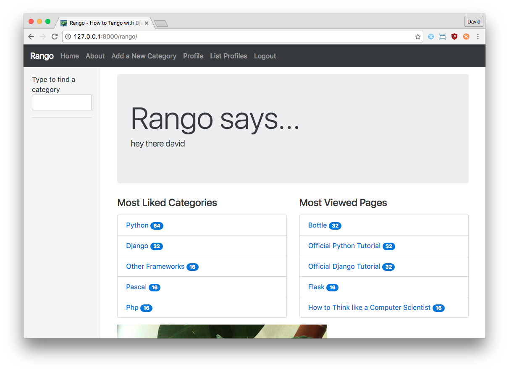
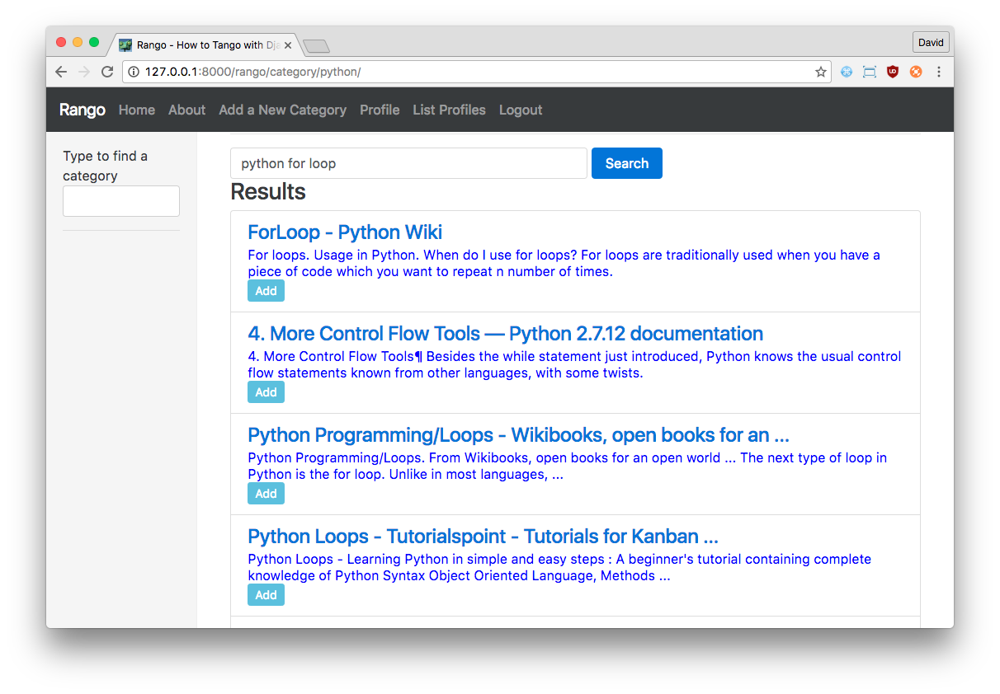

#AJAX in Django with JQuery {#chapter-ajax}
*Asynchronous JavaScript and XML (AJAX)* can be described as a series of different *client-side* technologies that work seamlessly together to allow for the development of asynchronous web applications. Recall that a standard request over HTTP is initiated by the client, with the server then sending back some form of response. Typically, a synchronous web application will return an entire page as the response to a request, which the browser then loads. Asynchronous web applications permit the request for data -- or pieces of a webpage -- that can then be used by the browser to update the currently loaded page in situ, without the need to refresh it in its entirety. AJAX is the basic technology that drives many of the web applications that are ubiquitous today, such as messenger apps, for example.

I> ### Need More Information?
I> If you're haven't used AJAX before, or require more information to grasp a better understanding of what AJAX achieves, check out the [AJAX resources page at the Mozilla website](https://developer.mozilla.org/en-US/docs/AJAX).

As the title may suggest, we'll be working towards incorporating some AJAX requests into Rango during this chapter. To aid our development, we'll also be using the JQuery framework. If you haven't worked through the [JQuery chapter](#chapter-jquery), we recommend you have a look at that now so everything is set up and ready to go.

## AJAX and Rango
What exactly will we be implementing in this chapter? Well, there's still one more major requirement outlined in our [introductory chapter](#overview-design-brief-label) that we still haven't satisfied! Users should be able to *like* a particular category. You may remember that we worked on this earlier in the book -- but we only covered *displaying* the number of likes that a category had received. We didn't implement functionality that allows a user to actually increase the count! This is what we'll be doing in this chapter. Specifically, we're going to:

- add a *like button* to allow registered users to "like" a particular category;
- add inline category suggestions, so that when a user types, they can quickly find a specific category; and
- add an *add button* to allow registered users to quickly and easily add a new page to a category when they perform a search.

All of these features will be implemented using AJAX technologies to make the user experience seamless. However, before we get stuck in, let's create a new JavaScript file called `rango-ajax.js`. This file will house all of our AJAX code for the features we implement in this chapter. Like existing JavaScript files, create this file in your project's `static/js/` directory. You'll also want to add a reference to this file in Rango's `base.html` template, underneath the existing references that we worked on in the previous chapter. As a reminder, these are located towards the bottom of the template.

I> ### JQuery Assumption
I> We assume that you have completed the [previous chapter on JQuery](#chapter-jquery) -- and are using version 3.3.1 of JQuery for this exercise. If you haven't gone through the setup steps of this chapter *at the very least,* we high recommend that you go through those steps now.

Now with everything set up and ready to go, let's get to work.

## Adding a "Like" Button
The functionality for ordering categories by likes was previously implemented in a previous chapter. Checking out Rango's homepage, categories are ordered by the number of likes they receive (in descending order). However, it would be nice to allow registered users of Rango to express their own fondness of a particular category by providing them with the ability to *like* it, too!

In the following workflow, we will allow registered users to *like* categories, but we won't be keeping track of what they have *liked*. A registered user could click the like button multiple times if they refresh the page. This is the simplest implementation -- if we wanted to keep track of what categories they liked, too, we would have to add an additional model and other supporting infrastructure. We'll leave this advanced step for you to complete as an exercise.

### Workflow
To permit registered users of Rango to *like* categories, we'll progress through the following workflow.

1. In Rango's `category.html` template, the following steps need to be undertaken.
	- Add in a *like* button, complete with an `id="like"`. There'll only be one of these buttons on the page, so using an `id` is fine.
	- We'll add in a template tag to display the number of likes the category has received. This count will be placed inside a tag with an `id` of `like_count`. This sets the template up to display likes for a given category.
2. We'll create a new view called `LikeCategoryView`. This view will examine the request, and pick out the `category_id` passed to it. The category being referred to will then have its `likes` field incremented by one.
	- Of course, we'll need to create a new URL mapping for this view, too. This should be named `/rango/like_category/` -- with the `category_id` passed as a querystring. A complete URL would look something like `/rango/like_category/?category_id=1`, for liking the category with ID `1`.
	- We'll make use of a `GET` request to implement this functionality.
	- A key point regarding this view will be that it *does not return a complete HTML page* -- but simply the number of likes that the category now has. This means our response *does not* need to inherit from Rango's `base.html` template!
3. For the actual AJAX code, we'll add some JavaScript/JQuery code to `rango-ajax.js` to complete the link between the client (displaying likes and providing the option to increment the count) and the server (incrementing the count in the database).

To graphically demonstrate what we are looking to achieve here, check out the [diagram below](#fig-ajax-workflow).

{id="fig-ajax-workflow"}

Study the diagram carefully to help your understanding of what will be implemented. On the left are events that take place client-side (within the browser), with events that take place server-side on the right (within the Django middleware). Everything starts from the user clicking the `Like Category` button. The JQuery code we will implement then fires off an AJAX `GET` request to the server. The Django middleware receives the request, executes the relevant view, and sends a simple response. For this exercise, the response will simply be the new number of likes for the given category -- nothing more. This response is then received by our JQuery code, and the value returned is then placed inside the element containing the count (using the `.html()`) method. Finally, we hide the `Like Category` button from view!

### Updating the Category Template
Our first step is to prepare Rango's `category.html` template for the new AJAX functionality. We'll need to add in the `Like Category` button, complete with a unique ID of `like_btn`, as well as adding a new element that will contain the number of likes a category has received.

To do this, open up the `category.html` template and locate the `<h1>` tag that displays the `{{ category.name }}`. After the `<h1>` tag has been closed, take a newline, and add in the following markup and template code.

{lang="html",linenos=off}
	

	    <strong id="like_count">{{ category.likes }}</strong> likes
	    
	    <button id="like_btn"
	            data-categoryid="{{ category.id }}"
	            class="btn btn-primary btn-sm"
	            type="button">
	        
	        Like Category
	    </button>
	    
	

Once this has been added, a user who is logged into Rango should see a page similar to [the one shown below](#fig-ajax-like-button). This markup adds a `
` containing all of the infrastructure required -- from a `<strong>` tag exclusively containing the number of likes the given category has received, to a new `<button>` element that will allow people to increment the number of likes. Note that within the button, we also add a small thumbs up icon (represented by the `` element). This icon is provided by [Feather](https://feathericons.com/), and is included as part of the Bootstrap framework. Note also the inclusion of the `id` attributes for both the `<strong>` and `<button>` elements. The `id` values we assign are important as our JQuery code will make use of them.

{id="fig-ajax-like-button"}

### Creating the Like Category View
With the basics now laid out in Rango's `category.html`, let's turn our attention server-side and focus on implementing the view that will handle incoming requests for liking categories. Recall that in our overview, we stated that we'd make use a `GET` request for liking categories, and URLs of the form `/rango/like_category/?category_id=1`. From these two requirements, our class-based view need only implement the `get()` method, with this method pulling the `category_id` querystring from the `GET` object.

Our implementation is shown below. Remember, this code would live inside Rango's `views.py` module.

{lang="python",linenos=off}
	@method_decorator(login_required)
	def get(self, request):
	    category_id = request.GET['category_id']
	    
	    try:
	        category = Category.objects.get(id=int(category_id))
	    except Category.DoesNotExist:
	        return HttpResponse(-1)
	    except ValueError:
	        return HttpResponse(-1)
	    
	    category.likes = category.likes + 1
	    category.save()
	    
	    return HttpResponse(category.likes)

Upon examination of the code above, you can see that we are only allowing users who are logged in to access this view -- hence the `@method_decorator(login_required)` decorator. We also implement some rudimentary error handling. If the user provides a category ID that does not exist, or the category ID supplied cannot be converted to an integer, `-1` is returned in the response. Otherwise, the `likes` attribute for the given category is incremented by one, with the updated value being returned.

You should have all of the necessary `import` statements required for this to work -- but double check that the following is present. This was used right back at the beginning of the tutorial, and you may have taken it out when cleaning up your code.

{lang="python",linenos=off}
	from django.http import HttpResponse

Of course, this view would be useless without a URL mapping to it. To comply with our requirements, let's add one. Add the following to the `urlpatterns` list in Rango's `urls.py` module.

{lang="python",linenos=off}
	path('like_category/', views.LikeCategoryView.as_view(), name='like_category'),

You should now be ready to proceed to the next step -- making the AJAX request.

### Making the AJAX request
To implement AJAX functionality, open up the blank `rango-ajax.js` file, located in your project's `static` directory. Add the following JavaScript.

{lang="javascript",linenos=off}
	$(document).ready(function() {
        $('#like_btn').click(function() {
            var category_id_var;
            category_id_var = $(this).attr('data-categoryid');
            
            $.get('/rango/like_category/',
                  {'category_id': category_id_var},
                  function(data) {
                      $('#like_count').html(data);
                      $('#like_btn').hide();
                  })
        });
    });

This JavaScript/JQuery code will be fired once the page has been loaded, and then binds code to an event handler on the `Like Category` button (identified by the unique identifier `like_btn`). When the user clicks this button, the `category_id` is extracted from the button `data-categoryid` attribute. If you look closely at the template code we defined earlier in this chapter, the `data-categoryid` attribute is populated by the Django templating engine with the unique ID of the category when the page is rendered server-side! Once the `category_id` has been obtained, we then call `$.get()`.

`$.get()` is a JQuery function that handles AJAX `GET` requests. We first specify the URL that we want to reach (hard-coded in this instance, which is undesirable!), with a dictionary-like object then passed as the second argument. This is the `data` parameter, from which a querystring is constructed with the key/value pairs supplied. This would mean the final request would look similar to `GET /rango/like_category/?category_id=<category_id_var>`, where `<category_id_var>` is replaced with the ID of the category.

The final argument we supply is a further anonymous function, this time taking a `data` parameter. This is called when the server responds from the request, with `data` containing the server's response. In our case, this will contain the number of likes that the given category now has associated with it. Within the function, we then simply replace the existing inner HTML of the `<strong>` tag (identified by `like_count`) with the updated value from the server -- and hide the button (identified by `like_btn`).

T> ### Remember, `$.get()` is Asynchronous!
T> This can take a while to get your head around, but this is worth repeating -- the call to the server is *asynchronous*. JQuery fires off the request to the server, but it doesn't hang around waiting for the server to respond. It could take several seconds, or minutes if the request takes a while! In the meantime, the browser focuses on other inputs from the user.
T> Once the request comes back from the server, the browser and JQuery jump back into action, calling the anonymous function we provided in the code above. In short, this anonymous function is called when the response comes through, *not immediately when the user clicks the `Like Category` button.*
T> If the browser waited for the response to come back, it would appear to crash! It wouldn't be able to accept any further input from the user until the response comes back. This is highly undesirable. What if the server doesn't respond, or takes substantially longer to respond than you design for? This is why designing systems that are asynchronous is such a challenge, and is one reason why using JQuery is such a bonus -- can take care of most of the issues for you!

With this code implemented, try everything out! Make sure you are logged into Rango, and like the category. You should see the `Like Category` button disappear, and the count of the number of likes increase. To double check everything, check the output of your development server. You should see a request to `/rango/like_category/` -- as shown in [the screenshot below](#fig-ajax-terminal). This is proof that the request was passed to the server.

{id="fig-ajax-terminal"}

##Adding Inline Category Suggestions
It would be really neat if we could provide a fast way for users to find a category, rather than browsing through a long list. To do this we can create a suggestion component that lets users type in a letter or part of a word, and then the system responds by providing a list of suggested categories, that the user can then select from. As the user types a series of requests will be made to the server to fetch the suggested categories relevant to what the user has entered.

### Workflow
To do this you will need to do the following.

- Create a parameterised function called `get_category_list(max_results=0, starts_with='')` that returns all the categories starting with `starts_with` if `max_results=0` otherwise it returns up to `max_results` categories.
	- The function returns a list of category objects annotated with the encoded category denoted by the attribute, `url`
- Create a view called *suggest\_category* which will examine the request and pick out the category query string.
	- Assume that a GET request is made and attempt to get the *query* attribute.
	- If the query string is not empty, ask the Category model to get the top 8 categories that start with the query string.
	- The list of category objects will then be combined into a piece of HTML via template.
	- Instead of creating a template called `suggestions.html` re-use the `cats.html` as it will be displaying data of the same type (i.e. categories).
	- To let the client ask for this data, you will need to create a URL mapping; let's call it *suggest*.

With the URL mapping, view, and template in place, you will need to update the `base.html` template to provide a category search box, and then add in some JavaScript/JQuery code to link up everything so that when the user types the suggested categories are displayed.

In the `base.html` template modify the sidebar block so that a div with an id="cats" encapsulates the categories being presented. The JQuery/AJAX will update this element. Before this `
` add an input box for a user to enter the letters of a category, i.e.:

{lang="html",linenos=off}
	<input type="search" class="form-control ds-input" 
        id="search-input" placeholder="Search..." >

With these elements added into the templates, you can add in some JQuery to update the categories list as the user types.

- Associate an on keypress event handler to the *input* with `id="suggestion"`
- `$('#suggestion').keyup(function(){ ... })`
- On keyup, issue an ajax call to retrieve the updated categories list
- Then use the JQuery `.get()` function i.e. `$(this).get( ... )`
- If the call is successful, replace the content of the `
` with id="cats" with the data received.
- Here you can use the JQuery `.html()` function i.e. `$('#cats').html( data )`

X> ### Populate Exercise
X> Update the population script by adding in the following categories: `Pascal`, `Perl`, `PHP`, `Prolog`, `PostScript` and `Programming`. 
X> These additional categories will make the demo of the inline category suggestion functionality more impressive.

### Parameterising `get_category_list()`
In this helper function, we use a filter to find all the categories that start with the string supplied. The filter we use will be `istartwith`, this will make sure that it doesn't matter whether we use uppercase or lowercase letters. If it on the other hand was important to take into account whether letters was uppercase or not you would use `startswith` instead.

{lang="python",linenos=off}
	def get_category_list(max_results=0, starts_with=''):
	    cat_list = []
	    if starts_with:
	        cat_list = Category.objects.filter(name__istartswith=starts_with)
	    
	    if max_results > 0:
	        if len(cat_list) > max_results:
	            cat_list = cat_list[:max_results]
	    return cat_list

### Create a Suggest Category View
Using the `get_category_list()` function, we can now create a view that returns the top eight matching results as follows:

{lang="python",linenos=off}
    def suggest_category(request):
        cat_list = []
        starts_with = ''
    
        if request.method == 'GET':
            starts_with = request.GET['suggestion']
        
        cat_list = get_category_list(8, starts_with)
        if len(cat_list) == 0:
            cat_list = Category.objects.order_by('-likes')

Note here we are reusing the `rango/cats.html` template.

### Mapping the View to URL
Add the following code to `urlpatterns` in `rango/urls.py`:

{lang="python",linenos=off}
	path('suggest/', views.suggest_category, name='suggest_category'),

### Updating the Base Template
In the base template, in the sidebar `<nav>`, update the HTML template so that you have:

{lang="html",linenos=off}
    

        <input type="search" class="form-control ds-input" id="suggestion" placeholder="Search..." >
        

        
            
        
        

     

Here, we have added in an input box with `id="suggestion"` and div with `id="cats"` in which we will display the response. We don't need to add a button as we will be adding an event handler on keyup to the input box that will send the suggestion request.

### Add AJAX to Request Suggestions
Add the following JQuery code to the `js/rango-ajax.js`:

{lang="javascript",linenos=off}
	$('#suggestion').keyup(function(){
	    var query;
	    query = $(this).val();
	    $.get('/rango/suggest/', {suggestion: query}, function(data){
	        $('#cats').html(data);
	    });
	});

Here, we attached an event handler to the HTML input element with `id="suggestion"` to trigger when a keyup event occurs. When it does, the contents of the input box is obtained and placed into the `query` variable. Then a AJAX `GET` request is made calling `/rango/category_suggest/` with the `query` as the parameter. On success, the HTML element with `id="cats"` (i.e. the `
`) is updated with the category list HTML.
	
{id="fig-exercises-suggestion"}

	

X> ### AJAX Add Button Exercise
X> To let registered users quickly and easily add a Page to the Category put an "Add" button next to each search result.
X>  - Update the `category.html` template:
X> 		- Add a small button next to each search result (if the user is authenticated), garnish the button with the title and URL data, so that the JQuery can pick it out.
X>		- Put a `
` with `id="page"` around the pages in the category so that it can be updated when pages are added.
X>  - Remove that link to `add` button, if you like.
X>  - Create a view `auto_add_page` that accepts a parameterised `GET` request ``(title, url, catid)`` and adds it to the category.
X>  - Map an URL to the view `url(r'^add/$', views.auto_add_page, name='auto_add_page'),`
X>   - Add an event handler to the add buttons using JQuery - when added hide the button. The response could also update the pages listed on the category page, too.

We have included the following code fragments to help you complete the exercises above. The HTML template code for `category.html` that inserts a button, and crucially keeps a record of the category that the button is associated with.

{lang="html",linenos=off}
	
	    <button data-catid="{{category.id}}" data-title="{{ result.title }}"
	        data-url="{{ result.link }}" 
	            class="rango-add btn btn-info btn-sm" type="button">Add</button>
	

The JQuery code that adds the `click` event handler to every button with the class `rango-add`:
 
{lang="javascript",linenos=off}
	$('.rango-add').click(function(){
	    var catid = $(this).attr("data-catid");
	    var url = $(this).attr("data-url");
	    var title = $(this).attr("data-title");
	    var me = $(this)
	    $.get('/rango/add/', 
	        {category_id: catid, url: url, title: title}, function(data){
	            $('#pages').html(data);
	            me.hide();
	        });
	    });  

The view code that handles the adding of a link to a category:

{lang="python",linenos=off}
	@login_required
	def auto_add_page(request):
	    cat_id = None
	    url = None
	    title = None
	    context_dict = {}
	    if request.method == 'GET':
	        cat_id = request.GET['category_id']
	        url = request.GET['url']
	        title = request.GET['title']
	        if cat_id:
	            category = Category.objects.get(id=int(cat_id))
	            p = Page.objects.get_or_create(category=category, 
	                title=title, url=url)
	            pages = Page.objects.filter(category=category).order_by('-views')
	            # Adds our results list to the template context under name pages.
	            context_dict['pages'] = pages
	    return render(request, 'rango/page_list.html', context_dict)

The HTML template markup for the new template `page_list.html`:

{lang="html",linenos=off}
	
	<ul>
	    
        <li class="list-group-item">
	        <a href="?page_id={{page.id}}">{{ page.title }}</a>
	        
	            ({{ page.views }} views)
	        
	            ({{ page.views }} view)
	        
	    </li>
        
	</ul>
	
	    <strong>No pages currently in category.</strong>
	

Finally, don't forget to add in the URL mapping:  `path('add/', views.auto_add_page, name='auto_add_page'),`.

If all has gone well, hopefully, your Rango application will be looking something like screenshots below. But don't stop now, get on with the next chapters and deploy your project!

{id="fig-exercises-main"}

{id="fig-exercises-results"}

