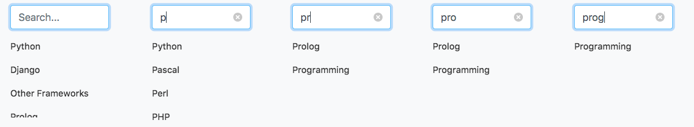

#AJAX in Django with JQuery {#chapter-ajax}
*Asynchronous JavaScript and XML (AJAX)* can be described as a series of different *client-side* technologies that work seamlessly together to allow for the development of asynchronous web applications. Recall that a standard request over HTTP is initiated by the client, with the server then sending back some form of response. Typically, a synchronous web application will return an entire page as the response to a request, which the browser then loads. Asynchronous web applications permit the request for data -- or pieces of a webpage -- that can then be used by the browser to update the currently loaded page in situ, without the need to refresh it in its entirety. AJAX is the basic technology that drives many of the web applications that are ubiquitous today, such as messenger apps, for example.

I> ### Need More Information?
I> If you're haven't used AJAX before, or require more information to grasp a better understanding of what AJAX achieves, check out the [AJAX resources page at the Mozilla website](https://developer.mozilla.org/en-US/docs/AJAX).

As the title may suggest, we'll be working towards incorporating some AJAX requests into Rango during this chapter. To aid our development, we'll also be using the JQuery framework. If you haven't worked through the [JQuery chapter](#chapter-jquery), we recommend you have a look at that now so everything is set up and ready to go.

## AJAX and Rango
What exactly will we be implementing in this chapter? Well, there's still one more major requirement outlined in our [introductory chapter](#overview-design-brief-label) that we still haven't satisfied! Users should be able to *like* a particular category. You may remember that we worked on this earlier in the book -- but we only covered *displaying* the number of likes that a category had received. We didn't implement functionality that allows a user to actually increase the count! This is what we'll be doing in this chapter. Specifically, we're going to:

- add a *like button* to allow registered users to "like" a particular category;
- add inline category suggestions, so that when a user types, they can quickly find a specific category; and
- add an *add button* to allow registered users to quickly and easily add a new page to a category when they perform a search.

All of these features will be implemented using AJAX technologies to make the user experience seamless. However, before we get stuck in, let's create a new JavaScript file called `rango-ajax.js`. This file will house all of our AJAX code for the features we implement in this chapter. Like existing JavaScript files, create this file in your project's `static/js/` directory. You'll also want to add a reference to this file in Rango's `base.html` template, underneath the existing references that we worked on in the previous chapter. As a reminder, these are located towards the bottom of the template.

I> ### JQuery Assumption
I> We assume that you have completed the [previous chapter on JQuery](#chapter-jquery) -- and are using version 3.3.1 of JQuery for this exercise. If you haven't gone through the setup steps of this chapter *at the very least,* we high recommend that you go through those steps now.

Now with everything set up and ready to go, let's get to work.

## Adding a "Like" Button
The functionality for ordering categories by likes was previously implemented in a previous chapter. Checking out Rango's homepage, categories are ordered by the number of likes they receive (in descending order). However, it would be nice to allow registered users of Rango to express their own fondness of a particular category by providing them with the ability to *like* it, too!

In the following workflow, we will allow registered users to *like* categories, but we won't be keeping track of what they have *liked*. A registered user could click the like button multiple times if they refresh the page. This is the simplest implementation -- if we wanted to keep track of what categories they liked, too, we would have to add an additional model and other supporting infrastructure. We'll leave this advanced step for you to complete as an exercise.

### Workflow
To permit registered users of Rango to *like* categories, we'll progress through the following workflow.

1. In Rango's `category.html` template, the following steps need to be undertaken.
	- Add in a *like* button, complete with an `id="like"`. There'll only be one of these buttons on the page, so using an `id` is fine.
	- We'll add in a template tag to display the number of likes the category has received. This count will be placed inside a tag with an `id` of `like_count`. This sets the template up to display likes for a given category.
2. We'll create a new view called `LikeCategoryView`. This view will examine the request, and pick out the `category_id` passed to it. The category being referred to will then have its `likes` field incremented by one.
	- Of course, we'll need to create a new URL mapping for this view, too. This should be named `/rango/like_category/` -- with the `category_id` passed as a querystring. A complete URL would look something like `/rango/like_category/?category_id=1`, for liking the category with ID `1`.
	- We'll make use of a `GET` request to implement this functionality.
	- A key point regarding this view will be that it *does not return a complete HTML page* -- but simply the number of likes that the category now has. This means our response *does not* need to inherit from Rango's `base.html` template!
3. For the actual AJAX code, we'll add some JavaScript/JQuery code to `rango-ajax.js` to complete the link between the client (displaying likes and providing the option to increment the count) and the server (incrementing the count in the database).

To graphically demonstrate what we are looking to achieve here, check out the [diagram below](#fig-ajax-workflow).

{id="fig-ajax-workflow"}

Study the diagram carefully to help your understanding of what will be implemented. On the left are events that take place client-side (within the browser), with events that take place server-side on the right (within the Django middleware). Everything starts from the user clicking the `Like Category` button. The JQuery code we will implement then fires off an AJAX `GET` request to the server. The Django middleware receives the request, executes the relevant view, and sends a simple response. For this exercise, the response will simply be the new number of likes for the given category -- nothing more. This response is then received by our JQuery code, and the value returned is then placed inside the element containing the count (using the `.html()`) method. Finally, we hide the `Like Category` button from view!

### Updating the Category Template
Our first step is to prepare Rango's `category.html` template for the new AJAX functionality. We'll need to add in the `Like Category` button, complete with a unique ID of `like_btn`, as well as adding a new element that will contain the number of likes a category has received.

To do this, open up the `category.html` template and locate the `<h1>` tag that displays the `{{ category.name }}`. After the `<h1>` tag has been closed, take a newline, and add in the following markup and template code.

{lang="html",linenos=off}
	

	    <strong id="like_count">{{ category.likes }}</strong> likes
	    
	    <button id="like_btn"
	            data-categoryid="{{ category.id }}"
	            class="btn btn-primary btn-sm"
	            type="button">
	        
	        Like Category
	    </button>
	    
	

Once this has been added, a user who is logged into Rango should see a page similar to [the one shown below](#fig-ajax-like-button). This markup adds a `
` containing all of the infrastructure required -- from a `<strong>` tag exclusively containing the number of likes the given category has received, to a new `<button>` element that will allow people to increment the number of likes. Note that within the button, we also add a small thumbs up icon (represented by the `` element). This icon is provided by [Feather](https://feathericons.com/), and is included as part of the Bootstrap framework. Note also the inclusion of the `id` attributes for both the `<strong>` and `<button>` elements. The `id` values we assign are important as our JQuery code will make use of them.

{id="fig-ajax-like-button"}

### Creating the Like Category View
With the basics now laid out in Rango's `category.html`, let's turn our attention server-side and focus on implementing the view that will handle incoming requests for liking categories. Recall that in our overview, we stated that we'd make use a `GET` request for liking categories, and URLs of the form `/rango/like_category/?category_id=1`. From these two requirements, our class-based view need only implement the `get()` method, with this method pulling the `category_id` querystring from the `GET` object.

Our implementation is shown below. Remember, this code would live inside Rango's `views.py` module.

{lang="python",linenos=off}
	@method_decorator(login_required)
	def get(self, request):
	    category_id = request.GET['category_id']
	    
	    try:
	        category = Category.objects.get(id=int(category_id))
	    except Category.DoesNotExist:
	        return HttpResponse(-1)
	    except ValueError:
	        return HttpResponse(-1)
	    
	    category.likes = category.likes + 1
	    category.save()
	    
	    return HttpResponse(category.likes)

Upon examination of the code above, you can see that we are only allowing users who are logged in to access this view -- hence the `@method_decorator(login_required)` decorator. We also implement some rudimentary error handling. If the user provides a category ID that does not exist, or the category ID supplied cannot be converted to an integer, `-1` is returned in the response. Otherwise, the `likes` attribute for the given category is incremented by one, with the updated value being returned.

You should have all of the necessary `import` statements required for this to work -- but double check that the following is present. This was used right back at the beginning of the tutorial, and you may have taken it out when cleaning up your code.

{lang="python",linenos=off}
	from django.http import HttpResponse

Of course, this view would be useless without a URL mapping to it. To comply with our requirements, let's add one. Add the following to the `urlpatterns` list in Rango's `urls.py` module.

{lang="python",linenos=off}
	path('like_category/', views.LikeCategoryView.as_view(), name='like_category'),

You should now be ready to proceed to the next step -- making the AJAX request.

### Making the AJAX request
To implement AJAX functionality, open up the blank `rango-ajax.js` file, located in your project's `static` directory. Add the following JavaScript.

{lang="javascript",linenos=off}
	$(document).ready(function() {
	    $('#like_btn').click(function() {
	        var category_id_var;
	        category_id_var = $(this).attr('data-categoryid');
	        
	        $.get('/rango/like_category/',
	              {'category_id': category_id_var},
	              function(data) {
	                  $('#like_count').html(data);
	                  $('#like_btn').hide();
	              })
	    });
	});

This JavaScript/JQuery code will be fired once the page has been loaded, and then binds code to an event handler on the `Like Category` button (identified by the unique identifier `like_btn`). When the user clicks this button, the `category_id` is extracted from the button `data-categoryid` attribute. If you look closely at the template code we defined earlier in this chapter, the `data-categoryid` attribute is populated by the Django templating engine with the unique ID of the category when the page is rendered server-side! Once the `category_id` has been obtained, we then call `$.get()`.

`$.get()` is a JQuery function that handles AJAX `GET` requests. We first specify the URL that we want to reach (hard-coded in this instance, which is undesirable!), with a dictionary-like object then passed as the second argument. This is the `data` parameter, from which a querystring is constructed with the key/value pairs supplied. This would mean the final request would look similar to `GET /rango/like_category/?category_id=<category_id_var>`, where `<category_id_var>` is replaced with the ID of the category.

The final argument we supply is a further anonymous function, this time taking a `data` parameter. This is called when the server responds from the request, with `data` containing the server's response. In our case, this will contain the number of likes that the given category now has associated with it. Within the function, we then simply replace the existing inner HTML of the `<strong>` tag (identified by `like_count`) with the updated value from the server -- and hide the button (identified by `like_btn`).

T> ### Remember, `$.get()` is Asynchronous!
T> This can take a while to get your head around, but this is worth repeating -- the call to the server is *asynchronous*. JQuery fires off the request to the server, but it doesn't hang around waiting for the server to respond. It could take several seconds, or minutes if the request takes a while! In the meantime, the browser focuses on other inputs from the user.
T>
T> Once the request comes back from the server, the browser and JQuery jump back into action, calling the anonymous function we provided in the code above. In short, this anonymous function is called when the response comes through, *not immediately when the user clicks the `Like Category` button.*
T>
T> If the browser waited for the response to come back, it would appear to crash! It wouldn't be able to accept any further input from the user until the response comes back. This is highly undesirable. What if the server doesn't respond, or takes substantially longer to respond than you design for? This is why designing systems that are asynchronous is such a challenge, and is one reason why using JQuery is such a bonus -- can take care of most of the issues for you!

With this code implemented, try everything out! Make sure you are logged into Rango, and like the category. You should see the `Like Category` button disappear, and the count of the number of likes increase. To double check everything, check the output of your development server. You should see a request to `/rango/like_category/` -- as shown in [the screenshot below](#fig-ajax-terminal). This is proof that the request was passed to the server.

{id="fig-ajax-terminal"}

##Adding Inline Category Suggestions
With a simple AJAX example implemented, let's try something more complex. Let's imagine a scenario where Rango has been populated with dozens of categories. If a user wishes to find one specific category, they would currently need to examine a long list of categories. That's annoying! A faster way to allow users to find the category they are looking for would be to provide a suggestion component. Users can start typing in the name of the category they are searching for, and Rango would respond with a list of suggested categories that the user can then select from. In essence, this feature would provide a form of *filtering* to allow the user to narrow down the options available to him or her.

We can of course achieve this with AJAX. Whenever the user types in a letter from their keyboard, we can send a request off to the Django server, and ask it to return a list of potential filtered down category matches. This list of categories can then be rendered within the loaded page. To ensure this functionality is present across the Rango app, we'll be looking to implement it on left-hand category listing section.

### Workflow
To implement this, we'll need to undertake the following steps.

1. First, we'll need to create a parameterised function called `get_category_list()`. This function will take two parameters, namely `max_results` (defaulting to `0`), and `starts_with` (defaulting to an empty string, `''`). The function will return a list of categories that match what the user is looking for.
	- `max_results` will limit how many results to return. If `0` is specified, no limit is placed on how many categories are returned.
	- `starts_with` will represent what the user has supplied so far. Imagine if the user is looking for `python`, a potential string being passed here could be `pyt` -- meaning that the user has supplied the first three characters of what they are looking for.
2. Second, a further view will need to be created. We'll call this `CategorySuggestionView`. This will again be class-based, and will be accessed through the URL mapping `/rango/suggest/` (with a name of `suggest`). This view will take the user's suggestion, and will return a list of the top eight suggestions for what the user has provided.
	- We will assume that this achieved through a HTTP `GET` request.
	- We will check if the querystring provided to the view is empty. If it contains something, we'll call `get_category_list()` to get the top eight results for the supplied string.
	- The results from `get_category_list()` will be munged together in an existing template, `categories.html`. This is what we used to display the category listing on the left-hand side of Rango's pages, through the custom template tag we implemented earlier.

T> ### Notice the Pattern
T> Like in the first example where we implemented the ability to like a category, we will once again be implementing a further view here. **AJAX requests need their own views as a means to communicate with the server.** It's just the same as a standard, synchronous request!

With the URL mapping, view and template then in place, we will need to alter Rango's `base.html` template to provide a search box, which will allow users to enter their request. After that, we'll then need to implement some further JavaScript/JQuery to glue the client-side and server-side functionality together.

### Preparing the Base Template
Let's tweak Rango's `base.html` template first. We'll modify the block of code responsible for rendering the sidebar. Find the definition of the `sidebar_block` block, and update the surrounding `
` element to include an `id`, like in the example below.

{lang="html",linenos=off}
	

	
	    
	
	

By adding an ID of `categories-listing`, we are providing a way for our future JavaScript/JQuery code to reference this `
` and update its contents, thus updating the list of categories presented to the user. But how do we allow the user to enter characters in the first place? By providing an `<input>` field! Add this in *above* the `
` you have just modified. We include a complete example of both components below.

{lang="html",linenos=off}
	

	    <input type="search"
	           id="search-input"
	           class="form-control ds-input"
	           placeholder="Search..." />
	

	
	

	
	    
	
	

Our new `input` element is of type `search` (which permits string entry), and is assigned an `id` of `search-input`. We also use a `placeholder` message of `Search...` to greet the user and prompt them that they can use this box to search for a category in the provided list. Note the inclusion of several Bootstrap classes to aid styling.

We'll come back to gluing these components to our server-side code later on.

X> ### Populate Exercise
X> Update Rango's population script. Add in the following categories: `Pascal`, `Perl`, `PHP`, `Prolog`, `PostScript` and `Programming`. Run the population script to add these new categories to your database. You don't need to worry about adding pages for each new category, although you can if you wish to do so. If you don't want to do this, just pass an empty list (`[]`) for value of `pages`.
X> By adding these additional categories, trying out the new inline category suggestion functionality will be a more impressive experience later on.

### The `get_category_list()` Helper Function
Recall that this helper function is to return a list of categories whose names closely match the string provided by the user. We can use a filter operation in the Django ORM to find all of the categories whose names begin with the provided string. This filter is called `istartwith`, and, as the name suggests, filters to categories that *start with* the given string. This is case insensitive, so it doesn't matter if the database has `Python` with a capital `P`, and the user starts typing `pyt` -- this will still match with `Python`.

This function can be added to Rango's `views.py` module. If you want to, you could always create a new module -- something like `helpers.py`, and place it in there. We'll just leave it in `views.py` for now. If you do however choose to create a new module, you'll need to `import` everything that is required!

{lang="python",linenos=off}
	def get_category_list(max_results=0, starts_with=''):
	    category_list = []
	    
	    if starts_with:
	        category_list = Category.objects.filter(name__istartswith=starts_with)
	    
	    if max_results > 0:
	        if len(category_list) > max_results:
	            category_list = category_list[:max_results]
	    
	    return category_list

Note that this function meets the requirements we defined above in that it takes two parameters -- `max_results`, allowing one to specify how many items to return, and `starts_with`, the user's input string. Note how we used the `filter` method to perform the `__istartswith` filter, looking for matches to `starts_with`. If `max_results==0`, we assume that all results are to be returned; otherwise, we chop the list using a standard Python list subindexing operation.

### The `CategorySuggestionView`
With our helper function defined, we can then make a new class-based view to make use of it. Remember, we're only dealing with a `GET` request here -- so, like in the example before, out view will only implement a `get()` method. The method will also be available to all, so there is no need to restrict it to users who are logged in.

{lang="python",linenos=off}
	class CategorySuggestionView(View):
	    def get(self, request):
	        suggestion = request.GET['suggestion']
	        category_list = get_category_list(max_results=8,
	                                          starts_with=suggestion)
	        
	        if len(category_list) == 0:
	            category_list = Category.objects.order_by('-likes')
	        
	        return render(request,
	                      'rango/categories.html',
	                      {'categories': category_list})

Note that we reuse the existing template tags template, `categories.html` -- so we don't need to define a new template here. We do however need to make sure our template variable `categories` is specified correctly -- hence the name for the key in the context dictionary.

The implemented `get()` view retrieves the user's input from the `suggestion` variable as part of the `GET` request, and then calls `get_category_list()`, passing this string to the `starts_with` parameter. We set `max_results` to `8` as per our specification. If no results are returned, we default to displaying all categories, sorted by the number of likes received in descending order.

Of course, no view is of any use without a URL mapping for accessibility! We'll add a further mapping to Rango's `urls.py` `urlpatterns` list.

{lang="python",linenos=off}
	path('suggest/', views.CategorySuggestionView.as_view(), name='suggest'),

X> ### Test the Filtering Functionality
X> With this all complete, you should then be able to test the filtering functionality. We'll leave this to you -- if you know the URL is `http://127.0.0.1:8000/rango/suggest/`, and you need to provide a querystring of the form `?suggestion=pro`, what would you do to do a simple test?

T> ### Hint
T> This is just a straightforward HTTP `GET` request, like any request *your browser issues when you type in a URL or click a link.* What happens when you point your browser to `http://127.0.0.1:8000/rango/suggest/?suggestion=pro`?

### Adding AJAX to Request Suggestions
If you tested your server-side functionality and are happy with it, now it's time to glue the left-hand side component of Rango's pages to the server. We'll do this by adding some more code to the `static` `rango-ajax.js` file. Note that you should add this *within* the `$(document).ready(function() { ... }` block, to ensure that all parts of the page are loaded before the code can be executed.

{lang="javascript",linenos=off}
	$('#search-input').keyup(function() {
        var query;
        query = $(this).val();
        
        $.get('/rango/suggest/,
              {'suggestion': query},
              function(data) {
                  $('#categories-listing').html(data);
              })
    });

This code binds a `keypress` event (when a user presses a key on their keyboard/smartphone screen) when the `search-input` element is focused. In other words, when the user types a letter into the search box, the code is fired. The value of the input box (`$(this).val()`) is then extracted, and passed to an AJAX `GET` request. We wrap the string provided up by the user in a dictionary-like object, again to help construct the correct URL and querystring.

Once the server responds, the anonymous function is called, with `data` containing the response -- or list of categories that match the user's query. This list is then simply placed inside the `categories-listing` `
` element we updated earlier -- replacing any existing content within the `
`. Job done. Have a look at the screenshots below to see the new functionality in action.
	
{id="fig-exercises-suggestion"}

## Further AJAX-ing
Having gone through two examples of how to incorporate AJAX within the Rango app, why not try one more? This time, *treat this as an exercise.* We'll lay out the specification for you and provide code snippets that will help you towards a solution. However, we implore you to solve it for yourself. If you need help, try going online and searching for a solution. Figuring out what query to type into a search engine can sometimes be half the battle in getting the help you require.

### Specification
We added several new categories to test out our category suggestion feature earlier on. If you didn't add pages to those categories, they'll just be blank. With the Bing Search functionality integrated within a category page, one missing link that we have not yet covered is providing a user the ability to *add a page from search results.*

That is, when a registered user issues a query and retrieves results, can we provide an `Add` button next to a search result to let the user add this page to the category they are looking at? Furthermore, can this be done through the use of AJAX?

Here's a rough workflow to assist you in finding a solution to this problem.

1. First, update Rango's `category.html` template.
	- Add a small button next to each search result. Within the `<button>` element, you'll want to add `data` attributes that provide the page title and page URL. Doing this will make it easier for JQuery to pick out this information.
	- Where pages are listed, you'll want to wrap that block of markup and template code with a `
` with a unique ID. Once again, this is so that JQuery can easily select this element and update the contents within it.
	- Remove the link to the existing `Add Page` view -- this is now essentially redundant.
2. With the changes in place to the template, you then need to create a new view to handle the addition of a new page.
	- The view will accept a `GET` request, containing the new `title` and `url` for a page, as well as the `category_id` for the category the page is being added to. This view should then add the new page to the given category.
	- Map the new view to a URL -- `/rango/search_add_page/`.
    - The new view should return an updated list of pages for the category. This may involve the addition of a new template to generate this list.
3. Glue the new view together with the updated `category.html` infrastructure. When an `Add` button is clicked, JQuery code should then be executed, issuing an AJAX `GET` request to your new view. The data returned from the new view should then be placed within your `
` container for the list of pages.

T> ### Use a `class` for the `Add` Button!
T> Until now, we've selected buttons in JQuery using a unique `id`. This is because until now, only one such button has existed on a page.
T>
T> However, having an `Add` button for *each page* returned from the Bing Search API presents a problem. How do you get JQuery to be able to bind code to all of them? Use the class selected (`.`) instead of the ID selector (`#`)! You can create a new class, apply it to each button, and then select items using that class with JQuery.

### Code Snippets
We've included several code snippets to help you along with this exercise. Our sample markup and template code that provides a `<button>` to `Add` a new page from search results is shown below.

{lang="html",linenos=off}
	<button class="btn btn-info btn-sm rango-page-add"
	        type="button"
	        data-categoryid="{{ category.id }}"
	        data-title="{{ result.title }}"
	        data-url="{{ result.link }}">
	    Add
	</button>

Note the three attributes beginning with `data-` to provide the `categoryid` of the category to add a page to, and the `title` and `url` values of the page we are adding. You should also be aware of the extra class we assign to the button -- `rango-page-add` -- that will help us with our JQuery code to select and bind code to the button when it is clicked.

Remember to also update your page listing component by wrapping a `
` element around it. For the examples below, we assume you give this `
` an `id` of `page-listing`.

Given the button that we add for each page above, we also need some JQuery code to request the addition of the new page, along with dealing with the incoming, updated list of pages returned from the initial request. Here is a model solution.

{lang="javascript",linenos=off}
	$('.rango-page-add').click(function () {
	    var categoryid = $(this).attr('data-categoryid');
	    var title = $(this).attr('data-title');
	    var url = $(this).attr('data-url');
	    var clickedButton = $(this);
	    
	    $.get('/rango/search_add_page/',
	          {'category_id': categoryid, 'title': title, 'url': url},
	          function(data) {
	              $('#page-listing').html(data);
	              clickedButton.hide();
	          })
	});

This code should by now be relatively self-explanatory, and you should also know by now to add this code within a `$(document).ready` block! We extract the necessary information we require from the clicked button's attributes (e.g. `title`, `url`, `categoryid`), then initiate an AJAX `GET` request. We pass the required information over to the URL `/rango/search_add_page/`.

Given the appropriate URL mapping (that we will leave for you to implement), we then pass control over to the new view. In this sample solution, we call the view `SearchAddPageView`. This implements the one required `get()` method.

{lang="python",linenos=off}
	class SearchAddPageView(View):
	    @method_decorator(login_required)
	    def get(self, request):
	        category_id = request.GET['category_id']
	        title = request.GET['title']
	        url = request.GET['url']
	        
	        try:
	            category = Category.objects.get(id=int(category_id))
	        except Category.DoesNotExist:
	            return HttpResponse('Error - category not found.')
	        except ValueError:
	            return HttpResponse('Error - bad category ID.')
	        
	        p = Page.objects.get_or_create(category=category,
	                                       title=title,
	                                       url=url)
	        
	        pages = Page.objects.filter(category=category).order_by('-views')
	        return render(request, 'rango/page_listing.html', {'pages': pages})

This sample class-based view complies with all requirements -- it only allows those who are logged in to add a page, and it expects input from the client with key names as per the JQuery AJAX call we implemented previously. While error handling is very rudimentary (look at the `except` blocks), it does at least catch basic error cases. Passing all of these, the code then creates (or gets, if it already exists), a page with the details passed, obtains a list of all the pages associated with the given category, and calls `render` with a new `page_listing.html` template.

Within this new `rango/page_listing.html` template, we simply copy and paste the markup and template code within Rango's `category.html` template that dealt with listing pages.

{lang="html",linenos=off}
	
	<ul>
	    
	    <li>
	        <a href="?page_id={{ page.id }}">{{ page.title }}</a>
	        
	            ({{ page.views }} views)
	        
	            ({{ page.views }} view)
	        
	    </li>
	    
	</ul>
	
	<strong>No pages currently in category.</strong>
	

This is *identical* from that existing template. Do not cut it -- you need the original markup and template code to do the initial rendering when the category view page is requested in the first place!

Once you have added in the URL mapping, you should then be able to see everything working. Issue a query in a category of your choice, and click the `Add` button next to one of the search results. The button should disappear, and the page listing at the top of the category view should then be updated to include the page you have added. Check out the two screenshots below -- [the first screenshot](#fig-ajax-php) shows the `PHP` category, without any pages. We issued the search term `php hello world`, and want to add the first result to our `PHP` category. Clicking the `Add` button next to the result fires off the JQuery code, issues an AJAX `GET` request to the server, with the server adding the page and returning a list of pages for the category -- just one in this instance! The page is then updated with this new list, with the `Add` button being hidden -- as seen in [the second screenshot](#fig-ajax-php-added).

{id="fig-ajax-php"}

{id="fig-ajax-php-added"}

With this functionality implemented, you're almost there! Look forward to being able to deploy your project online so that people from all around the world can look at your work!

I> ### Completely Stuck?
I> We've implemented everything in the book on our model solution Git repository. There's a commit for this exercise which [you can view here](https://github.com/maxwelld90/tango_with_django_2_code/tree/3907500757d271ae81be85e3e2f3dcbc28af0de3). However, we again implore you **not** to use this resource unless you're absolutely, positively unsure about what to do.