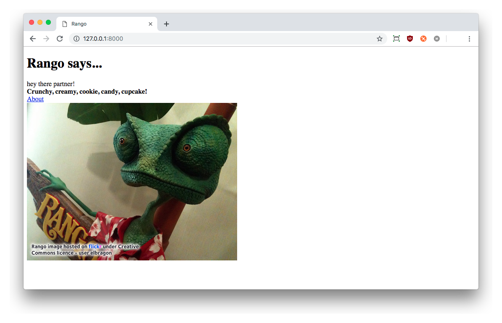

# Templates and Media Files {#chapter-templates-static}
In this chapter, we'll be introducing the Django template engine, as well as showing you how to serve both *static* files and *media* files. Rather than crafting each page by returning strings as our response, we can use *templates* to provide the skeleton structure of the page from a separate file. From the view that generates the response, we can provide the template with the necessary data to render that page in its entirety. To incorporate JavaScript and CSS (along with images and other media content) we will use the machinery provided by Django to include and dispatch such files to clients, which will in turn allow us to provide added functionality (in the case of JavaScript), or to provide styling to our pages. 

## Using Templates
Up until this point, we have only connected a URL mapping to a view. However, the Django framework is based around the *Model-View-Template* architecture. In this section, we will go through the mechanics of how *Templates* work with *Views*. In subsequent chapters, we will put these together with *Models*.

Why templates? The layout from page to page within a website is often the same. Whether you see a common header or footer on a website's pages, the [repetition of page layouts](http://www.techrepublic.com/blog/web-designer/effective-design-principles-for-web-designers-repetition/) aids users with navigation and reinforces a sense of continuity. [Django provides templates](https://docs.djangoproject.com/en/2.1/ref/templates/) to make it easier for developers to achieve this design goal, as well as separating application logic (code within your views) from presentational concerns (look and feel of your app).

In this chapter, you'll create a basic template that will be used to generate an HTML page. This will then be dispatched via a Django view. In the [chapter concerning databases and models](#chapter-models-databases), we will take this a step further by using templates in conjunction with models to dispatch dynamically generated data.

Q> ### Summary: What is a Template?
Q> In the world of Django, think of a *template* as the scaffolding that is required to build a complete HTML webpage. A template contains the *static parts* of a webpage (that is, parts that never change), complete with special syntax (or *template tags*) which can be overridden and replaced with *dynamic content* that your Django app's views can replace to produce a final HTML response.

### Configuring the Templates Directory
To get templates up and running with your Django app, you'll need to create two directories in which template files are stored.

In your Django project's directory (e.g. `<workspace>/tango_with_django_project/`), create a new directory called `templates`. To clarify, this is the directory that contains your project's `manage.py` script! Within the new templates directory, you will then want to create further directory called `rango`. This means that the path `<workspace>/tango_with_django_project/templates/rango/` is the location where we will store templates associated with our `rango` application.

T> ### Keep your Templates Organised
T> It's good practice to separate your templates into subdirectories for each app you have. This is why we've created a `rango` directory within our `templates` directory. If you package your app up to distribute to other developers, it'll be much easier to know which templates belong to which app!

To tell the Django project where templates will be stored, open your project's `settings.py` file. Next, locate the `TEMPLATES` data structure. By default, when you create a new Django project, it will look like the following.

{lang="python",linenos=off}
	TEMPLATES = [
	    {
	        'BACKEND': 'django.template.backends.django.DjangoTemplates',
	        'DIRS': [],
	        'APP_DIRS': True,
	        'OPTIONS': {
	            'context_processors': [
	                'django.template.context_processors.debug',
	                'django.template.context_processors.request',
	                'django.contrib.auth.context_processors.auth',
	                'django.contrib.messages.context_processors.messages',
	            ],
	        },
	    },
	]

What we need to do to is tell Django where our templates will be stored by modifying the `DIRS` list, which is set to an empty list by default. Change the dictionary key/value pair to look like the following.

{lang="python",linenos=off}
	'DIRS': ['<workspace>/tango_with_django_project/templates']

Note that you are *required to use absolute paths* to locate the `templates` directory. If you are collaborating with team members or working on different computers, then this will become a problem. You'll have different usernames and different drive structures, meaning the paths to the `<workspace>` directory will be different. One solution would be to add the path for each different configuration. For example:
	
{lang="python",linenos=off}
	'DIRS': [ '/Users/leifos/templates',
	          '/Users/maxwelld90/templates',
	          '/Users/davidm/templates', ]

	
However, there are several problems with this. First, you have to add in the path for each setting, each time. Second, if you are running the app on different operating systems the backslashes have to be constructed differently.

W> ### Don't hard code Paths!
W> **The road to hell is paved with hard-coded paths.** [Hard-coding paths](http://en.wikipedia.org/wiki/Hard_coding) is a [software engineering anti-pattern](http://sourcemaking.com/antipatterns), and will make your project [less portable](http://en.wikipedia.org/wiki/Software_portability) -- meaning that when you run it on another computer, it probably won't work! (Or it will work, just with a lot of effort!)

### Dynamic Paths
A better solution is to make use of built-in Python functions to work out the path of your `templates` directory automatically. This way, an absolute path can be obtained regardless of where you place your Django project's code. This, in turn, means that your project becomes more *portable.* 

At the top of your `settings.py` file, there is a variable called `BASE_DIR`. This variable stores the path to the directory in which your project's `settings.py` module is contained. This is obtained by using the special Python `__file__` attribute, which is [set to the path of your settings module](http://stackoverflow.com/a/9271479). Using this as a parameter to `os.path.abspath()` guarantees the *absolute path* to the `settings.py` module. The call to `os.path.dirname()` then provides the reference to the absolute path of the *directory containing* the `settings.py` module. Calling `os.path.dirname()` again removes another directory layer, so that `BASE_DIR` then points to your project directory, or `<workspace>/tango_with_django_project/`. If you are curious, you can see how this works by adding the following lines to your `settings.py` file.

{lang="python",linenos=off}
	print(__file__)
	print(os.path.dirname(__file__))
	print(os.path.dirname(os.path.dirname(os.path.abspath(__file__))))

Having access to the value of `BASE_DIR` makes it easy for you to reference other aspects of your Django project. Using the `BASE_DIR` variable, we can now create a new variable called `TEMPLATE_DIR` that will reference your new `templates` directory. We can make use of the `os.path.join()` function to join up multiple paths, leading to a variable definition like the example below. Make sure you put this underneath the definition of `BASE_DIR`!

I> ### Delete those Lines!
I> If you included the three `print()` statements above to see what's going on, make sure you remove them once you understand. Don't just leave them lying there. They will clutter your settings module, and clutter the output of the Django development server!

{lang="python",linenos=off}
	TEMPLATE_DIR = os.path.join(BASE_DIR, 'templates')

Here, we make use of the `os.path.join()` function to join together (or *concatenate*) the value of the `BASE_DIR` variable, and the string `'templates'`. Upon completion, this concatenation yields `<workspace>/tango_with_django_project/templates/`. From here, we can then use our new `TEMPLATE_DIR` variable to replace the hard-coded path we defined earlier in `TEMPLATES`. Update the `DIRS` key/value pairing to look like the following.

{lang="python",linenos=off}
	'DIRS': [TEMPLATE_DIR, ]

I> ### Why `TEMPLATE_DIR`?
I> You've created a new variable called `TEMPLATE_DIR` at the top of your `settings.py` file because it's easier to access should you ever need to change it. For more complex Django projects, the `DIRS` list allows you to specify more than one template directory to draw templates from. For this book however, one location is sufficient to get everything working.

W> ### Concatenating Paths
W> **When concatenating system paths together, always use `os.path.join()`.** Using this built-in function ensures that the correct path separators are used. On a UNIX operating system (or derivative of), forward slashes (`/`) would be used to separate directories, whereas a Windows operating system would use backward slashes (`\`). If you manually append slashes to paths, you may end up with path errors when attempting to run your code on a different operating system, thus reducing your project's portability.

### Adding a Template
With your template directory and path now set up, create a file called `index.html` and place it in the `templates/rango/` directory. Within this new file, add the following HTML markup and Django template code.

{lang="html",linenos=off}
	<!DOCTYPE html>
	<html>
	
	    <head>
	        <title>Rango</title>
	    </head>
	
	    <body>
	        <h1>Rango says...</h1>
	        

	            hey there partner!   
	            <strong>{{ boldmessage }}</strong> 
	        

	        

	            <a href="/rango/about/">About</a> 
	        

	    </body>
	
	</html>

From this HTML code, it should be clear that a simple HTML page is going to be generated that greets a user with a *hello world* message. You might also notice some non-HTML in the form of `{{ boldmessage }}`. This is a *Django template variable*. We can set values to these variables so they are replaced with whatever we want when the template is rendered. We'll get to that in a moment.

To use this template, we need to reconfigure the `index()` view that we created earlier. Instead of dispatching a simple response, we will change the view to dispatch our template.

In `rango/views.py`, check to see if the following `import` statement exists at the top of the file. Django should have added it for you when you created the Rango app. If it is not present, add it.

{lang="python",linenos=off}
	from django.shortcuts import render

You can then update the `index()` view function as follows. Check out the inline commentary to see what each line does.

{lang="python",linenos=off}
	def index(request):
	    # Construct a dictionary to pass to the template engine as its context.
	    # Note the key boldmessage matches to {{ boldmessage }} in the template!
	    context_dict = {'boldmessage': 'Crunchy, creamy, cookie, candy, cupcake!'}
	    
	    # Return a rendered response to send to the client.
	    # We make use of the shortcut function to make our lives easier.
	    # Note that the first parameter is the template we wish to use.
	    return render(request, 'rango/index.html', context=context_dict)

First, we construct a dictionary of key/value pairs that we want to use within the template. Then, we call the `render()` helper function. This function takes as input the user's `request`, the template filename, and the context dictionary. The `render()` function will take this data and mash it together with the template to produce a complete HTML page that is returned with a `HttpResponse`. This response is then returned and dispatched to the user's web browser.

I> ### What is the Template Context?
I> {#section-templates-static-context}
I> When a template file is loaded with the Django templating system, a *template context* is created. In simple terms, a template context is a Python dictionary that maps template variable names with Python variables. In the template we created above, we included a template variable name called `boldmessage`. In our updated `index(request)` view example, the string `Crunchy, creamy, cookie, candy, cupcake!` is mapped to template variable `boldmessage`. The string `Crunchy, creamy, cookie, candy, cupcake!` therefore replaces *any* instance of `{{ boldmessage }}` within the template.

Now that you have updated the view to employ the use of your template, start the Django development server and visit `http://127.0.0.1:8000/rango/`. You should see your simple HTML template rendered in your browser -- and it should look just like the [example screenshot shown below](#fig-ch4-first-template).

If you don't, read the error message presented to see what the problem is, and then double-check all the changes that you have made. One of the most common issues people have with templates is that the path is set incorrectly in `settings.py`. Sometimes it's worth adding a `print` statement to `settings.py` to report the `BASE_DIR` and `TEMPLATE_DIR` to make sure everything is correct.

This example demonstrates how to use templates within your views. However, we have only touched on a fraction of the functionality provided by the Django templating engine. We will use templates in more sophisticated ways as you progress through this book. In the meantime, you can find out more about [templates from the official Django documentation](https://docs.djangoproject.com/en/2.1/ref/templates/).

{id="fig-ch4-first-template"}

## Serving Static Media Files {#section-templates-static-static}
While you've got templates working, your Rango app is admittedly looking a bit plain right now -- there's no styling or imagery. We can add references to other files in our HTML template such as [*Cascading Style Sheets (CSS)*](http://en.wikipedia.org/wiki/Cascading_Style_Sheets), [*JavaScript*](https://en.wikipedia.org/wiki/JavaScript) and images to improve the presentation. These are called *static files*, because they are not generated dynamically by a web server; they are simply sent as is to a client's web browser. This section shows you how to set Django up to serve static files, and shows you how to include an image within your simple template.

### Configuring the Static Media Directory
To start, you will need to set up a directory in which static media files are stored. In your project directory (e.g. `<workspace>/tango_with_django_project/`), create a new directory called `static` and a new directory called `images` inside `static`. Check that the new `static` directory is at the same level as the `templates` directory you created earlier in this chapter.

Next, place an image inside the `images` directory. As shown in below, we chose a picture of [the chameleon Rango](http://www.imdb.com/title/tt1192628/) -- a fitting mascot, if ever there was one.

{id="fig-ch4-rango"}

Just like the `templates` directory we created earlier, we need to tell Django about our new `static` directory. To do this, we once again need to edit our project's `settings.py` module. Within this file, we need to add a new variable pointing to our `static` directory, and a data structure that Django can parse to work out where our new directory is.

First of all, create a variable called `STATIC_DIR` at the top of `settings.py`, preferably underneath `BASE_DIR` and `TEMPLATES_DIR` to keep your paths all in the same place. `STATIC_DIR` should make use of the same `os.path.join` trick -- but point to `static` this time around, just as shown below.

{lang="python",linenos=off}
	STATIC_DIR = os.path.join(BASE_DIR, 'static')

This results in the path `<workspace>/tango_with_django_project/static/`. We then need to create a new data structure called `STATICFILES_DIRS`. This is essentially a list of paths with which Django will expect to find static files that can be served. By default, this list does not exist -- **check** it doesn't before you create it. If you define it twice, you can start to confuse Django, and yourself.

For this book, we're only going to be using a single location to store our project's static files -- the path defined in `STATIC_DIR`. As such, we can simply set up the list STATICFILES_DIRS` with the following.

{lang="python",linenos=off}
	STATICFILES_DIRS = [STATIC_DIR, ]

T> ### Keep `settings.py` Tidy!
T> It's in your best interests to keep your `settings.py` module tidy and in good order. Don't just put things in random places; keep it organised. Keep your `DIRS` variables at the top of the module so they are easy to find, and place `STATICFILES_DIRS` in the portion of the module responsible for static media (close to the bottom). When you come back to edit the file later, it'll be easier for you or other collaborators to find the necessary variables.

Finally, check that the `STATIC_URL` variable is defined within your `settings.py` module. If it has not been defined, then add it in, as shown below. Note that this variable by default appears close to the end of the module, so you may have to scroll down to the bottom of `settings.py` to find it (if it's already there).

{lang="python",linenos=off}
	STATIC_URL = '/static/'

With everything required now entered, what does it all mean? Put simply, the first two variables `STATIC_DIR` and `STATICFILES_DIRS` refers to the locations on your computer where static files are stored. The final variable `STATIC_URL` then allows us to specify the URL with which static files can be accessed when we run our Django development server. For example, with `STATIC_URL` set to `/static/`, we would be able to access static content at `http://127.0.0.1:8000/static/`. *Think of the first two variables as server-side locations, with the third variable as the location with which clients can access static content.*

X> ### Test your Configuration
X> As a small exercise, test to see if everything is working correctly. Try and view the `rango.jpg` image in your browser when the Django development server is running.
X> If your `STATIC_URL` is set to `/static/` and `rango.jpg` can be found at `images/rango.jpg`, what is the complete URL that you would enter into your web browser's window to access this resource?
X>
X> **Try to figure this out before you move on! It'll help you understand how to interpret static URLs.** The answer is coming up if you are struggling to figure it out.

W> ### Don't Forget the Slashes!
W> When setting `STATIC_URL`, check that you end the URL you specify with a forward slash (e.g. `/static/`, not `/static`). As per the [official Django documentation](https://docs.djangoproject.com/en/2.1/ref/settings/#std:setting-STATIC_URL), not doing so can open you up to a world of pain. The extra slash at the end ensures that the root of the URL (e.g. `/static/`) is separated from the static content you want to serve (e.g. `images/rango.jpg`).

I> ### Serving Static Content
I> While using the Django development server to serve your static media files is fine for a development environment, it's highly unsuitable for a production environment. The [official Django documentation on deployment](https://docs.djangoproject.com/en/2.1/howto/static-files/deployment/) provides further information about deploying static files in a production environment. We'll look at this issue in more detail however when we [deploy Rango](#chapter-deploy).

If you haven't managed to figure out where the image should be accessible from, point your web browser to `http://127.0.0.1:8000/static/images/rango.jpg`.

### Static Media Files and Templates
Now that you have your Django project set up to handle static files, you can now make use of these files within your templates to improve their appearance and add additional functionality.

To demonstrate how to include static files, open up the `index.html` templates you created earlier, located in the `<workspace>/templates/rango/` directory. Modify the HTML source code as follows. The two lines that we add are shown with an HTML comment next to them for easy identification.

{lang="html",linenos=off}
	<!DOCTYPE html>
	
	 <!-- New line -->
	
	<html>
	    <head>
	        <title>Rango</title>
	    </head>
	    
	    <body>
	        <h1>Rango says...</h1>
	        
	        

	            hey there partner!  
	            <strong>{{ boldmessage }}</strong> 
	        

	        
	        

	            <a href="/rango/about/">About</a> 
	             <!-- New line -->
	        

	    </body>
	    
	</html>

The first new line added (``) informs Django's template engine that we will be using static files within the template. This then enables us to access the media in the static directories via the use of the `static` [template tag](https://docs.djangoproject.com/en/2.1/ref/templates/builtins/). This indicates to Django that we wish to show the image located in the static media directory called `images/rango.jpg`. Template tags are denoted by curly brackets (e.g. ``), and calling `static` will combine the URL specified in `STATIC_URL` with `images/rango.jpg` to yield `/static/images/rango.jpg`. The HTML generated by the Django template engine would be:

{lang="html",linenos=off}
	 

If for some reason the image cannot be loaded, it is always a good idea to specify an alternative text tagline. This is what the ``alt`` attribute provides inside the `img` tag. You can see what happens in the [image below](#fig-ch4-rango-site-with-alt-text).

{id="fig-ch4-rango-site-with-alt-text"}

With these minor changes in place, start the Django development server once more and navigate to `http://127.0.0.1:8000/rango`. If everything has been done correctly, you will see a webpage that looks similar to the [screenshot shown below](#fig-ch4-rango-site-with-pic).

{id="fig-ch4-rango-site-with-pic"}

T> ### Always put `<!DOCTYPE>` First!
T> When creating the HTML templates, always ensure that the [`DOCTYPE` declaration](http://www.w3schools.com/tags/tag_doctype.asp) appears on the **first line**. If you put the `` template command first, then whitespace will be added to the rendered template before the `DOCTYPE` declaration. This whitespace will lead to your HTML markup [failing validation](https://validator.w3.org/).

T> ### Loading other Static Files
T> The ```` template tag can be used whenever you wish to reference static files within a template. The code example below demonstrates how you could include JavaScript, CSS and images into your templates with correct HTML markup.
T>
T> {lang="html",linenos=off}
T> 	<!DOCTYPE html>
T> 	
T> 	
T> 	<html>
T> 	    
T> 	    <head>
T> 	        <title>Rango</title>
T> 	        <!-- CSS -->
T> 	        <link rel="stylesheet" href="" />
T> 	        <!-- JavaScript -->
T> 	        
T> 	    </head>
T> 	
T> 	    <body>
T> 	        <!-- Image -->
T> 	        
T> 	    </body>
T> 	
T> 	</html>
T>
T> **Don't update the `base.html` template here -- this is merely a demonstration to show you how the `` template function works. You'll be adding CSS and JavaScript later on in this tutorial.**
T>
T> Static files you reference will obviously need to be present within your `static` directory. If a requested file is not present or you have referenced it incorrectly, the console output provided by Django's development server will show a [`HTTP 404` error](https://en.wikipedia.org/wiki/HTTP_404). Try referencing a non-existent file and see what happens. Looking at the output snippet below, notice how the last entry's HTTP status code is `404`.
T>
T> {lang="text",linenos=off}
T> 	[24/Mar/2019 17:05:54] "GET /rango/ HTTP/1.1" 200 366
T> 	[24/Mar/2019 17:05:55] "GET /static/images/rango.jpg HTTP/1.1" 200 0
T> 	[24/Mar/2019 17:05:55] "GET /static/images/not-here.jpg HTTP/1.1" 404 0
T>
T> For further information about including static media you can read through the official [Django documentation on working with static files in templates](https://docs.djangoproject.com/en/2.1/howto/static-files/#staticfiles-in-templates).

## Serving Media {#section-templates-upload}
Static media files can be considered files that don't change and are essential to your application. However, often you will have to store *media files* which are dynamic. These files can be uploaded by your users or administrators, and so they may change. As an example, a media file would be a user's profile picture. If you run an e-commerce website, a series of media files would be used as images for the different products that your online shop has.

To serve media files successfully, we need to update the Django project's settings. This section details what you need to add -- [but we won't be fully testing it out until later](#chapter-ex) where we implement the functionality for users to upload profile pictures.

I> ### Serving Media Files
I> Like serving static content, Django provides the ability to serve media files in your development environment. This allows you to test and make sure everything is working. The methods that Django uses to serve this content are highly unsuitable for a production environment, so you should be looking to host your app's media files by some other means (through a production-grade web server like Apache). The [deployment chapter](#chapter-deploy) will discuss this in more detail.

### Modifying `settings.py`
First, open your Django project's `settings.py` module. In here, we'll be adding a couple more things. Like static files, media files are uploaded to a specified directory on your filesystem. We need to tell Django where to store these files.

At the top of your `settings.py` module, locate your existing `BASE_DIR`, `TEMPLATE_DIR` and `STATIC_DIR` variables -- they should be close to the top. Underneath, add a further variable, `MEDIA_DIR`.

{lang="python",linenos=off}
	MEDIA_DIR = os.path.join(BASE_DIR, 'media')

This line instructs Django that media files will be uploaded to your Django project's root, plus '/media' -- or `<workspace>/tango_with_django_project/media/`. As we previously mentioned, keeping these path variables at the top of your `settings.py` module makes it easy to change paths later on if necessary.

Now find a blank spot in `settings.py`, and add two more variables. The variables `MEDIA_ROOT` and `MEDIA_URL` will be [picked up and used by Django to set up media file hosting](https://docs.djangoproject.com/en/2.1/howto/static-files/#serving-files-uploaded-by-a-user-during-development).

{lang="python",linenos=off}
	MEDIA_ROOT = MEDIA_DIR
	MEDIA_URL = '/media/'

W> ### Once again, don't Forget the Slashes!
W> Like the `STATIC_URL` variable, ensure that `MEDIA_URL` ends with a forward slash (i.e. `/media/`, not `/media`). The extra slash at the end ensures that the root of the URL (e.g. `/media/`) is separated from the content uploaded by your app's users.

The two variables tell Django where to look in your filesystem for media files (`MEDIA_ROOT`) that have been uploaded/stored, and what URL to serve them from (`MEDIA_URL`). With the configuration defined above, the uploaded file `cat.jpg` will, for example, be available to access on your Django development server through the URL `http://localhost:8000/media/cat.jpg`.

When we come to working with templates [later on in this book](#chapter-mtv), it'll be handy for us to obtain a reference to the `MEDIA_URL` path when we need to reference uploaded content. Django provides a [*template context processor*](https://docs.djangoproject.com/en/2.1/ref/templates/api/#django-template-context-processors-media) that'll make it easy for us to do. While we don't strictly need this set up now, it's a good time to add it in.

To do this, find the `TEMPLATES` list that resides within your project's `settings.py` module. The list contains a dictionary; look for the `context_processors` list within the nested dictionary. Within the `context_processors` list, add a new string to include an additional context processor: `'django.template.context_processors.media'`. Your `context_processors` list should then look like the example below.

{lang="python",linenos=off}
	'context_processors': [
	    'django.template.context_processors.debug',
	    'django.template.context_processors.request',
	    'django.contrib.auth.context_processors.auth',
	    'django.contrib.messages.context_processors.messages',
	    'django.template.context_processors.media',  # Check/add this line!
	],

### Tweaking your URLs
The final step for setting up the serving of media in a development environment is to tell Django to serve static content from `MEDIA_URL`. This can be achieved by opening your **project's** `urls.py` module, and modifying it by appending a call to the `static()` function to your project's `urlpatterns` list. Remember, your **project's** `urls.py` module is the one that lives within the `tango_with_django_project` directory!

{lang="python",linenos=off}
	urlpatterns = [
	    ...
	    ...
	] + static(settings.MEDIA_URL, document_root=settings.MEDIA_ROOT)

You'll also need to add the following `import` statements at the top of the `urls.py` module.

{lang="python",linenos=off}
	from django.conf import settings
	from django.conf.urls.static import static

Once this is complete, you should be able to serve content from the `media` directory of your project from the `/media/` URL.

X> ### Create the `media` Directory
X> Did you create the `media` directory within the `tango_with_django_project` directory? It should be a the same level as the `static` directory and the `manage.py` module.

## Basic Workflow
With the chapter complete, you should now know how to set up and create templates, use templates within your views, setup and use the Django development server to serve static media files, *and* include images within your templates. We've covered quite a lot!

Creating a template and integrating it within a Django view is a key concept for you to understand. It takes several steps but will become second nature to you after a few attempts.

1. First, create the template you wish to use and save it within the `templates` directory you specified in your project's `settings.py` module. You may wish to use Django template variables (e.g. `{{ variable_name }}`) or [template tags](https://docs.djangoproject.com/en/2.1/ref/templates/builtins/) within your template. You'll be able to replace these with whatever you like within the corresponding view.
2. Find or create a new view within an application's `views.py` file.
3. Add your view specific logic (if you have any) to the view. For example, this may involve extracting data from a database and storing it within a list.
4. Within the view, construct a dictionary object which you can pass to the template engine as part of the [template's *context*](#section-templates-static-context).
5. Make use of the  `render()` helper function to generate the rendered response. Ensure you reference the request, then the template file, followed by the context dictionary.
6. Finally, map the view to a URL by modifying your project's `urls.py` file (or the application-specific `urls.py` file if you have one). This step is only required if you're creating a new view, or you are using an existing view that hasn't yet been mapped!

The steps involved in getting a static media file onto one of your pages are part of another important process that you should be familiar with. Check out the steps below on how to do this.

1. Take the static media file you wish to use and place it within your project's `static` directory. This directory is defined in `STATICFILES_DIRS` -- one of the variables that you set up in `settings.py`.
2. Add a reference to the static media file to a template. For example, an image would be inserted into an HTML page through the use of the `` tag. 
3. Remember to use the `` and `` commands within the template to access the static files. Replace `<filename>` with the path to the image or resource you wish to reference. **Whenever you wish to refer to a static file, use the `static` template tag!**

The steps for serving media files are similar to those for serving static media.

1. Place a file within your project's `media` directory. The `media` directory is specified by your project's `MEDIA_ROOT` variable. 
2. Link to the media file in a template through the use of the `{{ MEDIA_URL }}` context variable. For example, referencing an uploaded image `cat.jpg` would have an `` tag like ``.

X> ### Exercises
X> Give the following exercises a go to reinforce what you've learnt from this chapter.
X> 
X> * Convert the about page to use a template too. Use a template called `about.html` for this purpose. Base the contents of this file on `index.html`. In the new template's `<h1>` element, keep `Rango says...` -- but on the line underneath, have the text `here is the about page.`.
X> * Within the new `about.html` template, add a picture stored within your project's static files. You can just reuse the `rango.jpg` image you used in the index view! Make sure you keep the same `alt` text as the index page!
X> * On the about page, include a line that says `This tutorial has been put together by <your-name>`. If you copied over from `index.html`, replacing `{{ boldmessage }}` would be the perfect place for this.
X> * In your Django project directory, create a new directory called `media` (if you have not done so already). Download a JPEG image of a cat, and save it to the `media` directory as `cat.jpg`. 
X> * In your `about.html` template, add in an `` tag to display the picture of the cat to ensure that your media is being served correctly. *Keep the static image of Rango in your index page* so that your about page has working examples of both static and media files. The cat image should have alternative text of `Picture of a Cat`. **This means you should have an image of both Rango (from `static`) and a cat (from `media`) in your rendered about page.**

T> ### Static and Media Files
T> Remember, **static files, as the name implies, do not change.** These files form the core components of your website. **Media files are user-defined; and as such, they may change often!**
T>
T> An example of a static file could be a stylesheet file (CSS), which determines the appearance of your app's webpages. An example of a media file could be a user profile image, which is uploaded by the user when they create an account on your app.

X> ### Test your Implementation
X> If you have completed everything in this chapter up to and including the exercises, you can test your implementation so far. [Follow the guide we provided earlier](#section-getting-ready-tests), using the test module `tests_chapter4.py`. How does your implementation stack up against our tests?

<!-- Leaving out tests for now -- DMAX (2019-07-23), these require some work to make them work properly with the small tweaks that have been made throughout the book.>
<!-- I> ### Tests
I>
I> We have written a few tests to check if you have completed the exercises. To check your work so far, [download the `tests.py` script](https://github.com/leifos/tango_with_django_2/blob/master/code/tango_with_django_project/rango/tests.py) from our [GitHub repository](https://github.com/leifos/tango_with_django_2/), and save it within your `rango` app directory.
I>
I> It is good practice to write tests as you go to make sure the application is working as expected.
I> To run the tests, issue the following command in the terminal or Command Prompt.
I>
I> {lang="text",linenos=off}
I>     $ python manage.py test rango
I>
I> If you are interested in learning about automated testing, now is a good time to check out the [chapter on testing](#chapter-testing). The chapter runs through some of the basics on how you can write tests to automatically check the integrity of your code.
I>
I> However for the time being you can see if you pass the tests. If you don't check carefully the test out put and see what tests you fail on -- then go back to your code and update it to meet the test requirements. -->
