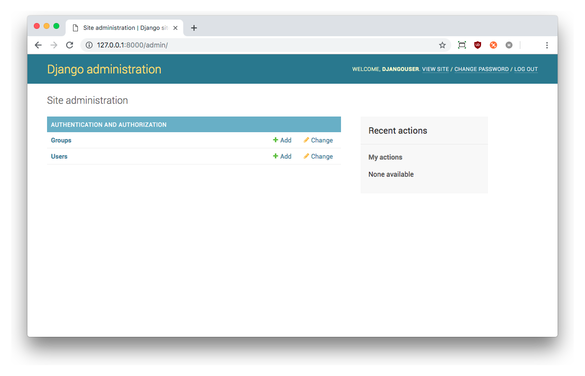
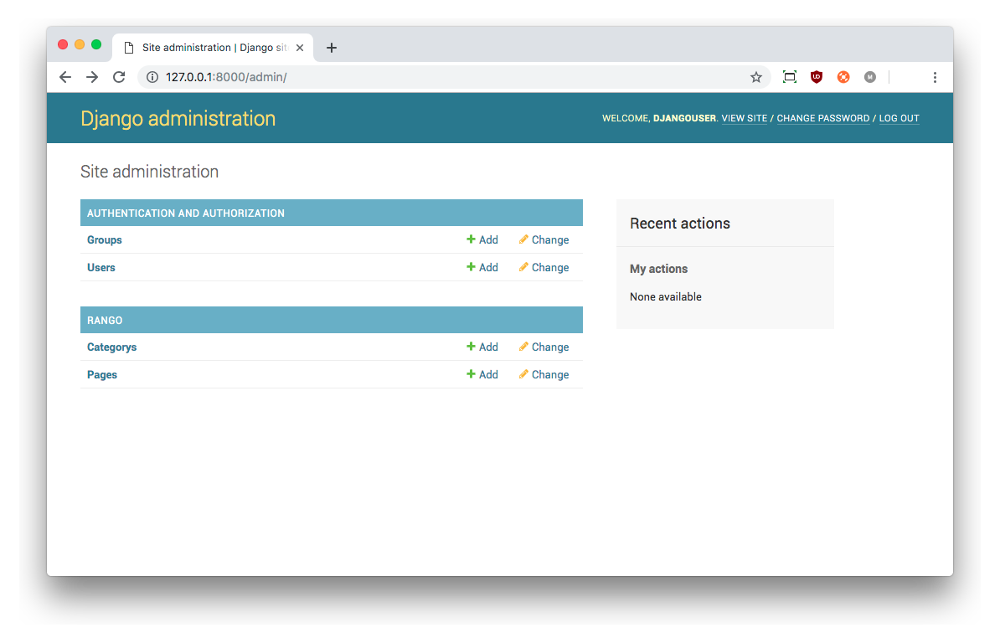

# Models and Databases {#chapter-models-databases}
Typically, web applications require a backend to store the dynamic content that appears on the app's webpages. For Rango, we need to store pages and categories that are created, along with other details. The most convenient way to do this is by employing the services of a relational database. These will likely use the *Structured Query Language (SQL)* to allow you to query the data store.

However, Django provides a convenient way in which to access data stored in databases by using an [*Object Relational Mapper (ORM)*](https://en.wikipedia.org/wiki/Object-relational_mapping). In essence, data stored within a database table is encapsulated via Django *models*. A model is a Python object that describes the database table's data. Instead of directly working on the database via SQL, Django provides methods that let you manipulate the data via the corresponding Python model object. Any commands that you issue to the ORM are automatically converted to the corresponding SQL statement on your behalf.

This chapter walks you through the basics of data management with Django and its ORM. You'll find it's incredibly easy to add, modify and delete data within your app's underlying database, and see how straightforward it is to get data from the database to the web browsers of your users.

## Rango's Requirements {#section-models-databases-requirements}
Before we get started, let's go over the data requirements for the Rango app that we are developing. Full requirements for the application are [provided in detail earlier on](#overview-er). Let's look at the database requirements again here.

* Rango is essentially a *web page directory* -- it is a website that houses links to other, external websites.
* There are several different *webpage categories* with each category housing none, one or many links. [We assumed in the overview chapter](#overview-er) that this is a one-to-many relationship. Check out the [Entity Relationship diagram below](#fig-rango-erd-repeat).
* A category has a name, several visits, and several likes.
* A page belongs to a particular category, has a title, a URL, and several views.

{id="fig-rango-erd-repeat"}

## Telling Django about Your Database {#section-models-database-telling}
Before we can create any models, we need to set up our database to work with Django. In Django, a `DATABASES` variable is automatically created in your `settings.py` module when you set up a new project. Unless you changed it, it should look like the following example.

{lang="python",linenos=off}
	DATABASES = {
	    'default': {
	        'ENGINE': 'django.db.backends.sqlite3',
	        'NAME': os.path.join(BASE_DIR, 'db.sqlite3'),
	    }
	}

We can pretty much leave this as-is for our Rango app. You can see a `default` database that is powered by a lightweight database engine, [SQLite](https://www.sqlite.org/) (see the `ENGINE` option). The `NAME` entry for this database is the path to the database file, which is by default `<workspace>/tango_with_django_project/db.sqlite3` -- or, in other words, the `db.sqlite3` file that lives in the root of your Django project.

T> ### Don't `git push` your Database!
T> If you are using Git, you might be tempted to add and commit the database file. However, we don't think that this is a particularly good idea. What if you are working on your app with other people? It would be highly likely that they will change the database as they test features. Different versions of database files (which ultimately do not matter in development) **will** cause endless conflicts.
T>
T> Instead, add `db.sqlite3` to your `.gitignore` file so that it won't be added when you `git commit` and `git push`. You can also do this for other files like `*.pyc` and machine specific files. For more information on how to set your `.gitignore` file up, you can refer to our [Git familiarisation chapter](#section-git-setup-tweaks) in the appendices.

I> ### Using other Database Engines
I> The Django database framework has been created to cater for a variety of different database backends, such as [PostgresSQL](http://www.postgresql.org/), [MySQL](https://www.mysql.com/) and [Microsoft's SQL Server](https://en.wikipedia.org/wiki/Microsoft_SQL_Server). For other database engines, other keys like `USER`, `PASSWORD`, `HOST` and `PORT` exist for you to configure the database with Django.
I>
I> While we don't cover how to use other database engines in this book, there are guides online which show you how to do this. A good starting point is the [official Django documentation](https://docs.djangoproject.com/en/2.1/ref/databases/#storage-engines).
I>
I> Note that SQLite is sufficient for demonstrating the functionality of the Django ORM. When you find your app has become viral and has accumulated thousands of users, you may want to consider [switching the database backend to something more robust](http://www.sqlite.org/whentouse.html).

## Creating Models
With your database configured in `settings.py`, let's create the two initial data models for the Rango application. Models for a Django app are stored in the respective `models.py` module. This means that for Rango, models are stored within `<workspace>/tango_with_django_project/rango/models.py`.

For the models themselves, we will create two classes -- one class representing each model. Both must [inherit](https://en.wikipedia.org/wiki/Inheritance_(object-oriented_programming)) from the `Model` base class, `django.db.models.Model`. The two Python classes will be the definitions for models representing *categories* and *pages*. Define the `Category` and `Page` model as follows.

{lang="python",linenos=off}
	class Category(models.Model):
	    name = models.CharField(max_length=128, unique=True)
	    
	    def __str__(self):  
	        return self.name
	
	class Page(models.Model):
	    category = models.ForeignKey(Category, on_delete=models.CASCADE)
	    title = models.CharField(max_length=128)
	    url = models.URLField()
	    views = models.IntegerField(default=0)
	
	    def __str__(self):  
	        return self.title

T> ### Check `import` Statements
T> At the top of the `models.py` module, you should see `from django.db import models`. If you don't see it, add it in.

When you define a model, you need to specify the list of fields and their associated types, along with any required or optional parameters. By default, all models have an auto-increment integer field called `id` which is automatically assigned and acts a primary key.

Django provides a [comprehensive series of built-in field types](https://docs.djangoproject.com/es/2.1/ref/models/fields/#model-field-types). Some of the most commonly used are detailed below.

* `CharField`, a field for storing character data (e.g. strings). Specify `max_length` to provide a maximum number of characters that a `CharField` field can store.
* `URLField`, much like a `CharField`, but designed for storing resource URLs. You may also specify a `max_length` parameter.
* `IntegerField`, which stores integers.
* `DateField`, which stores a Python `datetime.date` object.

I> ### Other Field Types
I> Check out the [Django documentation on model fields](https://docs.djangoproject.com/es/2.1/ref/models/fields/#model-field-types) for a full listing of the Django field types you can use, along with details on the required and optional parameters that each has.

For each field, you can specify the `unique` attribute. If set to `True`, the given field's value must be unique throughout the underlying database table that is mapped to the associated model. For example, take a look at our `Category` model defined above. The field `name` has been set to unique, meaning that every category name must be unique. This means that you can use the field as a primary key.

You can also specify additional attributes for each field, such as stating a default value with the syntax `default='value'`, and whether the value for a field can be blank (or [`NULL`](https://en.wikipedia.org/wiki/Nullable_type)) (`null=True`) or not (`null=False`).

Django provides three types of fields for forging relationships between models in your database. These are:

* `ForeignKey`, a field type that allows us to create a [one-to-many relationship](https://en.wikipedia.org/wiki/One-to-many_(data_model));
* `OneToOneField`, a field type that allows us to define a strict [one-to-one relationship](https://en.wikipedia.org/wiki/One-to-one_(data_model)); and
* `ManyToManyField`, a field type which allows us to define a [many-to-many relationship](https://en.wikipedia.org/wiki/Many-to-many_(data_model)).

From our model examples above, the field `category` in model `Page` is a `ForeignKey`. This allows us to create a one-to-many relationship with model/table `Category`, which is specified as an argument to the field's constructor. When specifying the foreign key, we also need to include instructions to Django on how to handle the situation when the category that the page belongs to is deleted. `CASCADE` instructs Django to delete the pages associated with the category when the category is deleted. However, there are other settings which will provide Django with other instructions on how to handle this situation. See the [Django documentation on Foreign Keys]( https://docs.djangoproject.com/en/2.1/ref/models/fields/#django.db.models.ForeignKey) for more details.

Finally, it is good practice to implement the `__str__()` method. Without this method implemented it will show as `<Category: Category object>` if you were to `print()` the object (perhaps in the Django shell, [as we discuss later in this chapter](#section-models-databases-shell)). This isn't very useful when debugging or accessing the object. How do you know what category is being shown? When including `__str__()` as defined above, you will see `<Category: Python>` (as an example) for the `Python` category. It is also helpful when we go to use the admin interface later because Django will display the string representation of the object, derived from `__str__()`.

T> ### Always Implement `__str__()` in your Classes
T> Implementing the `__str()__` method in your classes will make debugging so much easier -- and also permit you to take advantage of other built-in features of Django (such as the admin interface). If you've used a programming language like Java, `__str__()` is the Python equivalent of the `toString()` method!

## Creating and Migrating the Database
With our models defined in `models.py`, we can now let Django work its magic and create the tables in the underlying database. Django provides what is called a [*migration tool*](https://en.wikipedia.org/wiki/Data_migration) to help us set up and update the database to reflect any changes to your models. For example, if you were to add a new field, then you can use the migration tools to update the database.

### Setting up
First of all, the database must be *initialised*. This means that creating the database and all the associated tables so that data can then be stored within it/them. To do this, you must open a terminal or Command Prompt, and navigate to your project's root directory -- where the `manage.py` module is stored. Run the following command, *bearing in mind that the output may vary slightly from what you see below.*

{lang="text",linenos=off}
	$ python manage.py migrate
	
	Operations to perform:
		Apply all migrations: admin, auth, contenttypes, sessions
	Running migrations:
		Applying contenttypes.0001_initial... OK
		Applying auth.0001_initial... OK
		Applying admin.0001_initial... OK
		Applying admin.0002_logentry_remove_auto_add... OK
		Applying contenttypes.0002_remove_content_type_name... OK
		Applying auth.0002_alter_permission_name_max_length... OK
		Applying auth.0003_alter_user_email_max_length... OK
		Applying auth.0004_alter_user_username_opts... OK
		Applying auth.0005_alter_user_last_login_null... OK
		Applying auth.0006_require_contenttypes_0002... OK
		Applying auth.0007_alter_validators_add_error_messages... OK
		Applying auth.0008_alter_user_username_max_length... OK
		Applying auth.0009_alter_user_last_name_max_length... OK
		Applying sessions.0001_initial... OK

All apps installed in your Django project (check `INSTALLED_APPS` in `settings.py`) will be called to update their database representations when this command is issued. After this command is issued, you should then see a `db.sqlite3` file in your Django project's root.

Next, create a superuser to manage the database. Run the following command.

{lang="text",linenos=off}
	$ python manage.py createsuperuser

The superuser account will be used to access the Django admin interface, used later on in this chapter. Enter a username for the account, e-mail address and provide a password when prompted. Once completed, the script should finish successfully. Make sure you take note of the username and password for your superuser account.

### Creating and Updating Models/Tables
Whenever you make changes to your app's models, you need to *register* the changes via the `makemigrations` command in `manage.py`. Specifying the `rango` app as our target, we then issue the following command from our Django project's root directory.

{lang="text",linenos=off}
	$ python manage.py makemigrations rango
	
	Migrations for 'rango':
		rango/migrations/0001_initial.py
		- Create model Category
		- Create model Page

Upon the completion of this command, check the `rango/migrations` directory to see that a Python script has been created. It's called `0001_initial.py`, which contains all the necessary details to create your database schema for that particular migration. 

I> ### Checking the Underlying SQL
I> If you want to check out the underlying SQL that the Django ORM issues to the database engine for a given migration, you can issue the following command.
I>
I> {lang="text",linenos=off}
I>     $ python manage.py sqlmigrate rango 0001
I>
I> In this example, `rango` is the name of your app, and `0001` is the migration you wish to view the SQL code for. Doing this allows you to get a better understanding of what exactly is going on at the database layer, such as what tables are created. You will find for complex database schemas including a many-to-many relationship that additional tables are created for you.

After you have created migrations for your app, you need to commit them to the database. Do so by once again issuing the `migrate` command.

{lang="text",linenos=off}
	$ python manage.py migrate
	
	Operations to perform:
		Apply all migrations: admin, auth, contenttypes, rango, sessions
	Running migrations:
		Applying rango.0001_initial... OK

This output confirms that the database tables have been created in your database, and you are then ready to start using the new models and tables.

However, you may have noticed that our `Category` model is currently lacking some fields that [were specified in Rango's requirements](#section-models-databases-requirements). **Don't worry about this, as these will be added in later, allowing you to work through the migration process once more.**

## Django Models and the Shell {#section-models-databases-shell}
Before we turn our attention to demonstrating the Django admin interface, it's worth noting that you can interact with Django models directly from the Django shell -- a very useful tool for debugging purposes. We'll demonstrate how to create a ``Category`` instance using this method.

To access the shell, we need to call ``manage.py`` from within your Django project's root directory once more. Run the following command.

``$ python manage.py shell``

This will start an instance of the Python interpreter and load in your project's settings for you. You can then interact with the models, with the following terminal session demonstrating this functionality. Check out the inline commentary that we added to see what each command achieves.

{lang="python",linenos=off}
	# Import the Category model from the Rango application
	>>> from rango.models import Category
	
	# Show all the current categories
	>>> print(Category.objects.all())
	# Since no categories have been defined we get an empty QuerySet object.
	<QuerySet []>  
	
	# Create a new category object, and save it to the database.
	>>> c = Category(name='Test')
	>>> c.save()
	
	# Now list all the category objects stored once more.
	>>> print(Category.objects.all())
	# You'll now see a 'Test' category.
	<QuerySet [<Category: Test>] 
	
	# Quit the Django shell.
	>>> quit()

In the example, we first import the model that we want to manipulate. We then print out all the existing categories. As our underlying `Category` table is empty, an empty list is returned. Then we create and save a `Category`, before printing out all the categories again. This second `print` then shows the new ``Category`` just added. Note the name `Test` appears in the second `print` -- this is the output of the `__str__()`, and neatly demonstrates why including these methods is important!

X> ### Complete the Official Tutorial
X> The example above is only a very basic taster on database related activities you can perform in the Django shell. If you have not done so already, it's now a good time to complete [part two of the official Django Tutorial to learn more about interacting with models](https://docs.djangoproject.com/en/2.1/intro/tutorial02/). In addition, have a look at the [official Django documentation on the list of available commands](https://docs.djangoproject.com/en/2.1/ref/django-admin/#available-commands) for working with models.

## Configuring the Admin Interface
One of the standout features of Django is the built-in, web-based administrative (or *admin*) interface that allows you to browse, edit and delete data represented as model instances (from the corresponding database tables). In this section, we'll be setting the admin interface up so you can see the two Rango models you have created so far.

Setting everything up is relatively straightforward. In your project's `settings.py` module, you will notice that one of the preinstalled apps (within the `INSTALLED_APPS` list) is `django.contrib.admin`. Furthermore, there is a `urlpattern` that matches `admin/` within your project's `urls.py` module.

By default, things are pretty much ready to go. Start the Django development server in the usual way with the following command.

{lang="text",linenos=off}
	$ python manage.py runserver

Navigate your web browser to `http://127.0.0.1:8000/admin/`. You are then presented with a login prompt. Login using the credentials you created previously with the `$ python manage.py createsuperuser` command. You are then presented with an interface looking [similar to the one shown below](#fig-ch5-admin-first).

{id="fig-ch5-admin-first"}

While this looks good, we are missing the `Category` and `Page` models that were defined for the Rango app. To include these models, we need to let Django know that we want to include them.

To do this, open the file `rango/admin.py`. With an `include` statement already present, modify the module so that you `register` each class you want to include. The example below registers both the `Category` and `Page` class to the admin interface.

{lang="python",linenos=off}
	from django.contrib import admin
	from rango.models import Category, Page
	
	admin.site.register(Category)
	admin.site.register(Page)

Adding further classes which may be created in the future is as simple as adding another call to the `admin.site.register()` method, making sure that the model is `import`ed at the top of the module.

With these changes saved, restart the Django development server and revisit the admin interface at `http://127.0.0.1:8000/admin/`. You will now see the `Category` and `Page` models, [as shown below](#fig-ch5-admin-second).

{id="fig-ch5-admin-second"}

Try clicking the `Categorys` link within the `Rango` section. From here, you should see the `Test` category that we created earlier via the Django shell.

X> ### Experiment with the Admin Interface
X> As you move forward with Rango's development, you'll be using the admin interface extensively to verify data is stored correctly. Experiment with it, and see how it all works. The interface is self-explanatory and straightforward to understand.
X>
X> Delete the `Test` category that was previously created. We'll be populating the database shortly with example data. You can delete the `Test` category from the admin interface by clicking the checkbox beside it, and selecting `Delete selected categorys` from the dropdown menu at the top of the page. Confirm your intentions by clicking the big red button that appears!

I> ### User Management
I> The Django admin interface is also your port of call for user management through the Authentication and Authorisation section. Here, you can create, modify and delete user accounts, and vary privilege levels. [More on this later.](#chapter-user)

T> ### Plural vs. Singular Spellings
T>  Note the typo within the admin interface (`Categorys`, not `Categories`). This typo can be fixed by adding a nested `Meta` class into your model definitions with the `verbose_name_plural` attribute. Check out a modified version of the `Category` model below for an example, and [Django's official documentation on models](https://docs.djangoproject.com/en/2.1/topics/db/models/#meta-options) for more information about what can be stored within the `Meta` class.
T>
T> {lang="python",linenos=off}
T> 	class Category(models.Model):
T> 	    name = models.CharField(max_length=128, unique=True)
T> 	
T> 	    class Meta:
T> 	        verbose_name_plural = 'Categories'
T> 	        
T> 	    def __str__(self):
T> 	        return self.name

I> ### Expanding `admin.py`
I> It should be noted that the example `admin.py` module for your Rango app is the most simple, functional example available. However, you can customise the Admin interface in several ways. Check out the [official Django documentation on the admin interface](https://docs.djangoproject.com/en/2.1/ref/contrib/admin/) for more information if you're interested. We'll be working towards manipulating the `admin.py` module later on in the tutorial.

## Creating a Population Script {#section-models-population}
Entering test data into your database tends to be a hassle. Many developers will add in some bogus test data by randomly hitting keys, like `wTFzmN00bz7`. Rather than do this, it is better to write a script to automatically populate the database with **realistic and credible data**. This is because when you go to demo or test your app, you'll need to be able to see some credible examples in the database. If you're working in a team, an automated script will mean each collaborator can simply run that script to initialise the database on their computer with the same sample data as you. It's therefore good practice to create what we call a *population script*. 

To create a population script, create a new file called `populate_rango.py`. Create this file in `<workspace>/tango_with_django_project/`, or in other words, your Django project's root directory. When the file has been created, add the following code carefully.

{lang="python",linenos=on}
	import os
	os.environ.setdefault('DJANGO_SETTINGS_MODULE',
	                      'tango_with_django_project.settings')
	
	import django
	django.setup()
	from rango.models import Category, Page
	
	def populate():
	    # First, we will create lists of dictionaries containing the pages
	    # we want to add into each category.
	    # Then we will create a dictionary of dictionaries for our categories.
	    # This might seem a little bit confusing, but it allows us to iterate
	    # through each data structure, and add the data to our models.
	    
	    python_pages = [
	        {'title': 'Official Python Tutorial',
	         'url':'http://docs.python.org/3/tutorial/'},
	        {'title':'How to Think like a Computer Scientist',
	         'url':'http://www.greenteapress.com/thinkpython/'},
	        {'title':'Learn Python in 10 Minutes',
	         'url':'http://www.korokithakis.net/tutorials/python/'} ]
	    
	    django_pages = [
	        {'title':'Official Django Tutorial',
	         'url':'https://docs.djangoproject.com/en/2.1/intro/tutorial01/'},
	        {'title':'Django Rocks',
	         'url':'http://www.djangorocks.com/'},
	        {'title':'How to Tango with Django',
	         'url':'http://www.tangowithdjango.com/'} ]
	    
	    other_pages = [
	        {'title':'Bottle',
	         'url':'http://bottlepy.org/docs/dev/'},
	        {'title':'Flask',
	         'url':'http://flask.pocoo.org'} ]
	    
	    cats = {'Python': {'pages': python_pages},
	            'Django': {'pages': django_pages},
	            'Other Frameworks': {'pages': other_pages} }
	    
	    # If you want to add more categories or pages,
	    # add them to the dictionaries above.
	    
	    # The code below goes through the cats dictionary, then adds each category,
	    # and then adds all the associated pages for that category.
	    for cat, cat_data in cats.items():
	        c = add_cat(cat)
	        for p in cat_data['pages']:
	            add_page(c, p['title'], p['url'])
	    
	    # Print out the categories we have added.
	    for c in Category.objects.all():
	        for p in Page.objects.filter(category=c):
	            print('- {0} - {1}'.format(str(c), str(p)))
	
	def add_page(cat, title, url, views=0):
	    p = Page.objects.get_or_create(category=cat, title=title)[0]
	    p.url=url
	    p.views=views
	    p.save()
	    return p
	
	def add_cat(name):
	    c = Category.objects.get_or_create(name=name)[0]
	    c.save()
	    return c
	
	# Start execution here!
	if __name__ == '__main__':
	    print('Starting Rango population script...')
	    populate()

T> ### Understand this Code!
T> **To reiterate, don't simply copy, paste and leave.** Add the code to your new module, and then step through line by line to work out what is going on. It'll help with your understanding.
T> 
T> We've provided explanations below to help you learn from our code!
T>
T> You should also note that when you see line numbers alongside the code. We've included these to make copying and pasting a laborious chore -- why not just type it out yourself and think about each line instead?

While this looks like a lot of code, what is going on is essentially a series of function calls to two small functions, `add_page()` and `add_cat()`, both defined towards the end of the module. Reading through the code, we find that execution starts at the *bottom* of the module -- look at lines 75 and 76. This is because, above this point, we define functions; these are not executed *unless* we call them. When the interpreter hits [`if __name__ == '__main__'`](http://stackoverflow.com/a/419185), we call and begin execution of the `populate()` function.

T> ### What does `__name__ == '__main__'` Represent?
T> The `__name__ == '__main__'` trick is a useful one that allows a Python module to act as either a reusable module or a standalone Python script. Consider a reusable module as one that can be imported into other modules (e.g. through an `import` statement), while a standalone Python script would be executed from a terminal/Command Prompt by entering `python module.py`.
T>
T> Code within a conditional `if __name__ == '__main__'` statement will therefore only be executed when the module is run as a standalone Python script. Importing the module will not run this code; any classes or functions will however be fully accessible to you.

E> ### Importing Models
E> When importing Django models, make sure you have imported your project's settings by importing `django` and setting the environment variable `DJANGO_SETTINGS_MODULE` to be your project's setting file, as demonstrated in lines 1 to 6 above. You then call ``django.setup()`` to import your Django project's settings.
E>
E> If you don't perform this crucial step, you'll **get an exception when attempting to import your models. This is because the necessary Django infrastructure has not yet been initialised.** This is why we import `Category` and `Page` *after* the settings have been loaded on the seventh line.

The `for` loop occupying lines 47-50 is responsible for the calling the `add_cat()` and `add_page()` functions repeatedly. These functions are in turn responsible for the creation of new categories and pages. `populate()` keeps tabs on categories that are created. As an example, a reference to a new category is stored in local variable `c` -- check line 48 above. This is stored because a `Page` requires a `Category` reference. After `add_cat()` and `add_page()` are called in `populate()`, the function concludes by looping through all-new `Category` and associated `Page` objects, displaying their names on the terminal.

I> ### Creating Model Instances
I> We make use of the convenience `get_or_create()` method for creating model instances in the population script above. As we don't want to create duplicates of the same entry, we can use `get_or_create()` to check if the entry exists in the database for us. If it doesn't exist, the method creates it. If it does, then a reference to the specific model instance is returned.
I> 
I> This helper method can remove a lot of repetitive code for us. Rather than doing this laborious check ourselves, we can make use of code that does exactly this for us.
I>
I> The `get_or_create()` method returns a tuple of `(object, created)`. The first element `object` is a reference to the model instance that the `get_or_create()` method creates if the database entry was not found. The entry is created using the parameters you pass to the method -- just like `category`, `title`, `url` and `views` in the example above. If the entry already exists in the database, the method simply returns the model instance corresponding to the entry. `created` is a boolean value; `True` is returned if `get_or_create()` had to create a model instance.
I>
I> This explanation means that the `[0]` at the end of our call to the `get_or_create()` returns the object reference only. Like most other programming language data structures, Python tuples use [zero-based numbering](http://en.wikipedia.org/wiki/Zero-based_numbering).
I> 
I> You can check out the [official Django documentation](https://docs.djangoproject.com/en/2.1/ref/models/querysets/#get-or-create) for more information on the handy `get_or_create()` method. We'll be using this extensively throughout the rest of the tutorial.

When saved, you can then run your new populations script by changing the present working directory in a terminal to the Django project's root. It's then a simple case of executing the command ``$ python populate_rango.py``. You should then see output similar to that shown below -- the order in which categories are added may vary depending upon how your computer is set up.

{lang="text",linenos=off}
	$ python populate_rango.py
	
	Starting Rango population script...
	- Python - Official Python Tutorial
	- Python - How to Think like a Computer Scientist
	- Python - Learn Python in 10 Minutes
	- Django - Official Django Tutorial
	- Django - Django Rocks
	- Django - How to Tango with Django
	- Other Frameworks - Bottle
	- Other Frameworks - Flask

Next, verify that the population script worked as it should have and populated the database. To do this, restart the Django development server, and navigate to the admin interface (at `http://127.0.0.1:8000/admin/`). Once there, check that you have some new categories and pages. Do you see all the pages if you click `Pages`, like in the figure shown below?

{id="fig-admin-populated"}

While creating a population script may take time initially, you will save yourself heaps of time in the long run. When deploying your app elsewhere, running the population script after setting everything up means you can start demonstrating your app straight away. You'll also find it very handy when it comes to [unit testing your code](#chapter-testing).

## Workflow: Model Setup {#section-models-databases-workflow}
Now that we've covered the core principles of dealing with Django's ORM, now is a good time to summarise the processes involved in setting everything up. We've split the core tasks into separate sections for you. Check this section out when you need to quickly refresh your mind of the different steps.

### Setting up your Database
With a new Django project, you should first [tell Django about the database you intend to use](#section-models-database-telling) (i.e. configure `DATABASES` in `settings.py`). You can also register any models in the `admin.py` module of your app to then make them accessible via the web-based admin interface.

### Adding a Model
The workflow for adding models can be broken down into five steps.

1. First, create your new model(s) in your Django application's `models.py` file.
2. Update `admin.py` to include and register your new model(s) if you want to make them accessible to the admin interface.
3. Perform the migration `$ python manage.py makemigrations <app_name>`.
4. Apply the changes `$ python manage.py migrate`. This will create the necessary infrastructure (tables) within the database for your new model(s).
5. Create/edit your population script for your new model(s).

There will be times when you will have to delete your database. Sometimes it's easier to just start afresh. Perhaps you might end up caught in a loop when trying to make further migrations, and something goes wrong.

When you encounter the need to refresh the database, you can go through the following steps. Note that for this tutorial, you are using an SQLite database -- Django does support a [variety of other database engines](https://docs.djangoproject.com/en/2.1/ref/databases/).

1. If you're running it, stop your Django development server.
2. For an SQLite database, delete the `db.sqlite3` file in your Django project's directory. It'll be in the same directory as the `manage.py` file.
3. If you have changed your app's models, you'll want to run the `$ python manage.py makemigrations <app_name>` command, replacing `<app_name>` with the name of your Django app (i.e. `rango`). Skip this if your models have not changed.
4. Run the `$ python manage.py migrate` command to create a new database file (if you are running SQLite), and migrate database tables to the database.
5. Create a new admin account with the `$ python manage.py createsuperuser` command.
6. Finally, run your population script again to insert credible test data into your new database.

X> ### Exercises
X> Now that you've completed this chapter, try out these exercises to reinforce and practice what you have learnt. **Once again, note that the following chapters will have expected you to have completed these exercises!**
X>
X> * Update the `Category` model to include the additional attributes `views` and `likes` where the `default` values for each are both zero (`0`).
X> * As you have changed your models, make the migrations for your Rango app. After making migrations, commit the changes to the database.
X> * Next update your population script so that the `Python` category has `128` views and `64` likes, the `Django` category has `64` views and `32` likes, and the `Other Frameworks` category has `32` views and `16` likes.
X> * Delete and recreate your database, populating it with your updated population script.
X> * Complete parts [two](https://docs.djangoproject.com/en/2.1/intro/tutorial02/) and [seven](https://docs.djangoproject.com/en/2.1/intro/tutorial07/) of the official Django tutorial. The two sections will reinforce what you've learnt on handling databases in Django, and will also provide you with additional techniques to customising the Django admin interface. This knowledge will help you complete the final exercise below.
X> * Customise the admin interface. Change it in such a way so that when you view the `Page` model, the table displays the `category`, the `title` of the page, and the `url` -- just [like in the screenshot shown below](#fig-admin-completed). **Make sure the three fields appear in that order, too.** Complete the official Django tutorial or look at the tip below to complete this particular exercise.

{id="fig-admin-completed"}

T> ### Exercise Hints
T> If you require some help or inspiration to complete these exercises done, here are some hints.
T> 
T> * Modify the `Category` model by adding two `IntegerField`s: `views` and `likes`.
T> * In your population script, you can then modify the `add_cat()` function to take the values of the  `views` and `likes`.
T>      * You'll need to add two parameters to the definition of `add_cat()` so that `views` and `likes` values can be passed to the function, as well as a `name` for the category.
T>      * You can then use these parameters to set the `views` and `likes` fields within the new `Category` model instance you create within the `add_cat()` function. The model instance is assigned to variable `c` in the population script, as defined earlier in this chapter. As an example, you can access the `likes` field using the notation `c.likes`. Don't forget to `save()` the instance!
T>      * You then need to update the `cats` dictionary in the `populate()` function of your population script. Look at the dictionary. Each [key/value pairing](https://www.tutorialspoint.com/python/python_dictionary.htm) represents the *name* of the category as the key, and an additional dictionary containing additional information relating to the category as the *value*. You'll want to modify this dictionary to include `views` and `likes` for each category.
T>      * The final step involves you modifying how you call the `add_cat()` function. You now have three parameters to pass (`name`, `views` and `likes`); your code currently provides only the `name`. You need to add the additional two fields to the function call. If you aren't sure how the `for` loop works over dictionaries, check out [this online Python tutorial](https://www.tutorialspoint.com/python/python_dictionary.htm). From here, you can figure out how to access the `views` and `likes` values from your dictionary.
T> * After your population script has been updated, you can move on to customising the admin interface. You will need to edit `rango/admin.py` and create a `PageAdmin` class that inherits from `admin.ModelAdmin`. 
T>      * Within your new `PageAdmin` class, add `list_display = ('title', 'category', 'url')`.
T>      * Finally, register the `PageAdmin` class with Django's admin interface. You should modify the line `admin.site.register(Page)`. Change it to `admin.site.register(Page, PageAdmin)` in Rango's `admin.py` file.

X> ### Test your Implementation
X> Like in the previous chapter, we've implemented a series of unit tests to allow you to check your implementation up until this point. [Follow the guide we provided earlier](#section-getting-ready-tests), using the test module `tests_chapter5.py`. How does your implementation stack up against our tests?

<!-- I> ### Tests
I>
I> Like in the last chapter we have written tests to check if you have completed the chapter and the exercises. To check your work so far, [download the `tests.py` script](https://github.com/leifos/tango_with_django_2/blob/master/code/tango_with_django_project/rango/tests.py) from our [GitHub repository](https://github.com/leifos/tango_with_django_2/), and save it within your `rango` app directory.
I>
I> Un-comment the Chapter 5 related tests.
I> To run the tests, issue the following command in the terminal or Command Prompt.
I>
I> {lang="text",linenos=off}
I>     $ python manage.py test rango
I>
I> If you are interested in learning about automated testing, now is a good time to check out the [chapter on testing](#chapter-testing). The chapter runs through some of the basics on how you can write tests to automatically check the integrity of your code. -->