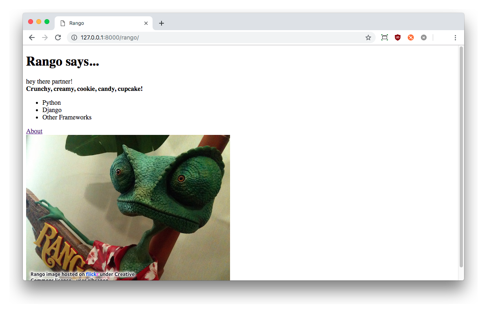
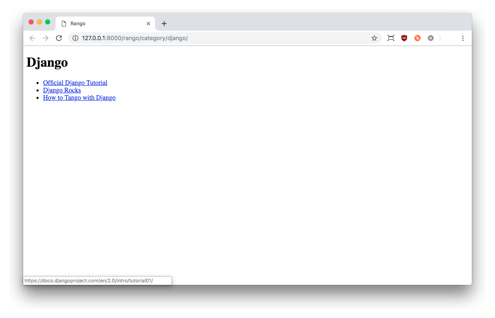
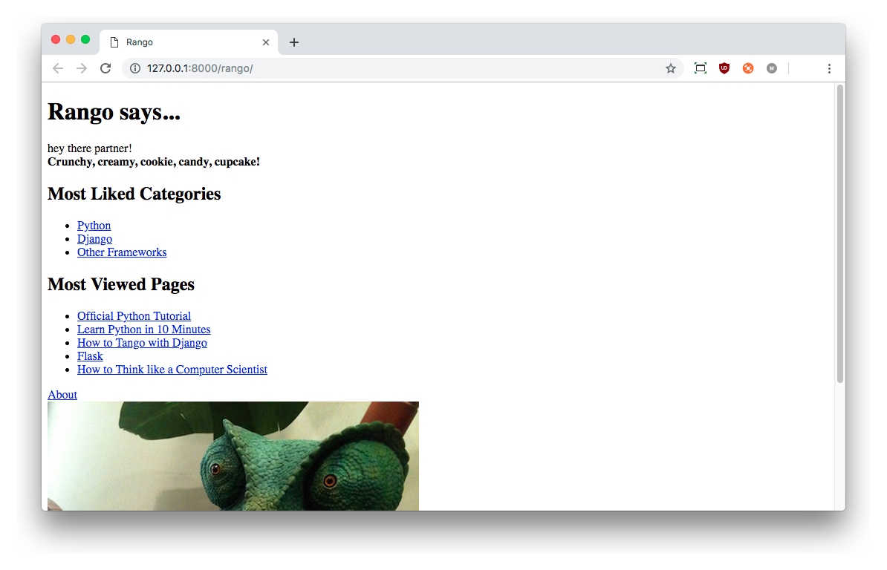

# Models, Templates and Views {#chapter-mtv}
Now that we have the models set up and populated the database with some sample data, we can now start connecting the models, views and templates to serve up dynamic content. In this chapter, we will go through the process of showing categories on the main page, and then create dedicated category pages which will show the associated list of links.

## Workflow: Data Driven Page 
To do this there are five main steps that you must undertake to create a data driven webpage in Django.

1.  In `views.py` file import the models you wish to use.
2.  In the view function, query the model to get the data you want to present.
3.  Then pass the results from your model into the template's context.
4.  Create/modify the template so that it displays the data from the context.
5.  If you have not done so already, map a URL to your view.

These steps highlight how we need to work within Django's framework to bind models, views and templates together.

## Showing Categories on Rango's Homepage
One of the requirements regarding the main page was to show the top five rango'ed categories. To fulfil this requirement, we will go through each of the above steps.

### Importing Required Models
First, we need to complete step one. Open `rango/views.py` and at the top of the file, after the other imports, import the `Category` model from Rango's `models.py` file.

{lang="python",linenos=off}
	# Import the Category model
	from rango.models import Category

### Modifying the Index View
Here we will complete step two and step three, where we need to modify the view `index()` function. Remember that the `index()` function is responsible for the main page view.  Modify `index()` as follows:

{lang="python",linenos=off}
	def index(request):
	    # Query the database for a list of ALL categories currently stored.
	    # Order the categories by no. likes in descending order.
	    # Retrieve the top 5 only - or all if less than 5.
	    # Place the list in our context_dict dictionary
	    # that will be passed to the template engine.
	    
	    category_list = Category.objects.order_by('-likes')[:5]
	    context_dict = {'categories': category_list}
	    
	    # Render the response and send it back!
	    return render(request, 'rango/index.html', context_dict)

Here, the expression `Category.objects.order_by('-likes')[:5]`  queries the `Category` model to retrieve the top five categories. You can see that it uses the `order_by()` method to sort by the number of `likes` in descending order. The `-` in `-likes` denotes that we would like them in descending order (if we removed the `-` then the results would be returned in ascending order). Since a list of `Category` objects will be returned, we used Python's list operators to take the first five objects from the list (`[:5]`) to return a subset of `Category` objects.

With the query complete, we passed a reference to the list (stored as variable `category_list`) to the dictionary, `context_dict`. This dictionary is then passed as part of the context for the template engine in the `render()` call.

W> ###Warning
W> For this to work, you will have had to complete the exercises in the previous chapter where you need to add the field `likes` to the `Category` model.

### Modifying the Index Template
With the view updated, we can complete the fourth step and update the template `rango/index.html`, located within your project's `templates` directory. Change the HTML so that it looks like the example shown below.

{lang="html",linenos=off}
	<!DOCTYPE html>
	
	<html>
	<head>
	    <title>Rango</title>
	</head>
	
	<body>
	    <h1>Rango says...</h1>
	    

			hey there partner!  
			<strong>{{ boldmessage }}</strong>
		

	
	    

	    
	    <ul>
	        
	            <li>{{ category.name }}</li>
	        
	    </ul>
	    
	        <strong>There are no categories present.</strong>
	    	
	    

	    
	    

	        <a href="/rango/about/">About Rango</a> 
	         
	    

	</body>
	</html>

Here, we make use of Django's template language to present the data using `if` and `for` control statements. Within the `<body>` of the page, we test to see if `categories` - the name of the context variable containing our list - actually contains any categories (``).

If so, we proceed to construct an unordered HTML list (within the `<ul>` tags). The `for` loop (``) then iterates through the list of results, and outputs each category's name (`{{ category.name }})` within a pair of `<li>` tags to indicate a list element.

If no categories exist, a message is displayed instead indicating that no categories are present.

As the example shows in Django's template language, all commands are enclosed within the tags ``, while variables are referenced within `{{` and `}}` brackets.

If you now visit Rango's homepage at `<http://127.0.0.1:8000/rango/>`, you should see a list of categories underneath the page title just like in the [figure below](#figch6-rango-categories-index).

{id="fig-ch6-rango-categories-index"}

##Creating a Details Page
According to the [specifications for Rango](#overview-design-brief-label), we also need to show a list of pages that are associated with each category. We have a number of challenges here to overcome. A new view must be created, which should be parameterised. We also need to create URL patterns and URL strings that encode category names.

### URL Design and Mapping
Let's start by considering the URL problem. One way we could handle this problem is to use the unique ID for each category within the URL. For example, we could create URLs like `/rango/category/1/` or `/rango/category/2/`, where the numbers correspond to the categories with unique IDs 1 and 2 respectively. However, it is not possible to infer what the category is about just from the ID.

Instead, we could use the category name as part of the URL. For example, we can imagine that the URL `/rango/category/python/` would lead us to a list of pages related to Python. This is a simple, readable and meaningful URL. If we go with this approach, we'll also have to handle categories that have multiple words, like 'Other Frameworks', etc.

T> ### Clean your URLs
T> Designing clean and readable URLs is an important aspect of web design. See [Wikipedia's article on Clean URLs](http://en.wikipedia.org/wiki/Clean_URL) for more details.

To handle this problem we are going to make use of the `slugify` function provided by Django. 

<!-->
<http://stackoverflow.com/questions/837828/how-do-i-create-a-slug-in-django>
-->
### Update Category Table with a Slug Field
To make readable URLs, we need to include a slug field in the `Category` model. First we need to import the function `slugify` from Django that will replace whitespace with hyphens - for example, `"how do i create a slug in django"` turns into `"how-do-i-create-a-slug-in-django"`.

W> ### Unsafe URLs
W> While you can use spaces in URLs, it is considered to be unsafe to use them. Check out the [Internet Engineering Task Force Memo on URLs](http://www.ietf.org/rfc/rfc1738.txt) to read more.

Next we need to override the `save()` method of the `Category` model, which we will call the `slugify` method and update the `slug` field with it. Note that every time the category name changes, the slug will also change. Update your model, as shown below, and add in the import.

{lang="python",linenos=off}
	from django.template.defaultfilters import slugify
	...
	class Category(models.Model):
	    name = models.CharField(max_length=128, unique=True)
	    views = models.IntegerField(default=0)
	    likes = models.IntegerField(default=0)
	    slug = models.SlugField()
	    
	    def save(self, *args, **kwargs):
	        self.slug = slugify(self.name)
	        super(Category, self).save(*args, **kwargs)
	        
	    class Meta:
	        verbose_name_plural = 'categories'
	    
	    def __str__(self):
	        return self.name

Now that the model has been updated, the changes must now be propagated to the database. However, since data already exists within the database, we need to consider the implications of the change. Essentially, for all the existing category names, we want to turn them into slugs (which is performed when the record is initially saved). When we update the models via the migration tool, it will add the `slug` field and provide the option of populating the field with a default value. Of course, we want a specific value for each entry - so we will first need to perform the migration, and then re-run the population script. This is because the population script will explicitly call the `save()` method on each entry, triggering the 'save()' as implemented above, and thus update the slug accordingly for each entry.

To perform the migration, issue the following commands (as detailed in the [Models and Databases Workflow](#section-models-databases-workflow)).

{lang="text",linenos=off}
	$ python manage.py makemigrations rango
	$ python manage.py migrate

Since we did not provide a default value for the slug and we already have existing data in the model, the `migrate` command will give you two options. Select the option to provide a default, and enter an empty string -- denoted by two quote marks (i.e. `''`).  Run the population script again, which will then update the slug fields.

{lang="text",linenos=off}
	$ python populate_rango.py

Now run the development server with the command `$ python manage.py runserver`, and inspect the data in the models with the admin interface at `http://127.0.0.1:8000/admin/`.

If you go to add in a new category via the admin interface you may encounter a problem, or two!

1. Let's say we added in the category, `Python User Groups`. If you do so, and try to save the record Django will not let you save it unless you also fill in the slug field too. While we could type in `python-user-groups` this is error prone. It would be better to have the slug automatically generated.

2. The next problem arises if we have one category called `Django` and one called `django`. Since the `slugify()` makes the slugs lower case it will not be possible to identify which category corresponds to the `django` slug.

To solve the first problem, we can either update our model so that the slug field allows blank entries, i.e.: 

{lang="python",linenos=off}
	slug = models.SlugField(blank=True) 

**or** we can customise the admin interface so that it automatically pre-populates the slug field as you type in the category name. To do this, update `rango/admin.py` with the following code.

{lang="python",linenos=off}
	from django.contrib import admin
	from rango.models import Category, Page
	...
	# Add in this class to customise the Admin Interface
	class CategoryAdmin(admin.ModelAdmin):
	    prepopulated_fields = {'slug':('name',)}
	
	# Update the registration to include this customised interface
	admin.site.register(Category, CategoryAdmin)
	...

Try out the admin interface and add in a new category.

Now that we have addressed the first problem, we can ensure that the slug field is also unique, by adding the constraint to the slug field.

{lang="python",linenos=off}
	slug = models.SlugField(unique=True)

Now that we have added in the slug field we can now use the slugs to uniquely identify each category. We could have added the unique constraint earlier, but if we performed the migration and set everything to be an empty string by default it would have raised an error. This is because the unique constraint would have been violated. We could have deleted the database and then recreated everything - but that is not always desirable. 

W> ### Migration Woes
W> It's always best to plan out your database in advance and avoid changing it. Making a population script means that you easily recreate your database if you need to delete it.
W>
W> Sometimes it is just better to just delete the database and recreate everything than try and work out where the conflict is coming from. A good exercise is to write a script to output the data in the database so that any changes you make can be saved out into a file that can be read in later.

### Category Page Workflow
To implement the category pages so that they can be accessed via `/rango/category/<category-name-slug>/` we need to make a number of changes and undertake the following steps:

1. Import the `Page` model into `rango/views.py`.
2. Create a new view in `rango/views.py` called `show_category()`. The `show_category()` view will take an additional parameter, `category_name_url` which will store the encoded category name.
	- We will need helper functions to encode and decode the `category_name_url`.
3.  Create a new template, `templates/rango/category.html`.
4.  Update Rango's `urlpatterns` to map the new `category` view to a URL pattern in `rango/urls.py`.

We'll also need to update the `index()` view and `index.html` template to provide links to the category page view.

### Category View
In `rango/views.py`, we first need to import the `Page` model. This means we must add the following import statement at the top of the file.

{lang="python",linenos=off}
	from rango.models import Page

Next, we can add our new view, `show_category()`.

{lang="python",linenos=off}
	def show_category(request, category_name_slug):
	    # Create a context dictionary which we can pass 
	    # to the template rendering engine.
	    context_dict = {}
	    
	    try:
	        # Can we find a category name slug with the given name?
	        # If we can't, the .get() method raises a DoesNotExist exception.
	        # So the .get() method returns one model instance or raises an exception.
	        category = Category.objects.get(slug=category_name_slug)
	        
	        # Retrieve all of the associated pages.
	        # Note that filter() will return a list of page objects or an empty list
	        pages = Page.objects.filter(category=category)
	        
	        # Adds our results list to the template context under name pages.
	        context_dict['pages'] = pages
	        # We also add the category object from 
	        # the database to the context dictionary.
	        # We'll use this in the template to verify that the category exists.
	        context_dict['category'] = category
	    except Category.DoesNotExist:
	        # We get here if we didn't find the specified category.
	        # Don't do anything - 
	        # the template will display the "no category" message for us.
	        context_dict['category'] = None
	        context_dict['pages'] = None
	    
	    # Go render the response and return it to the client.
	    return render(request, 'rango/category.html', context_dict)

Our new view follows the same basic steps as our `index()` view. We first define a context dictionary and then attempt to extract the data from the models, and add the relevant data to the context dictionary. We determine which category by using the value passed as parameter `category_name_slug` to the `show_category()` view function. If the category slug is found in the `Category` model, we can then pull out the associated pages, and add this to the context dictionary, `context_dict`.

### Category Template
Now let's create our template for the new view. In `<workspace>/tango_with_django_project/templates/rango/` directory, create `category.html`. In the new file, add the following code.

{lang="html",linenos=on}
	<!DOCTYPE html>
	<html>
	<head>
	    <title>Rango</title>
	</head>
	<body>
	    

	    
	        <h1>{{ category.name }}</h1>
	        
	            <ul>
	            
	                <li><a href="{{ page.url }}">{{ page.title }}</a></li>
	            
	            </ul>
	        
	            <strong>No pages currently in category.</strong>
	        
	    
	        The specified category does not exist!
	    
	    

	</body>
	</html>

The HTML code example again demonstrates how we utilise the data passed to the template via its context through the tags `{{ }}`. We access the `category` and `pages` objects, and their fields e.g. `category.name` and `page.url`.

If the `category` exists, then we check to see if there are any pages in the category. If so, we iterate through the pages using the `` template tags. For each page in the `pages` list, we present their `title` and `url` attributes. This is displayed in an unordered HTML list (denoted by the `<ul>` tags). If you are not too familiar with HTML then check out the [HTML Tutorial by W3Schools.com](http://www.w3schools.com/html/) to learn more about the different tags.

I> ### Note on Conditional Template Tags
I> The Django template conditional tag - `` - is a really neat way of determining the existence of an object within the template's context. Make sure you check the existence of an object to avoid errors.
I>
I> Placing conditional checks in your templates - like `` in the example above - also makes sense semantically. The outcome of the conditional check directly affects the way in which the rendered page is presented to the user. Remember, presentational aspects of your Django appls should be encapsulated within templates.

### Parameterised URL Mapping
Now let's have a look at how we actually pass the value of the `category_name_url` parameter to the `show_category()` function. To do so, we need to modify Rango's `urls.py` file and update the `urlpatterns` tuple as follows.

{lang="python",linenos=off}
	urlpatterns = [
	    path('', views.index, name='index'),
	    path('about/', views.about, name='about'),
	    path('category/<slug:category_name_slug>/', 
			views.show_category, name='show_category'),
	]

We have added a new path which contains a parameter `<slug:category_name_slug>`. This indicates to django that we want to match a string which is a slug, and to assign it to `category_name_slug`. You will notice that this variable name is what we pass through to the view `show_category`. You can also extract out other variables like strings and integers, see the [Django documentation on URL paths](https://docs.djangoproject.com/en/2.0/ref/urls/) for more details. If you need to parse more complicated expressions you can use `re_path()` instead of `path()` which will allow you to match all sorts of regular (and iregular) expressions. Luckily for us Django provides matches for the most common patterns.
<!-->
We have added in a rather complex entry that will invoke `view.show_category()` when the URL pattern `r'^category/(?P<category_name_slug>[\w\-]+)/$'` is matched. 

There are two things to note here. First we have added a parameter name with in the URL pattern, i.e. `<category_name_slug>`, which we will be able to access in our view later on. When you create a parameterised URL you need to ensure that the parameters that you include in the URL are declared in the corresponding view.
The next thing to note is that the regular expression `[\w\-]+)` will look for any sequence of alphanumeric characters e.g. `a-z`, `A-Z`, or `0-9` denoted by `\w` and any hyphens (-) denoted by `\-`, and we can match as many of these as we like denoted by the `[ ]+` expression.

The URL pattern will match a sequence of alphanumeric characters and hyphens which are between the `rango/category/` and the trailing `/`. This sequence will be stored in the parameter `category_name_slug` and passed to `views.show_category()`. For example, the URL `rango/category/python-books/` would result in the `category_name_slug` having the value, `python-books`. However, if the URL was `rango/category/££££-$$$$$/` then the sequence of characters between `rango/category/` and the trailing `/` would not match the regular expression, and a `404 not found` error would result because there would be no matching URL pattern.
-->

All view functions defined as part of a Django applications *must* take at least one parameter. This is typically called `request` - and provides access to information related to the given HTTP request made by the user. When parameterising URLs, you supply additional named parameters to the signature for the given view.  That is why our `show_category()` view was defined as `def show_category(request, category_name_slug)`.

<!--
It's not the position of the additional parameters that matters, it's
the *name* that must match anything defined within the URL pattern.
 Note how `category_name_slug` defined in the URL pattern matches the
 `category_name_slug` parameter defined for our view. 
		Using  `category_name_slug` in our view will give `python-books`, or whatever value was supplied as that part of the URL.
-->
		
I> ###Regex Hell
I> "Some people, when confronted with a problem, think *'I know, I'll use regular expressions.'* Now they have two problems."
I> [Jamie Zawinski](http://blog.codinghorror.com/regular-expressions-now-you-have-two-problems/)
I>
I> Django's `path()` method means you can generally avoid Regex Hell - but if you need to use a regular expression this [cheat sheet](http://cheatography.com/davechild/cheat-sheets/regular-expressions/) is really useful.

### Modifying the Index Template
Our new view is set up and ready to go - but we need to do one more thing. Our index page template needs to be updated so that it links to the category pages that are listed. We can update the `index.html` template to now include a link to the category page via the slug.

{lang="html",linenos=off}
	<!DOCTYPE html>
	
	<html>
	    <head>
	        <title>Rango</title>
	    </head>
	    
	    <body>
			hey there partner!  
			<strong>{{ boldmessage }}</strong>
	        
	        

	            hey there partner!
	        

	        
	        

	        
	        <ul>
	            
	            <!-- Following line changed to add an HTML hyperlink -->
	            <li>
	            <a href="/rango/category/{{ category.slug }}">{{ category.name }}</a>
	            </li>
	            
	        </ul>
	        
	            <strong>There are no categories present.</strong>
	        
	        

	        
	        

	            <a href="/rango/about/">About Rango</a> 
	             
	        

	    </body>
	</html>

Again, we used the HTML tag `<ul>` to define an unordered list. Within the list, we create a series of list elements (`<li>`), each of which in turn contains a HTML hyperlink (`<a>`). The hyperlink has an `href` attribute, which we use to specify the target URL defined by `/rango/category/{{ category.slug }}` which, for example, would turn into `/rango/category/python-books/` for the category `Python Books`.

### Demo
Let's try everything out now by visiting the Rango homepage. You should see up to five categories on the index page. The categories should now be links. Clicking on `Django` should then take you to the `Django` category page, as shown in the [figure below](#fig-ch6-rango-links). If you see a list of links like `Official Django Tutorial`, then you've successfully set up the new page. 

What happens when you visit a category that does not exist? Try navigating a category which doesn't exist, like `/rango/category/computers/`. Do this by typing the address manually into your browser's address bar. You should see a message telling you that the specified category does not exist.

{id="fig-ch6-rango-links"}

X> ## Exercises
X> Reinforce what you've learnt in this chapter by trying out the following exercises.
X> 
X> * Update the population script to add some value to the `views` count for each page.
X> * Modify the index page to also include the top 5 most viewed pages.
X> * Include a heading for the "Most Liked Categories" and "Most Viewed Pages".
X> * Include a link back to the index page from the category page.
X> * Undertake [part three of official Django tutorial](https://docs.djangoproject.com/en/2.0/intro/tutorial03/) if you have not done so already to reinforce what you've learnt here.

{id="fig-ch6-exercises"}

T> ### Hints
T> * When updating the population script, you'll essentially follow the same process as you went through in the [previous chapter's](#chapter-models-databases) exercises. You will need to update the data structures for each page, and also update the code that makes use of them.
T>      * Update the three data structures containing pages for each category -- `python_pages`, `django_pages` and `other_pages`. Each page has a `title` and `url` -- they all now need a count of how many `views` they see, too.
T>      * Look at how the `add_page()` function is defined in your population script. Does it allow for you to pass in a `views` count? Do you need to change anything in this function?
T>      * Finally, update the line where the `add_page()` function is *called*. If you called the views count in the data structures `views`, and the dictionary that represents a page is called `p` in the context of where `add_page()` is called, how can you pass the views count into the function?
T> * Remember to re-run the population script so that the views are updated.
T>      * You will need to edit both the `index` view and the `index.html` template to put the most viewed (i.e. popular pages) on the index page.
T>      * Instead of accessing the `Category` model, you will have to ask the `Page` model for the most viewed pages.
T>      * Remember to pass the list of pages through to the context.
T>      * If you are not sure about the HTML template code to use, you can draw inspiration from the `category.html` template code as the markup is essentially the same.

T> ### Model Tips
T> For more tips on working with models you can take a look through the following blog posts:
T> 
T> 1. [Best Practices when working with models](http://steelkiwi.com/blog/best-practices-working-django-models-python/) by Kostantin Moiseenko. In this post you will find a series of tips and tricks when working with models.
T> 2. [How to make your Django Models DRYer](https://medium.com/@raiderrobert/make-your-django-models-dryer-4b8d0f3453dd#.ozrdt3rsm) by Robert Roskam. In this post you can see how you can use the `property` method of a class to reduce the amount of code needed when accessing related models.