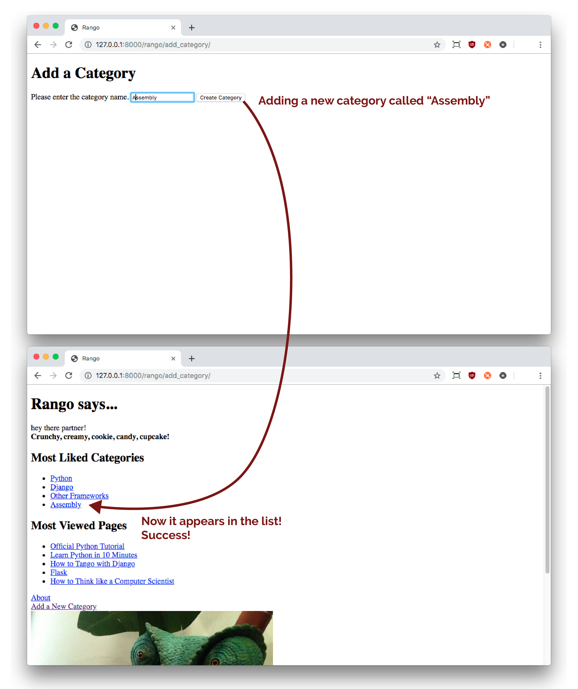

#Forms {#chapter-forms}
As part of the Rango application, we will want to capture new categories and new pages from users. In this chapter, we will run through how to capture data through web forms. Django comes with some excellent form handling functionality, making it a pretty straightforward process to collect information from users and save it to the database via the models. According to [Django's documentation on forms](https://docs.djangoproject.com/en/2.1/topics/forms/), the form handling functionality allows you to:

1. display an HTML form with automatically generated *form widgets* (like a text field or date picker);
2. check submitted data against a set of validation rules;
3. redisplay a form in case of validation errors; and
4. convert submitted form data to the relevant Python data types.

One of the major advantages of using Django's forms functionality is that it can save you a lot of time and hassle creating the HTML forms.

## Basic Workflow
The basic steps involved in creating a form and handling user input is as follows.

1. If you haven't already got one, create a `forms.py` module within your Django app's directory (`rango`) to store form-related classes.
2. Create a `ModelForm` class for each model that you wish to represent as a form.
3. Customise the forms as you desire.
4. Create or update a view to handle the form...
	 - including *displaying* the form, 
	 - *saving* the form data, and 
	 - *flagging up errors* which may occur when the user enters incorrect data (or no data at all) in the form.
5. Create or update a template to display the form.
6. Add a `urlpattern` to map to the new view (if you created a new one).

This workflow is a bit more complicated than those we have previously seen, and the views that we have to construct are lot more complex, too. However, once you undertake the process a few times, it will become clearer how everything pieces together. Trust us.

##Page and Category Forms
Here, we will implement the necessary infrastructure that will allow users to add categories and pages to the database via forms.

First, create a file called `forms.py` within the `rango` application directory. While this step is not necessary (you could put the forms in the `models.py`), this makes your codebase tidier and easier to work with.

### Creating `ModelForm` Classes {#section-forms-pagecategory-modelform}
Within Rango's `forms.py` module, we will be creating several classes that inherit from Django's `ModelForm`. In essence, [a `ModelForm`](https://docs.djangoproject.com/en/2.1/topics/forms/modelforms/#modelform) is a *helper class* that allows you to create a Django `Form` from a pre-existing model. As we've already got two models defined for Rango (`Category` and `Page`), we'll create `ModelForms` for both.

In `rango/forms.py` add the following code.

{lang="python",linenos=on}
	from django import forms
	from rango.models import Page, Category
	
	class CategoryForm(forms.ModelForm):
	    name = forms.CharField(max_length=128, 
	                           help_text="Please enter the category name.")
	    views = forms.IntegerField(widget=forms.HiddenInput(), initial=0)
	    likes = forms.IntegerField(widget=forms.HiddenInput(), initial=0)
	    slug = forms.CharField(widget=forms.HiddenInput(), required=False)
	    
	    # An inline class to provide additional information on the form.
	    class Meta:
	        # Provide an association between the ModelForm and a model
	        model = Category
	        fields = ('name',)
	
	class PageForm(forms.ModelForm):
	    title = forms.CharField(max_length=128, 
	                            help_text="Please enter the title of the page.")
	    url = forms.URLField(max_length=200, 
	                         help_text="Please enter the URL of the page.")
	    views = forms.IntegerField(widget=forms.HiddenInput(), initial=0)
	    
	    class Meta:
	        # Provide an association between the ModelForm and a model
	        model = Page
	        
	        # What fields do we want to include in our form?
	        # This way we don't need every field in the model present.
	        # Some fields may allow NULL values; we may not want to include them.
	        # Here, we are hiding the foreign key.
	        # we can either exclude the category field from the form,
	        exclude = ('category',)
	        # or specify the fields to include (don't include the category field).
	        #fields = ('title', 'url', 'views')

We need to specify which fields are included on the form, via `fields`, or specify which fields are to be excluded, via `exclude`.

Django provides us with several ways to customise the forms that are created on our behalf. In the code sample above, we've specified the widgets that we wish to use for each field to be displayed. For example, in our `PageForm` class, we've defined `forms.CharField` for the `title` field, and `forms.URLField` for `url` field. Both fields provide text entry for users. Note the `max_length` parameters we supply to our fields -- the lengths that we specify are identical to the maximum length of each field we specified in the underlying data models. Go back to the [chapter on models](#chapter-models-databases) to check for yourself, or have a look at Rango's `models.py` module.

You will also notice that we have included several `IntegerField` entries for the views and likes fields in each form. Note that we have set the widget to be hidden with the parameter setting `widget=forms.HiddenInput()`, and then set the value to zero with `initial=0`. This is one way to set the field to zero by default. Since the fields will be hidden, the user won't be able to enter a value for these fields.

However, even though we have a `hidden` field in the `PageForm`, we still need to include the field in the form. If in `fields` we excluded `views`, then the form would not contain that field (despite it being specified). This would mean that the form would not return the value zero for that field. This may raise an error depending on how the model has been set up. If in the model we specified that the `default=0` for these fields, then we can rely on the model to automatically populate the field with the default value -- and thus avoid a `not null` error. In this case, it would not be necessary to have these hidden fields. We have also included the field `slug` in the `CategoryForm`, and set it to use the `widget=forms.HiddenInput()`.

However, rather than specifying an initial or default value, we have said the field is not required by the form. This is because our model will be responsible for populating the field when the `save()` method is called. Essentially, you need to be careful when you define your models and forms to make sure that the form is going to contain and pass on all the data that is required to populate your model correctly.

Besides the `CharField` and `IntegerField` widgets, many more are available for use. As an example, Django provides `EmailField` (for e-mail address entry), `ChoiceField` (for radio input buttons), and `DateField` (for date/time entry). There are many other field types you can use, which perform error checking for you (e.g. *is the value provided a valid integer?*). 

Perhaps the most important aspect of a class inheriting from `ModelForm` is the need to define *which model we're wanting to provide a form for.* We take care of this through our nested `Meta` class. Set the `model` attribute of the nested `Meta` class to the model you wish to use. For example, our `CategoryForm` class has a reference to the `Category` model. This is a crucial step enabling Django to take care of creating a form in the image of the specified model. It will also help in handling the flagging up of any errors, along with saving and displaying the data in the form.

We also use the `Meta` class to specify which fields we wish to include in our form through the `fields` tuple. Use a tuple of field names to specify the fields you wish to include.

I> ### More about Forms
I> Check out the [official Django documentation on forms](https://docs.djangoproject.com/en/2.1/ref/forms/) for further information about the different widgets and how to customise forms.

### Creating an *Add Category* View {#section-forms-addcategory}
With our `CategoryForm` class now defined, we're now ready to create a new view to display the form and handle the posting of form data. To do this, add the following code to `rango/views.py`.

{lang="python",linenos=off}
	def add_category(request):
	    form = CategoryForm()
	    
	    # A HTTP POST?
	    if request.method == 'POST':
	        form = CategoryForm(request.POST)
	        
	        # Have we been provided with a valid form?
	        if form.is_valid():
	            # Save the new category to the database.
	            form.save(commit=True)
	            # Now that the category is saved
	            # We could give a confirmation message
	            # But since the most recent category added is on the index page
	            # Then we can direct the user back to the index page.
	            return index(request)
	        else:
	            # The supplied form contained errors -
	            # just print them to the terminal.
	            print(form.errors)
	    
	    # Will handle the bad form, new form, or no form supplied cases.
	    # Render the form with error messages (if any).
	    return render(request, 'rango/add_category.html', {'form': form})

You'll need to add the following `import` at the top of the module, too.

{lang="python",linenos=off}
	from rango.forms import CategoryForm

The new `add_category()` view adds several key pieces of functionality for handling forms. First, we create a CategoryForm(), then we check if the HTTP request was a `POST` (did the user submit data via the form?).  We can then handle the `POST` request through the same URL. The `add_category()` view function can handle three different scenarios:

- showing a new, blank form for adding a category;
- saving form data provided by the user to the associated model, and rendering the Rango homepage; and
- if there are errors, redisplay the form with error messages.

I> ### `GET` and `POST`
I> What do we mean by `GET` and `POST`? They are *HTTP requests*.
I>
I> - An HTTP `GET` is used to *request a representation of the specified resource.* In other words, we use a HTTP `GET` to retrieve a particular resource, whether it is a webpage, image or some other file.
I> - In contrast, an HTTP `POST` *submits data from the client's web browser to be processed.* This type of request is used for example when submitting the contents of a HTML form.
I> - Ultimately, an HTTP `POST` may end up being programmed to create a new resource (e.g. a new database entry) on the server. This could later be accessed through an HTTP `GET` request.
I> - Check out the [w3schools page on `GET` vs. `POST`](http://www.w3schools.com/tags/ref_httpmethods.asp) for more details.

Django's form handling machinery processes the data returned from a user's browser via an HTTP `POST` request. It not only handles the saving of form data into the chosen model but will also automatically generate any error messages for each form field (if any are required). This means that Django will not store any submitted forms with missing information that could potentially cause problems for your database's [referential integrity](https://en.wikipedia.org/wiki/Referential_integrity). For example, supplying no value in the `category` name field will return an error, as the field cannot be blank.

From the `render()` call, you'll see that we refer to `add_category.html` -- a new template. This will contain the relevant Django template code and HTML for the form and page.

### Creating the *Add Category* Template
Create the file `templates/rango/add_category.html`. Within the file, add the following HTML markup and Django template code.

{lang="html",linenos=on}
	<!DOCTYPE html>
	<html>
	    <head>
	        <title>Rango</title>
	    </head>
	    
	    <body>
	        <h1>Add a Category</h1>
	        

	            <form id="category_form" method="post" action="/rango/add_category/">
	                
	                
	                    {{ hidden }}
	                
	                
	                    {{ field.errors }}
	                    {{ field.help_text }}
	                    {{ field }}
	                
	                <input type="submit" name="submit" value="Create Category" />
	            </form>
	        

	    </body>
	</html>

You can see that within the `<body>` of the HTML page, we placed a `<form>` element. Looking at the attributes for the `<form>` element, you can see that all data captured within this form is sent to the URL `/rango/add_category/` as an HTTP `POST` request (the `method` attribute is case insensitive, so you can do `POST` or `post` -- both provide the same functionality). Within the form, we have two for loops,

- with the first controlling *hidden* form fields, and
- the second controlling *visible* form fields. 

The visible fields (those that will be displayed to the user) are controlled by the `fields` attribute within your `ModelForm` `Meta` class. These template loops produce the necessary HTML markup for each form element. For visible form fields, we also add in any errors that may be present with a particular field and help text that can be used to explain to the user what he or she needs to enter.

I> ### Hidden Fields
I> The need for hidden as well as visible form fields are necessitated by the fact that HTTP is a *stateless protocol.* You can't persist state between different HTTP requests that can make certain parts of web applications difficult to implement. To overcome this limitation, hidden HTML form fields were created which allow web applications to pass important information to a client (which cannot be seen on the rendered page) in an HTML form, only to be sent back to the originating server when the user submits the form.

I> ### Cross Site Request Forgery Tokens
I> You should also take note of the code snippet ``. This is a *Cross-Site Request Forgery (CSRF) token*, which helps to protect and secure the HTTP `POST` request that is initiated on the subsequent submission of a form. *The Django framework requires the CSRF token to be present. If you forget to include a CSRF token in your forms, a user may encounter errors when he or she submits the form.* Check out the [official Django documentation on CSRF tokens](https://docs.djangoproject.com/en/2.1/ref/csrf/) for more information about this.

### Mapping the *Add Category* View
Now we need to map the `add_category()` view to a URL. In the template, we have used the URL `/rango/add_category/` in the form's action attribute. We now need to create a mapping from the URL to the view. In `rango/urls.py` modify the `urlpatterns` list to make it look like the following.

{lang="python",linenos=off}
	urlpatterns = [
	    path('', views.index, name='index'),
	    path('about/', views.about, name='about'),
	    path('category/<slug:category_name_slug>/', views.show_category,
	         name='show_category'),
	    path('add_category/', views.add_category, name='add_category'),
	]

Ordering doesn't necessarily matter in this instance. However, take a look at the [official Django documentation on how Django processes a request](https://docs.djangoproject.com/en/2.1/topics/http/urls/#how-django-processes-a-request) for more information. The URL for adding a category is `/rango/add_category/`, with the name of `add_category`.

<!--BREAK-->

### Modifying the Index Page View
As a final step, we can put a link on the index page so that users can then easily navigate to the page that allows them to add categories. Edit the template `rango/index.html`, and add the following HTML hyperlink in the `
` element with the *About* link.

{lang="html",linenos=off}
	<a href="/rango/add_category/">Add New Category</a> 

### Demo
Now let's try it out! Start or restart your Django development server, and then point your web browser to Rango at `http://127.0.0.1:8000/rango/`. Use your new link to jump to the Add Category page, and try adding a category. The [figure below](#fig-ch7-add-cat) shows screenshots of the *Add Category* and *Index* pages. In the screenshots, we add the category *Assembly*.

{id="fig-ch7-add-cat"}
>

I> ### Missing Categories?
I> If you play around with this new functionality and add several different categories, remember that they will not always appear on the index page. This is because we coded up our index view to only show the *top five categories* in terms of the number of likes they have received. If you log into the admin interface, you should be able to view all the categories that you have entered. 
I> 
I> For confirmation that the category is being added is to update the `add_category()` method in `rango/views.py` and change the line  `form.save(commit=True)` to be `cat = form.save(commit=True)`. This will give you a reference to an instance of the created `Category` object. You can then `print` the category(e.g. `print(cat, cat.slug)` ).

### Cleaner Forms
Recall that our `Page` model has a `url` attribute set to an instance of the `URLField` type. In a corresponding HTML form, Django would reasonably expect any text entered into a `url` field to be a correctly formatted, complete URL. However, users can find entering something like `http://www.url.com` to be cumbersome -- indeed, users [may not even know what forms a correct URL](https://support.google.com/webmasters/answer/76329?hl=en)!

I> ### URL Checking
I> Most modern browsers will now check to make sure that the URL is well-formed for you, so this example will only work on older browsers. However, it does show you how to clean the data before you try to save it to the database. If you don't have an old browser to try this example (in case you don't believe it), try changing the `URLField` to a `CharField`. The rendered HTML will then not instruct the browser to perform the checks on your behalf, and the code you implemented will be executed.

In scenarios where user input may not be entirely correct, we can *override* the `clean()` method implemented in `ModelForm`. This method is called upon before saving form data to a new model instance, and thus provides us with a logical place to insert code which can verify -- and even fix -- any form data the user inputs. We can check if the value of `url` field entered by the user starts with `http://` -- and if it doesn't, we can prepend `http://` to the user's input.

{lang="python",linenos=off}
	class PageForm(forms.ModelForm):
	    ...
	    def clean(self):
	        cleaned_data = self.cleaned_data
	        url = cleaned_data.get('url')
	        
	        # If url is not empty and doesn't start with 'http://', 
	        # then prepend 'http://'.
	        if url and not url.startswith('http://'):
	            url = 'http://' + url
	            cleaned_data['url'] = url
	            
	            return cleaned_data

Within the `clean()` method, a simple pattern is observed which you can replicate in your own Django form handling code.

1.  Form data is obtained from the `ModelForm` dictionary attribute `cleaned_data`.
2.  Form fields that you wish to check can then be taken from the `cleaned_data` dictionary. Use the `.get()` method provided by the dictionary object to obtain the form's values. If a user does not enter a value into a form field, its entry will not exist in the `cleaned_data` dictionary. In this instance, `.get()` would return `None` rather than raise a `KeyError` exception. This helps your code look that little bit cleaner!
3.  For each form field that you wish to process, check that a value was retrieved. If something was entered, check what the value was. If it isn't what you expect, you can then add some logic to fix this issue before *reassigning* the value in the `cleaned_data` dictionary.
4.  You *must* always end the `clean()` method by returning the reference to the `cleaned_data` dictionary. Otherwise, the changes won't be applied.

This trivial example shows how we can clean the data being passed through the form before being stored. This is pretty handy, especially when particular fields need to have default values -- or data within the form is missing, and we need to handle such data entry problems.

I> ### What about `https`?
I> The overridden `clean()` method we provide above only considers `http://` as a valid protocol/schema. As using secure HTTP is now commonplace in today's world, you should also really consider URLs starting with `https://`, too. The above however only serves as a simple example of how you can check and clean a form's fields before saving its data.

I> ### Clean Overrides
I> Overriding methods implemented as part of the Django framework can provide you with an elegant way to add that extra bit of functionality for your application. There are many methods which you can safely override for your benefit, just like the `clean()` method in `ModelForm` as shown above. Check out [the Official Django Documentation on Models](https://docs.djangoproject.com/en/2.1/topics/db/models/#overriding-predefined-model-methods) for more examples on how you can override default functionality to slot your own in.

X> ###Exercises
X> Now that you've worked through the chapter, consider the following questions, and how you could solve them.
X> 
X> - What would happen if you don't enter in a category name on the add category form?
X> - What happens when you try to add a category that already exists?
X> - What happens when you visit a category that does not exist? A hint for a potential solution to solving this problem can be found below.
X> - In the [section above where we implemented our `ModelForm` classes](#section-forms-pagecategory-modelform), we repeated the `max_length` values for fields that we had previously defined in [the models chapter](#chapter-models-databases). This is bad practice as we are *repeating ourselves!* How can you refactor your code so that you are *not* repeating the `max_length` values?
X> - If you have not done so already undertake [part four of the official Django Tutorial](https://docs.djangoproject.com/en/2.1/intro/tutorial04/) to reinforce what you have learnt here.
X> - Now, implement functionality to let users add pages to each category. See below for some example code and hints.

### Creating an *Add Pages* View, Template and URL Mapping {#section-forms-addpage}
A next logical step would be to allow users to add pages to a given category. To do this, repeat the same workflow above, but for adding pages.

- Create a new view, `add_page()`.
- Create a new template, `rango/add_page.html`.
- Create a mapping between `/rango/category/<category_name_slug>/add_page/` and the new view.
- Update the category page/view to provide a link from the category add page functionality.

To get you started, here is the code for the `add_page()` view function.

{lang="python",linenos=off}
	from rango.forms import PageForm

	def add_page(request, category_name_slug):
	    try:
	        category = Category.objects.get(slug=category_name_slug)
	    except Category.DoesNotExist:
	        category = None
	    
	    form = PageForm()
	    if request.method == 'POST':
	        form = PageForm(request.POST)
	        if form.is_valid():
	            if category:
	                page = form.save(commit=False)
	                page.category = category
	                page.views = 0
	                page.save()
	                
	                return redirect(reverse('rango:show_category',
	                                        kwargs={'category_name_slug':
	                                                category_name_slug}))
	        else:
	            print(form.errors)
	    
	    context_dict = {'form':form, 'category': category}
	    return render(request, 'rango/add_page.html', context_dict)

Note that in the example above, we need to *redirect* the user to the `show_category()` view once the page has been created. This involves the use of the `redirect()` and `reverse()` helper functions to redirect the user and to lookup the appropriate URL, respectively. The following imports at the top of Rango's `views.py` module will therefore be required for this code to work.

{lang="python",linenos=off}
	from django.shortcuts import redirect
	from django.urls import reverse

Here, the `redirect()` function is called which in turn calls the `reverse()` function. `reverse()` looks up URL names in your `urls.py` modules -- in this instance, `rango:show_category`. If a match is found against the name provided, the complete URL is returned. The added complication here is that the `show_category()` view takes an additional parameter `category_name_slug`. By providing this value in a dictionary as `kwargs` to the `reverse()` function, it has all of the information it needs to formulate a complete URL. This completed URL is then used as the parameter to the `redirect()` method, and the response is complete!

T> ### Hints
T> To help you with the exercises above, the following hints may be of use.
T>
T> - In the `add_page.html` template, you can access the slug with ``{{ category.slug }}``. This is because the view passes the `category` object through to the template via the context dictionary.
T> - Ensure that the link only appears when *the requested category exists* -- with or without pages. In terms of code, we mean that your template should have the following conditional: ` ....  The specified category does not exist. `.
T> - Update Rango's `category.html` template with a new hyperlink, complete with a line break immediately following it: `<a href="/rango/category/{{category.slug}}/add_page/">Add Page</a>  `.
T> - Make sure that in your `add_page.html` template that the form posts to `/rango/category/{{ category.slug }}/add_page/`.
T> - Update `rango/urls.py` with a URL mapping (`/rango/category/<category_name_slug>/add_page/`) to handle the above link. Provide a name of `add_page` to the new mapping.
T> - You can avoid the repetition of `max_length` parameters through the use of an additional attribute in your `Category` model. This attribute could be used to store the value for `max_length`, and then be referenced where required.
T>
T> If you get *really* stuck, you can always check out [our code on GitHub](https://github.com/maxwelld90/tango_with_django_2_code).